강화학습의 대명사로 알려진 AlphaGo. DeepMind가 개발한 바둑 AI는 2016년 3월 이세돌 9단에게 역사적 승리를 거둔 이후 세계랭킹 1위 커제까지 이기고 바둑 리그를 은퇴했다. 그 이후에도 알고리즘은 지속적으로 발전해 더이상 인간의 기보를 참조하지 않고 스스로 진화하는 수준에까지 이르렀다. 이번 포스팅에서는 Self Play로 학습하면서도 바둑(Go)의 도메인에 얽매이지 않는 알고리즘인 AlphaZero에 대해 정리해보자.

<br>

## AlphaGo Zero vs. AlphaZero

이세돌을 이긴 AlphaGo Lee(2016.03), 커제와 고수팀을 이긴 AlphaGo Master(2017.05)는 인간 아마추어 기사의 기보를 바탕으로 바둑에 대한 기본을 학습한다. 이후 스스로와의 대국(Self Play)을 통해 바둑 실력을 갈고 닦았다.

이후에 나온 AlphaGo Zero(2017.10)와 AlphaZero(2017.12)는 더이상 인간의 대국을 참조하지 않는다. 완전히 처음부터 Self Play만으로 절대고수의 경지에 이르렀다. 둘은 어떤 차이가 있는걸까?

### AlphaGo Zero - Go = AlphaZero

AlphaGo Zero와 AlphaZero의 차이는 그 이름이 가장 잘 표현한다. AlphaZero는 Go(바둑)에 특화된 알고리즘이 아니다. AlphaGo Zero는 학습 과정에서 바둑의 특징적인 부분을 반영했기에 체스나 일본 장기에 바로 적용할 수 없었다. 

예를 들어 바둑은 상하좌우가 없다. AlphaGo Zero는 이 특징을 사용해서 학습시에 data augmentation을 수행했으며, Monte Carlo Tree Search(MCTS)를 할 때 랜덤으로 바둑판을 회전시켰다. AlphaGo Zero 논문에서는 이 정도 domain knowledge를 제외하면 인간의 지도(supervision)이 전혀 필요없다고 설명한다. 

> (4) The rules of Go are invariant under rotation and reflection; this knowledge has been used in AlphaGo Zero both by augmenting the dataset during training to include rotations and reflections of each position, and to sample random rotations or reflections of the position during MCTS (see Search algorithm). Aside from komi, the rules of Go are also invariant to colour transposition; this knowledge is exploited by representing the board from the perspective of the current player (see Neural network architecture).

그런데 진영 개념이 있는 체스나 일본 장기는 바둑과 같이 데이터를 처리할 수 없다. 예컨대 체스의 폰(pawn)은 플레이어 시점에서 앞으로만 이동할 수 있다. 반대로 바둑은 8방향으로 돌리고 뒤집어도 게임에 전혀 영향을 주지 않는다.

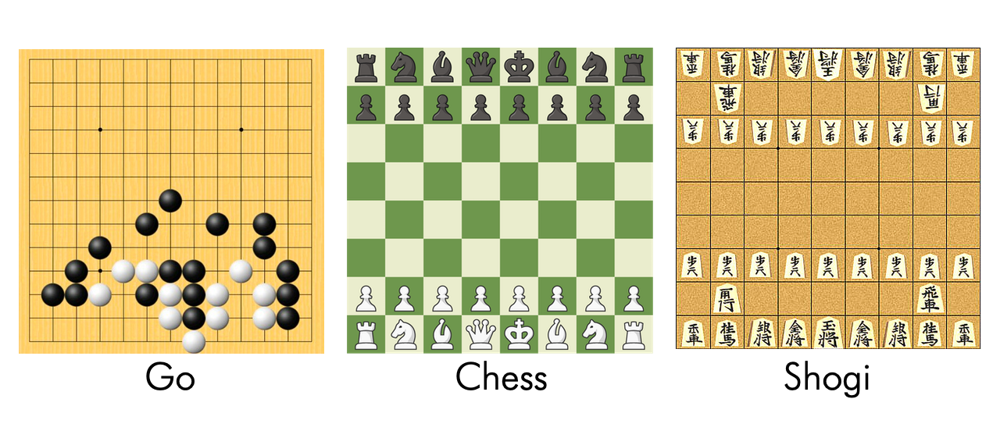

*source: Google*

따라서 더 폭넓은 보드게임에 AlphaGo를 적용하려면 "Go"에 기반한 도메인 지식마저 버려야 했다. 그 결과로서 등장한 것이 AlphaZero다. 

논문에서 소개된 AlphaGo Zero와 AlphaZero의 차이는 다음과 같다.

#### What to estimate

- AlphaGo Zero: 결과를 승/패로 정의하고, 승률을 추정/최적화한다.
- AlphaZero: 무승부나 기타 결과까지 포함할 수 있으며, 기대값을 추정/최적화한다.

#### Translation Invariance and Data Augmentation

- AlphaGo Zero: 8방향 전환을 적용해 학습 데이터를 보강하고, MCTS시에 랜덤으로 보드를 변환한다.
- AlphaZero: 데이터 보강 및 변환을 하지 않는다.

#### Evolution via Self Play

- AlphaGo Zero: Iteration이 끝날때마다 new 모델과 최근 best 모델간의 승부를 겨뤄, 55% 이상의 승률을 얻는 경우 new 모델을 채택한다. 따라서 Iteration이 끝날때까지 기다려야 한다.
- AlphaZero: 두 개의 모델을 비교하는 것이 아니라 하나의 모델을 지속적으로 업데이트한다. 따라서 Iteration이 끝날때가지 기다릴 필요가 없다. 최신 모델의 파라미터를 사용해 스스로와의 대국을 진행한다. 따라서 모델간 비교하는 evaluation이나 둘 중 하나를 선택하는 selection 과정이 필요없다.

#### Hyper-paramter Tuning

- AlphaGo Zero: Bayesian optimization을 사용해 각 게임별로 하이퍼 파라미터를 튜닝한다.
- AlphaZero: 모든 게임에 동일한 하이퍼 파라미터를 적용한다. Exploration을 위한 noise만 게임별로 일반적으로 허용하는 legal move의 수에 비례해 정했다.

이로서 AlphaGo가 Go의 영역을 벗어나 General AI로 향하는 발걸음을 한발짝 떼었다 할 수 있겠다. 


## Performance of AlphaZero

### Against Benchmark Models

AlphaZero는 논문에서 Go, Chess와 일본장기(shogi)에 도전했고 몇 시간 지나지않아 벤치마크 모델을 압도한다. Stockfish와 Elmo는 AlphaGo의 방식이 아닌 Handcrafted Feature와 Alpha-Beta Search로 무장한 기존의 최강자다. AlphaZero가 순식간에 이들의 Elo 스코어를 뛰어넘는 것이 매우 흥미롭다.

- Go: AlphaGo Lee 압도 / 8시간 후 / 165k steps (학습 이터레이션)
- Chess: Stockfish 압도 / 4시간 후 / 300k steps
- Shogi: Elmo 압도 / 2시간 후 / 110k steps

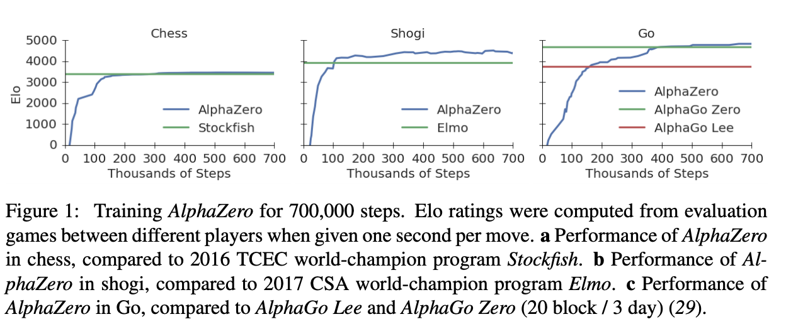

*source: AlphaZero paper*

### Fully Trained AlphaZero

완전히 학습이 끝난 AlphaZero(700k steps)를 StockFish, Elmo, 3일동안 학습한 AlphaGo Zero(AGO 3-day)를 상대로 대전해본 실험 결과도 흥미롭다. (Fully Trained AlphaZero의 학습 시간은 논문에 명시되지 않았으나, 165k steps에 8시간이 걸렸으므로 700k는 대략 산술적으로 34시간 정도 걸린 것으로 추정된다)

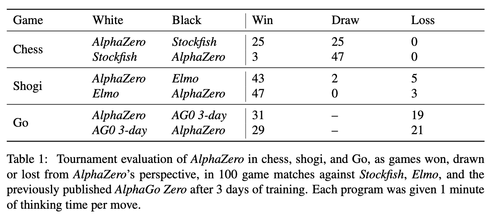

AlphaZero는 체스에서는 무패, 일본 장기에서는 8번의 패배와 2번의 무승부만을 기록하고 모두 승리했다. 바둑에서는 AlphaGo Zero가 선전했으나 역시 AlphaZero의 아성을 넘지 못한다. 

위 Elo 그래프를 보면 AlphaZero는 700k step만에 AlphaGo Zero의 스코어를 넘어섰다. 그리고 1:1 승부에서도 60:40으로 우세했다. 어떤 알고리즘 상의 차이가 이러한 결과를 만들었을까? 파라미터 업데이트에 따른 차이일까? 혹은 Go를 벗어난 일반화된 정보 처리의 결과일까. Data augmentation이 보통 성능에 +요소를 제공한다는 측면을 고려하면 아무래도 업데이트 방식에 따른 차이가 아닐까 싶다.

### Search Efficiency

Stockfish와 Elmo는 도메인 지식에 기반한 alpha-beta search를 사용해 수 읽기를 한다. alpha-beta search는 minimax 알고리즘을 사용해 탐색할 필요가 없는 경우의 수를 제외한다. AlphaZero는 alpha-beta search 대신 Policy Network로부터 가이드를 받는 Monte Carlo Tree Search를 사용한다. MCTS에 대한 자세한 내용은 뒤에서 알아보자.

두 알고리즘의 검색 범위를 비교해보면,

#### Chess

- AlphaZero - 80,000 positions per second
- Stockfish - 70,000,000 positions per second

#### Shogi

- AlphaZero - 40,000 positions per second
- Elmo - 35,000,000 positions

AlphaZero는 Stockfish나 Elmo에 비해 훨씬 적은 경우의 수를 탐색했다. 탐색한 경우의 가짓수만 보자면 alpha-beta search가 MCTS보다 더 나은 것처럼 보인다. 그러나 바둑이나 체스는 애초에 검색 공간이 너무 넓어 넓게 보는 것이 능사가 아니다. 오히려 검색 폭이 좁더라도 더 가능성있는 미래를 들여다보는 것이 더 나은 결과를 만들어 낼 수 있다. 논문에서도 AlphaZero는 검색 범위가 적은 대신 더 가능성있는 수읽기에 집중하는 "인간적인 접근"을 취했다고 설명한다.


### Discovering Chess Moves

요새 유행하는 게임의 메타나 빌드처럼 Chess에도 유명한 오프닝 무브가 있다. 우리 인간이 수백년 플레이를 해오면서 정립한 오프닝을 AlphaZero가 스스로 깨우칠 수 있을까?  

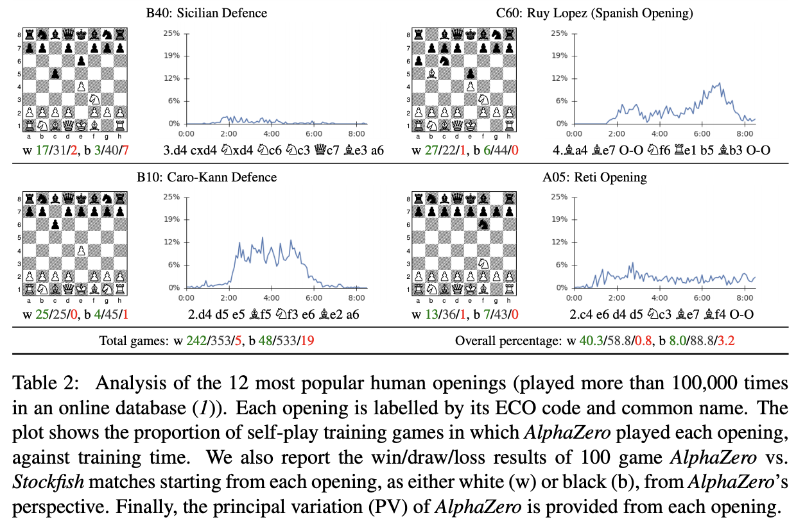

논문에서는 Chess 온라인 데이터 베이스에서 가장 인기있었던 12개 오프닝 무브가 AlphaZero의 학습 과정 중 발생하는지 트래킹해보았다. 위 그림을 보면 B10: Caro-Kann Defence는 학습 시작 후 2시간부터 6시간까지 약 10%의 Self Play에서 발생했음을 알 수 있다. 이런 결과를 보면 인간의 창의성, 직관이라는 것도 결국 수많은 경우의 수와 계산으로 표현할 수 있는것이 아닐까 싶다. 


## AlphaZero with TicTacToe

Udacity에서 Deep Reinforecement Learning 코스에서 제공하는 TicTacToe 예제로 AlphaZero의 동작 방식을 살펴보자.

### TicTacToe Environment

가장 간단한 TicTacToe는 가로세로 3x3 크기의 보드에서 두명의 플레이어(흑/백)가 번갈아 돌을 둔다. 가로, 세로 혹은 대각선으로 같은 색의 돌이 3개 연속 이어지면 해당 플레이어가 승리한다. ConnectN.py에 구현된 코드를 사용해 보드의 `size`와 승리 조건 `N`으로 게임을 아래와 같이 구성한다.

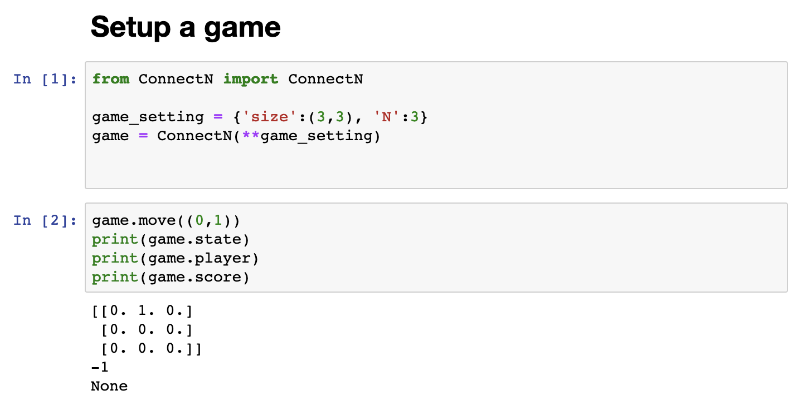

- game.move(coordinate) : 좌표를 입력해 수를 둔다.
- game.state : 현재 보드판의 상태를 리턴한다.
- game.player : 현재 플레이어를 리턴한다. 1, -1, 1, -1 순으로 번갈아 플레이어를 표시한다.
- game.score : 게임이 끝나지 않으면 None을, 끝나면 플레이어 1을 기준으로 승리(1), 패배(-1)를 리턴한다.

게임이 종료된 상태는 아래와 같이 출력된다.

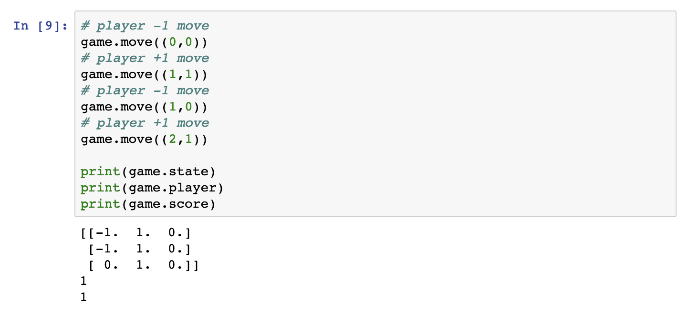


### Play Game Interactively

Play.py에는 Notebook cell에서 인터랙티브하게 게임을 실행할 수 있다. Player1혹은 2에 None을 입력하면 해당 플레이어를 사람이 직접 플레이할 수 있다. 여기에 AlphaZero를 사용한 플레이어를 함수로 만들어 넘기면 AI 대전이 된다.

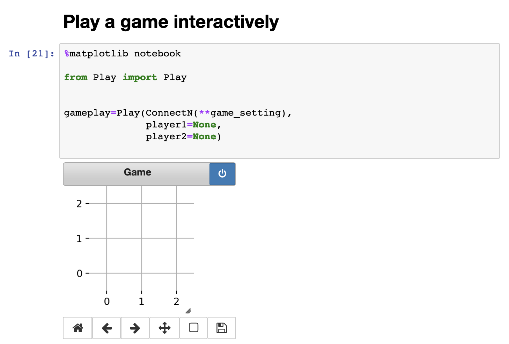


### AlphaZero Neural Network Architecture

AlphaGo Zero는 주어진 보드 state $s$ 에 따라 선택할 수 있는 action $a$ 의 확률 $p$ 와 그 state의 추정 가치 $v$를 리턴한다. 

이렇게만 놓고 보자면 Actor-Critic 모델과 비슷하다. 지난번 <a href="https://jsideas.net/ddpg_reacher/">RL Project: Reacher</a> 에서는 DDPG를 사용해 Reacher를 학습시켰다. 이때 최적의 행동을 학습하는 Actor와 해당 상황의 가치 추정을 학습하는 Critic은 별개의 네트워크로 구성되었다.

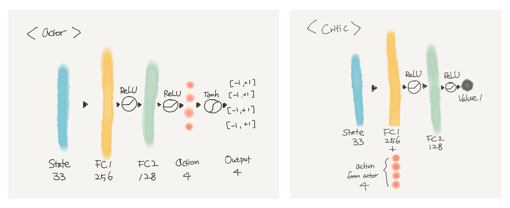

이에 반해 AlphaZero는 하나의 네트워크가 $p$ 와 $v$ 를 동시에 처리한다. TicTacToe를 구성하는 네트워크의 구조는 다음과 같다.

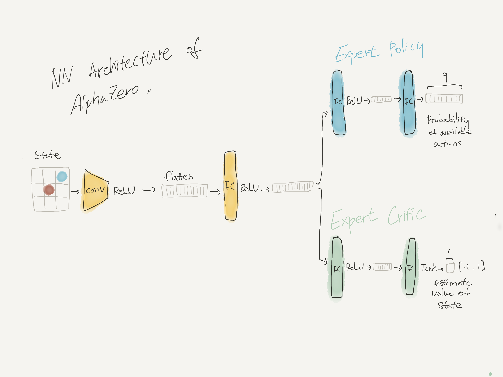


### Monte Carlo Tree Search

TicTacToe를 시작해 아래와 같은 상황에 처했다고 하자. 그 다음에는 어떤 수를 두어야 할까? Udacity의 Reinforcement Learning 강의자료를 사용해 정리해보았다.

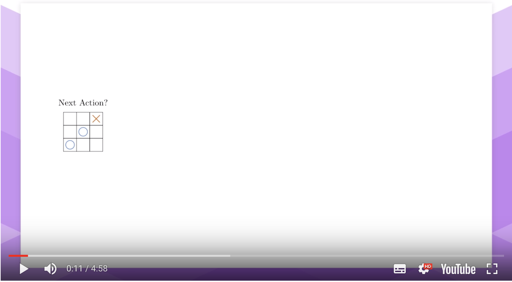

다음 수를 둘 때 우리는 앞으로 벌어질 미래를 시뮬레이션한다. 상대가 대응하기 어려운 수를 두면 승리할 가능성이 높아진다.

#### Brute Force

상대가 두기 어려운 수는 어떻게 알 수 있을까? 가장 쉬운 방법은 모든 경우의 수를 다 따져보는 것이다. 그리고 경우의 수를 끝까지 전개해서 승리하는 경우를 찾아 선택하면 된다.

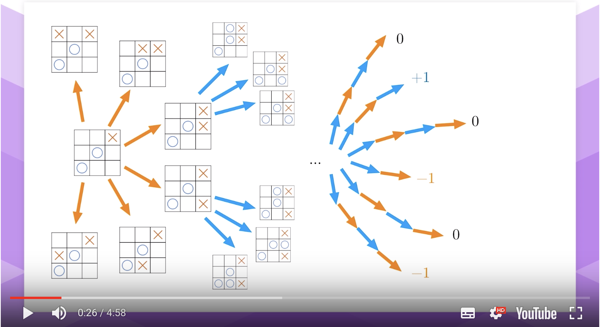

그런데 간단한 TicTacToe도 사실 모든 경우의 수를 돌려보기가 어렵다. 처음 수는 9개, 다음 수는 8개, 그 다음 수는 7개.. 이므로 TicTacToe의 모든 가능한 경우의 수는 9! = 362,880개에 달한다.

#### Random Sampling

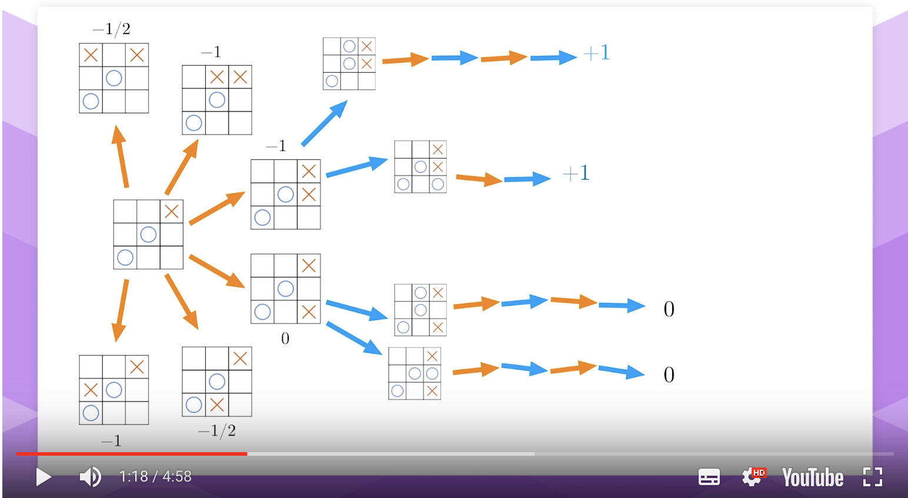

모든 수를 다 뒤져보는 것은 비효율적이므로 랜덤으로 샘플링을 해서 경우의 수를 줄일 수 있다. 랜덤으로 뽑은 샘플을 끝까지 플레이하여 그 결과의 기대값을 산출한다. 그리고 기대값이 가장 높은 다음 수를 선택하면 된다. 위 그림에서 위 2개는 파란색이 이기는 결과가 나오고, 아래 2개는 무승부가 나왔다. 파란색의 승리는 주황색 플레이어의 관점에서는 반대이므로 (-) 사인이 붙는다. 주황색의 입장에서는 패배보다는 무승부가 나으므로 선택할 수 있는 다음 state 중 가치가 가장 높은 0을 다음 state로 선택한다.

#### MCTS: Random Explorations with Exploitations 

완전 랜덤으로 샘플링하는 것은 여전히 비효율적이다. 랜덤으로 검색을 하더라도 어느정도 가이딩을 줄 수는 없을까? 랜덤으로 샘플링을 하더라도 좀 더 가능성있는 영역에 검색을 수행하는 것이 더 효율적일 것이다.

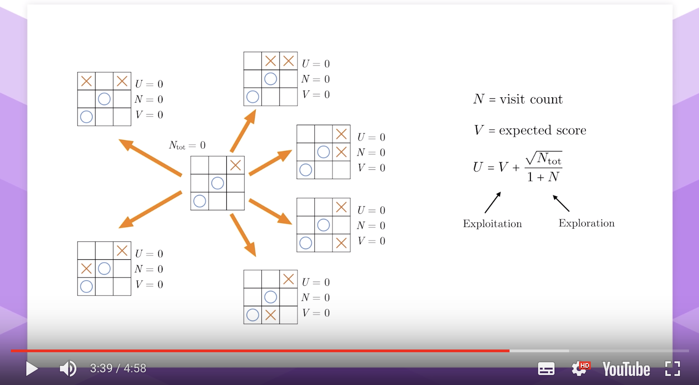

다시 처음 state로 돌아가보자. 이 state를 root 노드로 하는 tree 구조를 생각해보자. root 노드가 가질 수 있는 child 노드, 즉 가능한 다음 state는 위 그림처럼 6개가 된다. 이 6개의 선택지 중 가장 가능성이 높은 child 노드는 어떻게 알 수 있을까?

각 노드는 $U$, $N$, $V$ 값을 가진다. $N$ 은 해당 노드가 선택된 횟수 (visit count)이며, $V$ 는 해당 노드의 기대 스코어다. $U$ 는 $V + \frac{\sqrt{N_{tot}}}{1+N}$ 로 구한다. $N_{tot}$ 은 해당 child 노드의 mother 노드의 visit count가 된다. 

가능성이 높은 child 노드란 $U$가 큰 노드를 의미한다. $U$ 는 노드의 기대 스코어인 $V$ 에 비례한다. $V$ 가 큰 노드를 다시 방문한다는 것은 안전한 길을 가는 셈이다. 따라서 이는 Exploitation에 해당한다.

$\frac{\sqrt{N_{tot}}}{1 + N}$ 은 $N$ 이 작을수록 커진다. 즉, 해당 child 노드가 별로 선택되지 않았을수록 $U$ 가 커지므로 낮선 선택지를 탐색하게끔 만든다. 따라서 이는 Exploration에 해당한다.

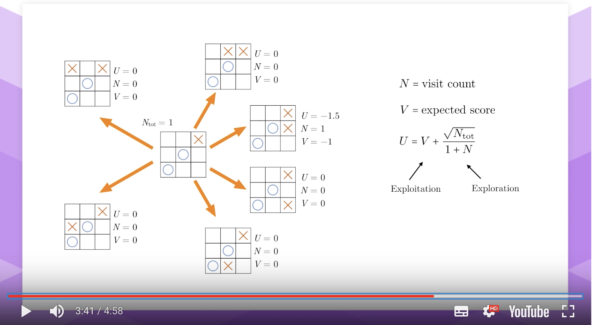 

아직 아무 child 노드도 방문하지 않은 최초에는 모든 child 노드의 $U$가 0으로 같다. 랜덤으로 오른쪽 위의 state를 택해 게임을 플레이한다. 그 결과로 $V=-1$ 을 얻었다. 해당 child 노드는 방문이 1회 이루어졌으므로 $N=1$ 로 업데이트한다. mother 노드 역시 $N_{tot}=1$ 로 업데이트된다. 이로서 해당 child 노드의 $U= -1 + \frac{\sqrt{1}}{1+1} = -0.5$ 가 된다. 아래에는 $U$가 -1.5로 오기되어있다.

해당 child 노드의 $U$ 를 업데이트한 이후에는 그 형제들인 sibling 노드들 역시 U를 업데이트할 수 있다. 나머지 형제들은 $N$ 과 $V$ 가 모두 0인 초기상태이므로 $U=1$ 이 된다. 

여기서 **다시** root 노드를 기준으로 다음에 선택할 child 노드를 찾는다. -0.5인 지난 child 노드를 제외하고 모든 노드의 $U=1$ 이므로 이중 하나를 랜덤으로 선택한다. 그리고 해당 선택한 노드에서 게임을 끝까지 플레이해서 $V, N, U$를 업데이트한다. 이 것을 정해진 Iteration 횟수만큼 반복한다. 

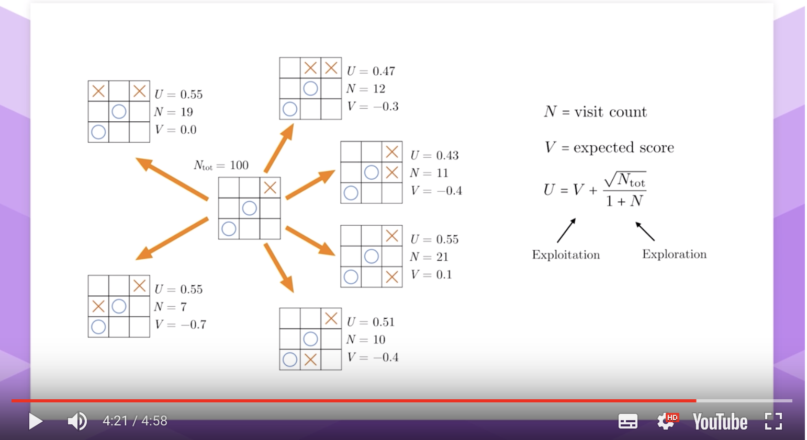

그리고 나면 위와 같이 각 child 노드의 $U, N, V$ 값이 업데이트된다. 

이제는 다음 수를 선택할 차례다. 어떤 수가 최적의 수일까? 앞에서는 $U$의 값이 가장 큰 child 노드를 선택했지만, $U$ 값은 $N$ 때문에 조금 불안정할 수 있다. 따라서 가장 많이 선택된, 즉 $N$ 이 최대인 child 노드를 선택한다. $U$ 가 높을수록 해당 노드가 선택될 가능성 역시 높아지므로 높은 $N$ 을 가진 child 노드는 그 기대값 역시 높다고 생각하면 된다. (그리고 조금 더 안정적이라고 한다.) 위 사례에서 $N=21$ 인 우하단 노드를 다음 수로 선택하게 된다.

#### MCTS: Going Deeper

지금까지 살펴본 것은 바로 직후 수에 대한 탐색 방법이었다. 더 멀리 내다보려면 어떻게 해야할까? Expansion과 Backpropagation을 사용한다.


다시 처음으로 돌아가보자. child 노드의 $U$ 가 모두 0이므로 랜덤으로 우하단의 노드를 골랐다. 이번에는 현재 플레이어가 이겨서 $V=1$이 된다.

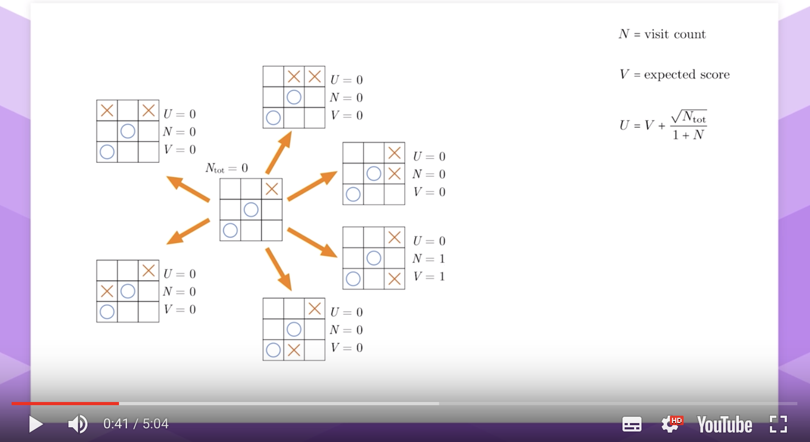

그리고 $N_{tot}=1$로, 나머지 sibling의 $U$ 도 업데이트한다.

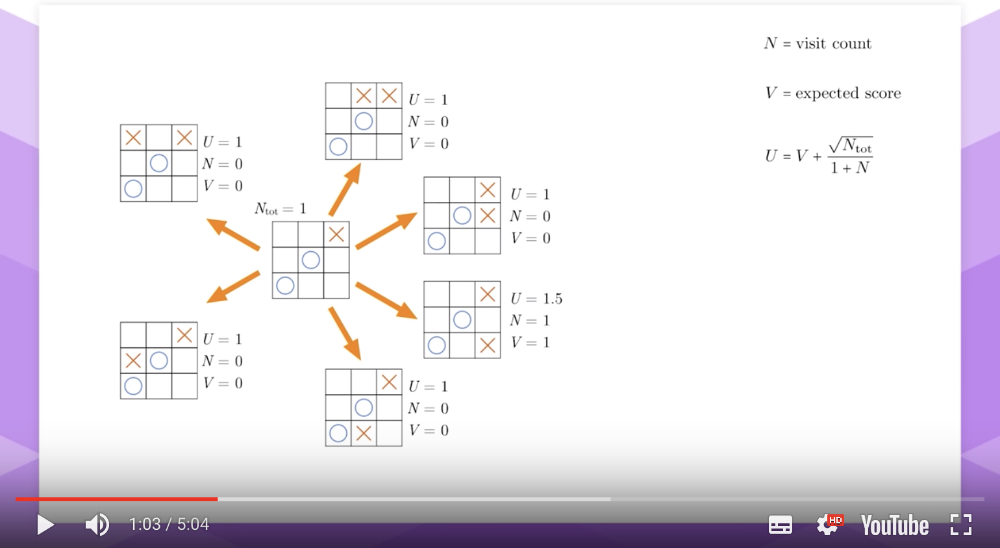

이로서 하나의 iteration이 끝났다. 이제 다시 root 노드에서 다음 child를 선택한다. 우하단 노드의 $U=1.5$ 이므로 이 노드를 선택한다. 그런데 노드는 방문 기록($N=1$) 이 있기 때문에, 이제 뎁스 더 들어가게 된다. 이를 Expansion이라 한다.

한 뎁스를 더 들어가서 여기서 가능한 child 노드를 살펴본다.

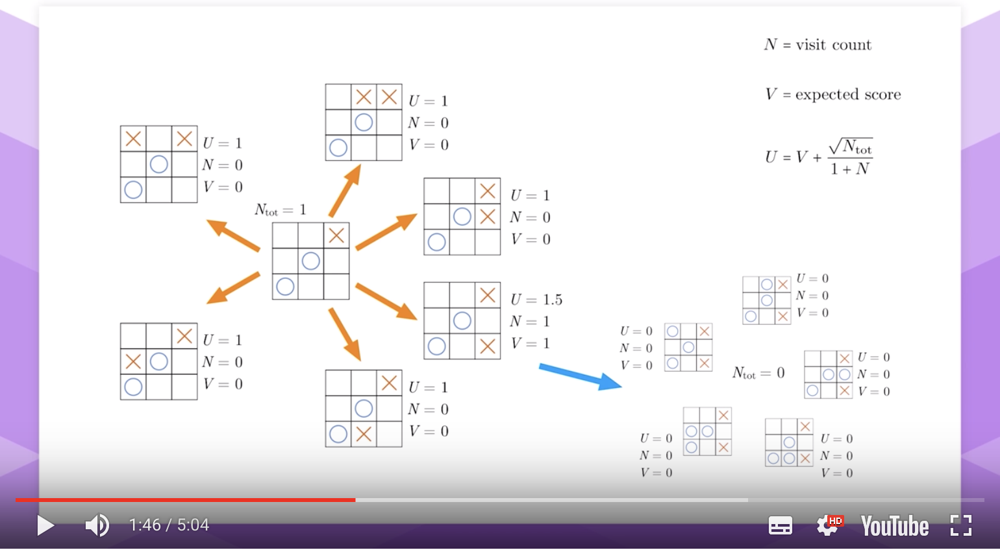

이전과 동일하게 $U, N, V, N_{tot} $ 를 모두 0으로 초기화한다. 그리고 다시 이중 $U$ 가 가장 높은 child 노드를 선택한다. 모두 값이 0이므로 랜덤으로 하나(확장된 노드 중 위 노드)를 잡아 끝까지 플레이한다.

 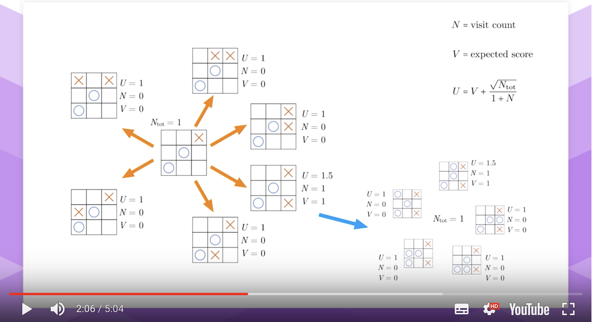

그 결과로 상대방(파란색) 플레이어가 이겼다. 해당 노드의 $V$, $N$, 그리고 $N_{tot}$ 을 업데이트하고, 나머지 sibling들의 $U$ 도 업데이트한다. 

이제 두번째 뎁스 레이어의 업데이트가 끝났으므로, 이 정보를 사용해 첫번째 뎁스 레이어의 정보를 업데이트한다. 이 과정을 Backpropagation이라 한다. 

두번째 뎁스는 첫번째 뎁스의 우하단 노드에서 시작했다. 따라서 두번째 뎁스의 정보를 사용해 해당 mother 노드의 $N, V$ 를 업데이트한다. 

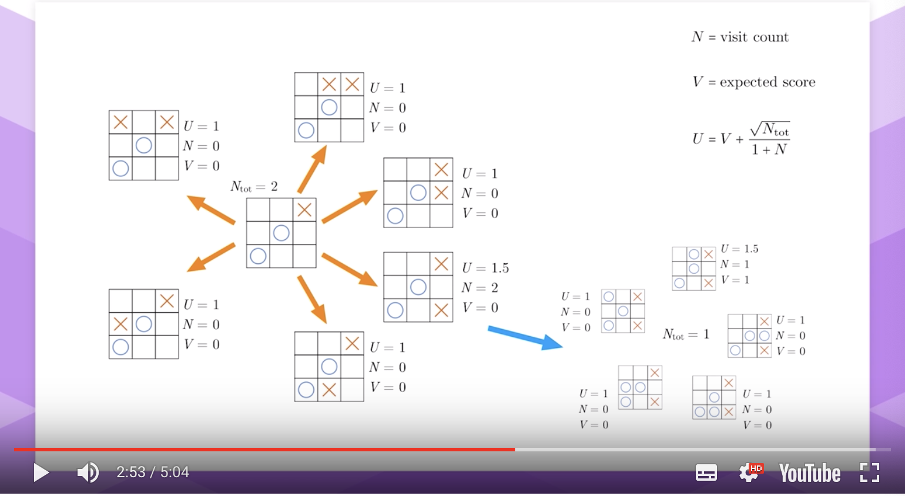

$N=2$ 로, $V=0$ 으로 업데이트된다. 왜 $V$ 가 1에서 0이 될까? mother.V += (-current.V - mother.V) / mother.N 으로 계산한다. 두번째 뎁스에서 선택한 노드는 current.V = 1이다. mother.V는 1이므로 새로운 mother.V는 $1 + (-1 - 1) / 2 = 0$이 된다.

첫번째 레이어의 child node의 N이 업데이트되었으므로, $N_{tot}$ 역시 2로 업데이트된다. 그리고 이제 첫번째 레이어의 sibling 노드의 $U$ 값을 아래와 같이 업데이트한다.


즉, 방문한 적 없는 노드에서는 끝까지 플레이를 실행한다.

방문 기록이 이미 있는 노드를 선택했다면 그 이후 가능한 다음 수를 모두 확장한 다음, 그 중 하나를 선택하여 끝까지 플레이한다. 확장된 레이어에서 나온 결과를 바탕으로 그 어머니 노드를 업데이트한다. 그리고 그 어머니 레이어의 모든 노드를 업데이트한다. 업데이트한 어머니 노드의 어머니 노드와 레이어가 존재한다면 마찬가지의 방식으로 계속 업데이트를 반복한다.

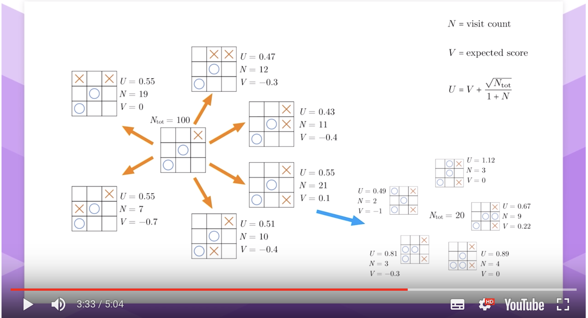

앞서 레이어 1개 예시와 마찬가지로, root 노드에서 실제 액션을 선택할 때 child 노드 중 $N$이 가장 높은 action을 선택한다. 이 경우 $N=21$ 인 노드가 되겠다.

Expansion과 Backpropagation을 통해 얻는 이점은, 다음 수를 선택한 이후에 MCTS를 다시 돌릴 때 완전히 처음부터 시작하지 않아도 된다는 것이다. 다음 수를 선택하고 나서 그 어머니 노드를 None으로 처리하면, 선택한 수를 root 노드로 하는 트리가 만들어진다. 이때 이전에 서치한 $U, N, V$ 를 그대로 계승하므로 더 효율적으로 탐색할 수 있게 된다.

아래 그림처럼 두번째 레이어가 첫번째 레이어가 된다.

 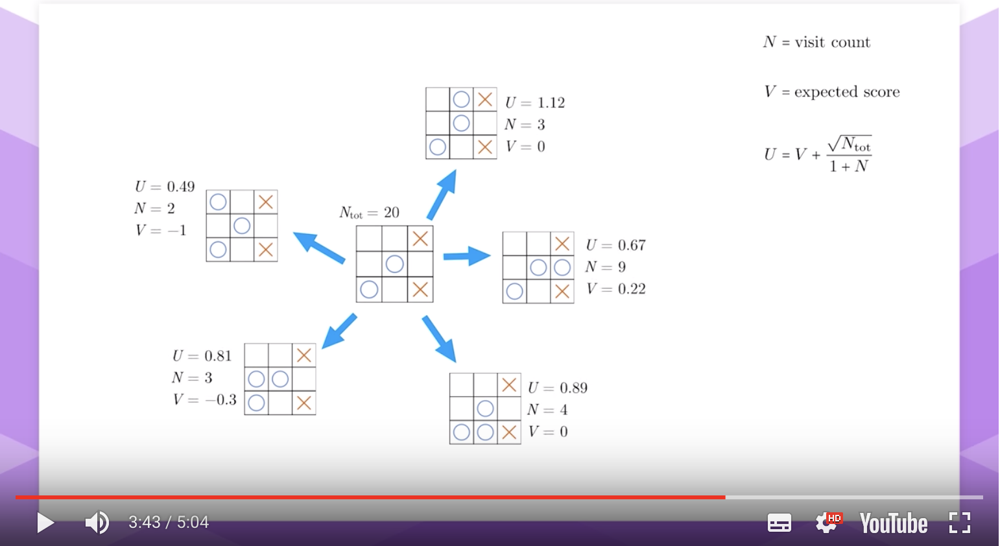

MCTS를 요약하자면 다음과 같다.

현재 state를 root 노드로 하는 트리를 생성하고 초기화한다. 그리고 지정한 Iteration 만큼 다음의 작업을 수행한다.

1. root 노드에서 시작해서 $U$ 가 가장 큰 child 노드를 반복적으로 선택한다.
2. 만약 노드의 visit count $N$ 이 0이라면 랜덤 게임을 끝까지 플레이한다. 아니라면 노드를 확장하고 거기서 선택한 랜덤 노드로부터 게임을 끝까지 플레이한다.
3. 확장된 레이어의 $N, V, U$ 를 업데이트하고 상위 레이어로 정보를 Backpropagate한다.

가장 방문 횟수가 높은 수를 선택한다.


#### AlphaZero : Guided Tree Search

그런데 바둑처럼 search space가 엄청나게 큰 게임은 MCTS로도 버겁다. 그래서 딥러닝을 사용해서 MCTS를 개선하는 방식을 쓴다. 앞서 네트워크 구조에서 설명한 것처럼 AlphaZero는 하나의 네트워크로 다음 수의 확률과 현재 state의 가치를 추정한다. 이를 각각 Expert Policy와 Expert Critic이라 한다.

- Expert Policy: $\pi_\theta(a_t \| (-1)^t s_t)$
- Expert Critic: $v_\theta((-1)s_t)^t$

-1이 들어가는 이유는 턴이 바뀔때마다 시점이 바뀌기 때문이다. 플레이 시점을 고정하면, 내 턴 직후 상대 턴의 state value가 높을 수록 내가 느끼는 가치는 떨어지게 된다. Chess, Go, Shogi 모두 1:1 승부이므로 $(-1)^t$ 로 간단히 턴 전환을 반영할 수 있다.

다음 액션의 확률을 학습하는 Expert Policy는 MCTS의 Exploration을 가이딩하는데 사용한다. MCTS와 AlphaZero를 비교하면..

- MCTS: $U = V + \frac{\sqrt{N_{tot}}}{1+N}$
- AlphaZerop: $U = V + c \pi_\theta(a_t \|(-1)^ts_t)\frac{\sqrt{N_{tot}}}{1+N}$

Exploration을 관장하는 두번째 텀에 Expert Policy가 들어간다. 즉, 낮은 방문 횟수 외에도 Expert Policy가 출력하는 해당 action의 확률이 높다면 해당 액션을 선택하게 된다.

그러면 Expert Critic은 어디에 쓰는 것일까? 

MCTS에서는 visit count가 0인 child 노드를 선택한 경우 랜덤으로 게임을 플레이해 그 결과인 V를 얻었다. AlphaZero에서는 게임을 실제로 플레이하지 않는다. 대신 Expert Critic을 사용해 V값을 구한다.

이외에는 MCTS와 동일하게 Expansion과 Backpropagation으로 노드의 값들을 업데이트한다.

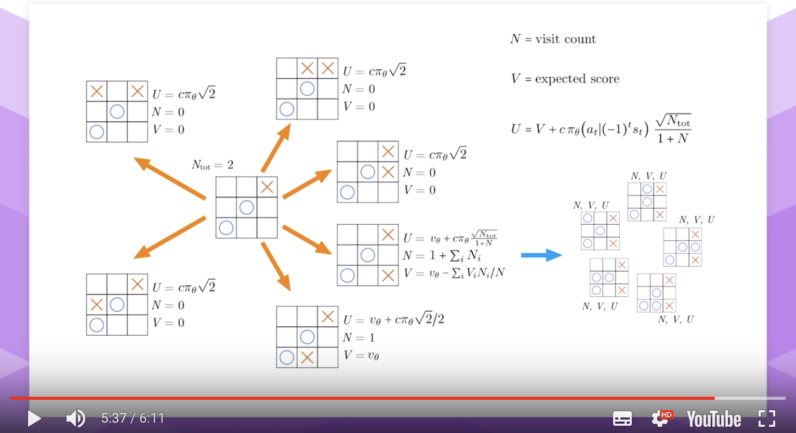

이터레이션이 진행될수록 트리는 계속 깊어지게 되고, 어느 순간 게임이 종료되는 시점이 도래한다. 이 시점에서는 $V$ 를 Critic 추정치가 아닌 실제 게임 결과를 사용한다. 

마구잡이로 플레이하는 것이 아니라 게임이 끝나지 않을 정도로 대응하면서 플레이를 한다. 그러나 NN이 학습되지 않아 멀리 내다보지 못하므로, 첫 수를 잘못 두어 뒤따르는 가불기를 피하지 못한다.

#### MCTS.py

TicTacToe는 MCTS.py에 정의된 Node 클래스를 사용해서 MCTS를 수행한다. 뒤에 간단히 소개할 학습 코드에서 MCTS를 통한 서치는 다음과 같이 게임 스코어가 정해질 때까지 수행된다.

```python
# 트리 초기화
mytree = MCTS.Node(ConnectN(**game_setting))
    
while mytree.outcome is None:
    # 50번 이터레이션을 돌면서 검색 공간 서치
    for _ in range(50):
        mytree.explore(policy)
        
    current_player = mytree.game.player
    mytree, (v, nn_v, p, nn_p) = mytree.next()        
    mytree.detach_mother()
```

여기서 `mytree.explore(policy)` 는 어떤 일을 수행하는 걸까?

```python
def explore(self, policy):

        current = self

        # child 노드가 이미 확장되었고 게임이 안끝났다면...
        while current.child and current.outcome is None:

            # 가장 U가 높은 child를 찾아 action으로 선택한다. 
            child = current.child
            max_U = max(c.U for c in child.values()) 
            actions = [ a for a,c in child.items() if c.U == max_U ]
            action = random.choice(actions)            

            # child 노드를 확장할 때 게임이 끝나면 승패에 따라 "inf", "-inf"가 할당된다.
            # 이때 explore는 무의미하므로 루프를 끝낸다.
            if max_U == -float("inf"):
                current.U = float("inf")
                current.V = 1.0
                break
            
            elif max_U == float("inf"):
                current.U = -float("inf")
                current.V = -1.0
                break
                
            # 그게 아니라면 선택한 child 노드로 이동한다.
            # 아직 while loop 안에 있으므로 다시 이동한 노드가 확장되었는지 체크하게 된다.
            current = child[action]
        
        # 만약 확장되지 않았다면..
        if not current.child and current.outcome is None:
            # policy outputs results from the perspective of the next player
            # thus extra - sign is needed
            # 다음 가능한 무브, NN을 사용한 probs와 v를 출력한다. 
            next_actions, probs, v = process_policy(policy, current.game)
            # 현재 state의 추정 value는 다음 상대턴의 추정치 * -1이 된다.
            current.nn_v = -v
            # 현재 노드를 확장하고 V값을 업데이트한다.
            current.create_child(next_actions, probs)
            current.V = -float(v)

        # 현재 노드의 방문 수를 1 증가시킨다.
        current.N += 1

        # 현재 노드에 부모 노드가 존재한다면 (즉, 확장한 노드를 타고 내려와있다면..)
        # 되돌아가서 부모 노드의 값을 업데이트해야 한다. Backpropagate
        while current.mother:
            mother = current.mother
            # 부모 노드의 N과 V를 업데이트한다.
            mother.N += 1
            mother.V += (-current.V - mother.V)/mother.N

            # 그리고 부모 노드가 가진 모든 child 노드의 U값을 업데이트한다.
            # current.U도 여기서 업데이트된다.
            for sibling in mother.child.values():
                if sibling.U is not float("inf") and sibling.U is not -float("inf"):
                    sibling.U = sibling.V + c*float(sibling.prob)* sqrt(mother.N)/(1+sibling.N)
            
            # current의 부모 노드로 이동한다.
            current = current.mother
```

Explore를 여기서는 50번을 수행하므로, 게임의 끝을 50번 보면서 MCTS의 값을 업데이트하게 된다.

`mytree.next()` 는 다음 노드를 선택해 current를 이동시킨다.

`mytree.detach_mother()` 는 이동한 후 남은 부모 노드를 None으로 만들어 없애버린다. 왜냐하면 이미 수를 두었기 때문에 정해진 과거를 다시 검색할 필요가 없기 때문이다.


### Loss Function

AlphaZero의 MCTS는 $U$를 계산할 때 Expert Policy와 Expert Critic을 사용한다. 그렇다면 Expert Policy와 Expert Critic의 파라미터는 어떻게 업데이트하는 것일까?

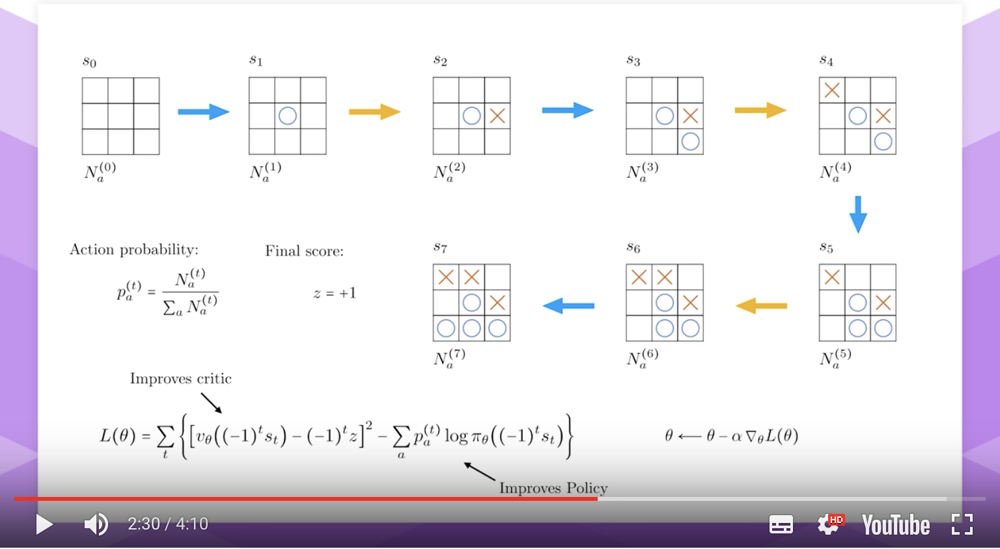 

처음 빈 보드에서 Policy와 Critic을 통해 MCTS를 실행하면, 그 결과로서 각 액션별로 MCTS 방문값인 $N_a^{(0)}$ 를 얻게 된다. 각 action의 $N$ 값을 전체 합으로 나눠주면 그 확률인 $p_a^{(0)} = \frac{N_0^{(0}}{\Sigma_aN_a^{(0)}}$를 얻을 수 있다. 

그리고 첫번째 수를 선택하고, 다시 MCTS를 돌린다. 이때 기존 트리를 승계하므로 처음부터 시작할 필요가 없다. 수를 두면 둘수록 검색 공간이 줄어들기 때문에 수 탐색이 더 수월해진다. 

MCTS 실행 - 수 선택의 과정을 게임 결과$z$가 나올때까지 반복한다. 위 그림에서 파란색 플레이어가 $s_7$ 에서 라인을 만들어 이겼다. actual outcome $z$ 는 +1이 된다. 

Expert Critic이 매 스텝 추정한 $V_\theta$ 는 Self Play를 통해 도달한 실제값 $z$ 에 비교할 수 있다. 파라미터 $\theta$를 학습해 $z$ 에 가까운 $V_\theta$ 를 출력하게 된다면, 끝까지 수를 두지 않고도 미래의 결과에 기반해 현재 state의 가치를 정확하게 측정하게 된다.

Expert Policy는 state $s$ 에서 취할 수 있는 action $a$ 의 확률 $\pi_\theta(a_t\|(-1)^ts_t)$을 리턴한다. MCTS도 탐색을 거쳐 각 action을 선택할 확률 $p_a^{(t)}$ 를 출력한다. Policy의 추론 확률이 MCTS의 결과와 비슷해진다면, policy가 MCTS에 더 정확한 가이딩을 줄 수 있게 된다.

종합하자면, AlphaZero의 학습 목표는 Expert Critic의 $V_\theta$ 와 실제 결과 $z$ 간의 오차가 작도록, Expert Policy $\pi_\theta((-1)^ts_t)$와 $p_a^{(t)}$ 간의 분포 차가 작아지도록 하는 것이다. 즉 Loss function은 다음과 같다.

$$L(\theta) = \Sigma_t \bigg\{ \color{red}{[v_\theta((-1)^ts_t) - (-1)^tz]^2} \color{blue}{ - \Sigma_a p_a^{(t)} \log \pi_\theta((-1)^ts_t)}  \bigg\} $$

즉, 매 시점별로 <span style="color:red">Expert Critic의 출력과 실제값간의 MSE Loss</span>와 <span style="color:blue">Expert Policy의 확률과 MCTS 확률간의 Cross Entropy</span> 를 모두 더한 것이 AlphaZero의 Loss가 된다.

논문에서는 여기에 L2 Regularisation인 $c \left\| \theta \right\|^2$ 를 더한다. $c$ 는 Regularisation의 강도를 조절하는 하이퍼 파라미터다. TicTacToe 구현에서는 이 대신에 constant term $\Sigma_t \Sigma_a p_a^{(t)} \log p_a^{(t)}$ 를 더해 $v_\theta^{(t)} = z$ 이고 $p_a^{(t)} = \pi_\theta(a\|s_t)$ 일 때 Loss가 완전히 0이 되도록 처리했다.

$$L(\theta) = \Sigma_t \bigg\{[v_\theta((-1)^ts_t) - (-1)^tz]^2 - \Sigma_a p_a^{(t)} \log \pi_\theta((-1)^ts_t)  \bigg\} - \Sigma_t \Sigma_a p_a^{(t)} \log p_a^{(t)} $$ 

$$L(\theta) = \Sigma_t \bigg\{[v_\theta((-1)^ts_t) - (-1)^tz]^2 - \Sigma_a p_a^{(t)} \log \pi_\theta((-1)^ts_t) - p_a^{(t)} \log p_a^{(t)} \bigg\}$$ 

$$L(\theta) = \Sigma_t \bigg\{[v_\theta((-1)^ts_t) - (-1)^tz]^2 - \Sigma_a p_a^{(t)} (\log \pi_\theta((-1)^ts_t) -  \log p_a^{(t)}) \bigg\}$$ 

$$L(\theta) = \Sigma_t \bigg\{[v_\theta((-1)^ts_t) - (-1)^tz]^2 - \Sigma_a p_a^{(t)} \log \frac{\pi_\theta((-1)^ts_t)}{p_a^{(t)}}  \bigg\}$$

두 확률이 서로 일치하면 $log1=0$이 되어 Cross Entropy Term도 0이 된다.


### AlphaZero Algorithm

AlphaZero는 다음과 같은 순서로 학습을 진행한다.

1. critic과 policy를 포함한 네트워크 NN을 생성한다.
2. MCTS로 게임을 플레이한다.
3. 앞서 정의한 $L(\theta)$ 를 구한 후, 이를 최소화하도록 Gradient Descent로 NN의 파라미터를 조정한다.
4. step 2-3을 반복한다.

이와 관련된 학습 코드는 아래와 같다.

#### NN architecture

```python
class Policy(nn.Module):

    def __init__(self):
        super(Policy, self).__init__()
        
        # 공용 레이어
        self.conv = nn.Conv2d(1, 16, kernel_size=2, stride=1, bias=False)
        self.size = 2*2*16
        self.fc = nn.Linear(self.size,32)

        # Expert Policy를 위한 레이어
        self.fc_action1 = nn.Linear(32, 16)
        self.fc_action2 = nn.Linear(16, 9)
        
        # Expert Critic을 위한 레이어
        self.fc_value1 = nn.Linear(32, 8)
        self.fc_value2 = nn.Linear(8, 1)
        self.tanh_value = nn.Tanh()
        
    def forward(self, x):
        # state x를 받아 공용 처리
        y = F.relu(self.conv(x))
        y = y.view(-1, self.size)
        y = F.relu(self.fc(y))
        
        # action 확률 처리 (3x3 가짓수에 대한 logit 도출)
        a = F.relu(self.fc_action1(y))
        a = self.fc_action2(a)
        # 이미 착수한 지점이 아닌 부분을 식별 (1 혹은 -1로 두므로 절대값이 1이 아닌 부분 식별)
        avail = (torch.abs(x.squeeze())!=1).type(torch.FloatTensor)
        avail = avail.view(-1, 9)
        
        # logit 중 최대값을 구함
        maxa = torch.max(a)
        # 지수를 씌울 때 값이 폭발하지 않도록 최대값을 빼주고, 착수 가능하지 않은 영역은 0으로 만듦
        exp = avail*torch.exp(a-maxa)
        # exp를 전체 합으로 나누어 확률로 변환
        prob = exp/torch.sum(exp)
        
        # state value 추정 (하나의 값 출력)
        value = F.relu(self.fc_value1(y))
        value = self.tanh_value(self.fc_value2(value))
        return prob.view(3,3), value
        
```


#### Training

```python
# 게임 생성
game=ConnectN(**game_setting)

# 1. critic과 policy를 포함한 네트워크 NN을 생성한다.
policy = Policy()
optimizer = optim.Adam(policy.parameters(), lr=.01, weight_decay=1.e-4)

# 4. 지정한 episode 만큼 반복해서 Self Play 실행
episodes = 400
for e in range(episodes):
    
    # 트리 초기화
	mytree = MCTS.Node(ConnectN(**game_setting))
    vterm = []
    logterm = []
    
	# 2. MCTS로 게임을 플레이한다.
    while mytree.outcome is None:
        # 50번 이터레이션을 돌면서 검색 공간 서치
        for _ in range(50):
            mytree.explore(policy)

        current_player = mytree.game.player
        # 다음 노드를 선택하고 현재 스텝에서의 v, nn_v, p, nn_p를 리턴
        mytree, (v, nn_v, p, nn_p) = mytree.next()
        # 이전 root 노드를 제거
        mytree.detach_mother()
        
        # Policy와 MCTS prob간의 Cross Entropy 계산
        loglist = torch.log(nn_p)*p
        constant = torch.where(p>0, p*torch.log(p),torch.tensor(0.))
        logterm.append(-torch.sum(loglist-constant))
        
        # Critic의 estimate value 저장
        vterm.append(nn_v*current_player)
        
    
    # 3. 앞서 정의한 Loss 를 구한 후, 이를 최소화하도록 Gradient Descent로 NN의 파라미터를 조정한다.
    # while loop는 게임 결과가 정해지면 종료되므로, outcome은 승리 혹은 패배가 된다.
    outcome = mytree.outcome
    # loss를 구한다. Critic의 예상과 실제 outcome간의 MSE와, 앞서 구한 CE를 step별로 스택하여
    # 모두 더한다.
    loss = torch.sum( (torch.stack(vterm)-outcome)**2 + torch.stack(logterm) )
    # loss를 Gradient Descent로 최소화시키도록 NN의 파라미터를 조정한다.
    optimizer.zero_grad()
    
    
```


## AlphaZero in TicTacToe

지금까지 AlphaZero의 NN Architecture와 MCTS 서치 구조, 그리고 Training 구조에 대해 코드로 간략히 알아보았다. 이를 한데 묶어 학습을 실행해보면 아래 그림과 같이 학습이 진행될수록 loss가 점차 감소하는 것을 확인할 수 있다.

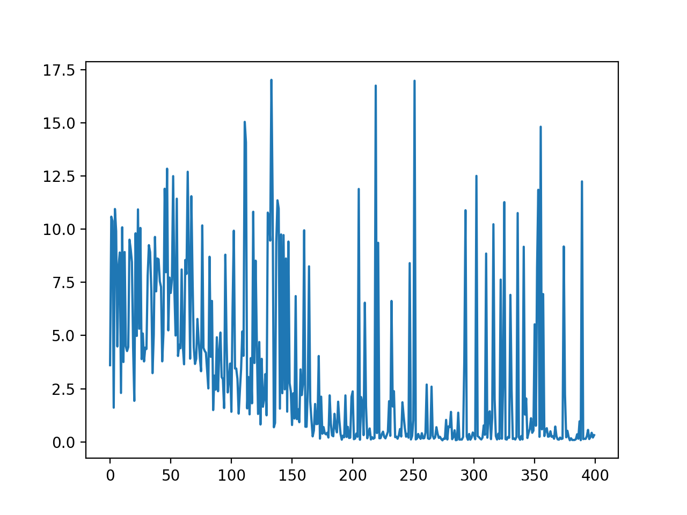

loss가 상당히 많이 튀긴 하지만 대체적으로 episode를 진행할수록 loss가 떨어지는 경향을 보인다. TicTacToe는 검색 공간이 큰 편은 아니라 1분 정도면 학습이 완료된다.

학습이 성과가 있었는지를 정성적으로 판단하기 위해, 학습 전과 후를 나누어 플레이해본다.

### Before Training

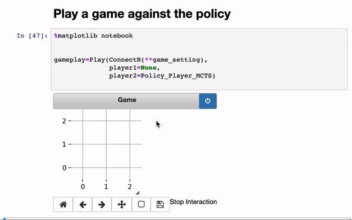

중앙 첫 수를 두고 대각선을 막아야 후속 공격이 차단되는데 AI가 이를 막지 못한다. NN이 학습되지 않아 MCTS 탐색에 가이드를 주지 못해 몇 수 앞을 내다보지 못한 듯 하다.

###After Training

#### AI 후공

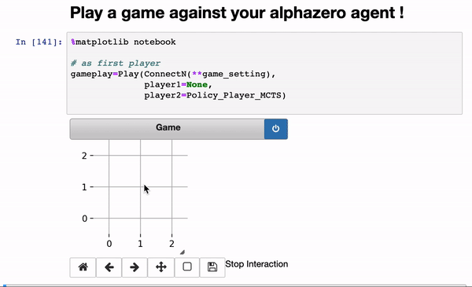

가불기에 더이상 당하지 않는다.

#### AI 선공

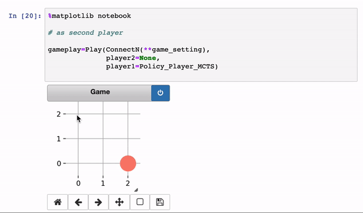

선공은 당연히 중앙이 유리하다고 생각했었는데 AI의 선공을 보고 하나 배웠다. 구석에서 시작했을 때 상대가 바로 맞닿아 수를 두지 않으면 반드시 승리하는 방법이 존재한다.. ㅎㄷㄷ 

또 학습을 여러번 시켜보았는데 이처럼 구석에서 선공하는 모델이 있는가 하면 내가 했던 것처럼 중앙에서 선공을 하는 모델도 나왔다. 매우 간단한 게임이지만 AlphaZero로 학습이 가능하다니 정말 신기하다.


## Outro

이번 포스팅에서는 Go의 틀을 벗어나기 시작한 AlphaZero에 대해 알아보았다. AlphaZero는 별도로 인간이 만든 도메인 지식을 전혀 사용하지 않고 기본 게임 룰에 기반해 스스로 전략을 학습한다. 덕분에 Go에 쓰인 네트워크 구조나 하이퍼 파라미터를 거의 그대로 Chess나 일본장기 문제에 사용할 수 있었다. 도메인 지식을 버리고 더 일반화했음에도 불구하고 AlphaZero가 기존의 최강 알고리즘을 몇시간 만에 앞지르는 것이 놀랍다. 업무나 개인적으로 데이터 모델링을 하며 도메인 지식은 당연히 필요하다고만 생각했었는데, Go처럼 시뮬레이션이 가능하고 목표가 명확한 문제에서는 인간의 고집을 잠시 내려두는게 답일 수도 있겠다는 생각도 든다.