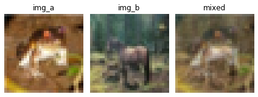
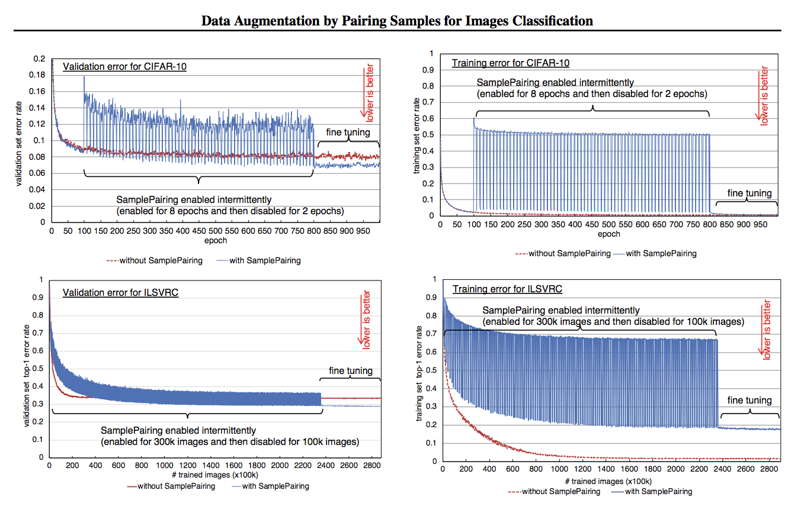
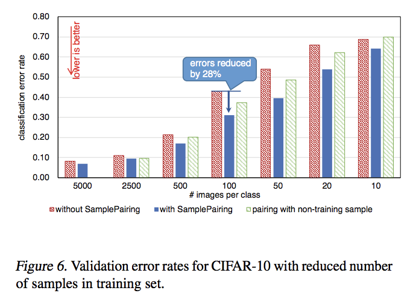
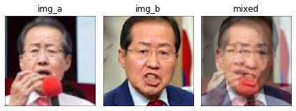
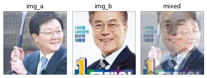
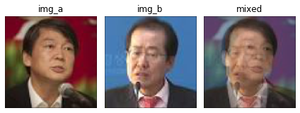
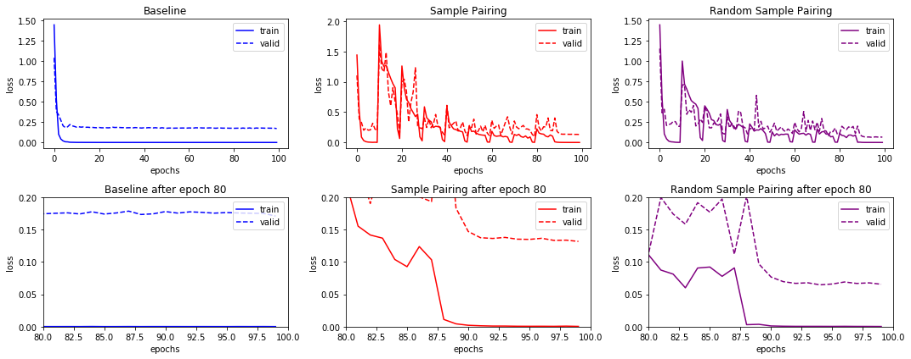
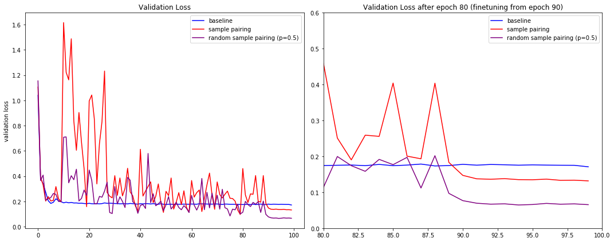
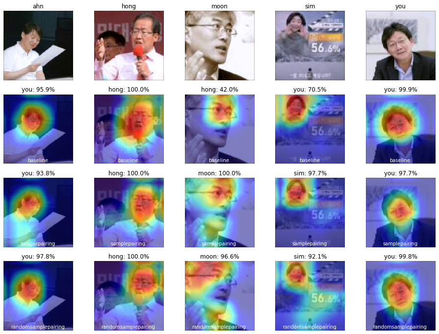

## Intro

It's hard to find image classifiers that do not employ Image Augmentation techniques. We can instantly explode the size of our dataset by flipping, rotating and changing colour intensity in our data loaders. Not only Image Augmentation free us from "is my dataset big enough?" it also gives a significant performance boost to the model performance.

There have been numerous ingenious papers on arXiv introducing novel Image Augmentation techniques. The one that recently drew my attention is <a href="https://arxiv.org/pdf/1801.02929.pdf">Data Augmentation by Pairing Samples for Images Classification"  </a> published by Hiroshi Inoue. This paper introduces a method called "SamplePairing".

<br>

## Sample Pairing

As its name suggests, Sample Pairing pairs a couple of sample images and feeds it to the model.



Sample Pairing takes the most naive approach of blending two images; taking an average of two images. And it only uses the first label and discards the second. It's so easy to implement. Here's my implementation in Pytorch.

```python
class SamplePairing(object):
    def __init__(self, train_data_dir, p=1):
        self.train_data_dir = train_data_dir
        self.pool = self.load_dataset()
        self.p = p

    def load_dataset(self):
        dataset_train_raw = vdatasets.ImageFolder(self.train_data_dir)
        return dataset_train_raw

    def __call__(self, img):
        toss = np.random.choice([1, 0], p=[self.p, 1 - self.p])

        if toss:
            img_a_array = np.asarray(img)

            # pick one image from the pool
            img_b, _ = random.choice(self.pool)
            img_b_array = np.asarray(img_b.resize((197, 197)))

            # mix two images
            mean_img = np.mean([img_a_array, img_b_array], axis=0)
            img = Image.fromarray(np.uint8(mean_img))
            
            # could have used PIL.Image.blend

        return img
```

<br>

### Performance Boost



The author of the paper ran the above experiments with CIFAR-10 and ImageNet dataset. We can see two interesting points.

1. The training and validation error soars when SamplePairing is enabled.
2. During the fine-tuning stage, the validation error of "with SamplePairing" outperforms the one without it.

<br>

### Why does it work?

SamplePairing introduces training goal related noises. The model is given a label "frog" with a weird image of a frog being overlapped by a horse. SamplePairing does not even use a weighted average that could provide more hints about the correct image. Simple averaging shows superior performance compared to other weighted average settings in the author's experiment.

In my view, SamplePairing functions as a strong regularizer that prevents the model from overfitting. SamplePairing's disruption to the training is much more severe than other regularization methods like L2-norm, as it gives wrong information to the model. If SamplePairing is turned on for the entire training period, the model will never be able to gain decent performance.

For this reason, the author suggests the following training schedule (CIFAR-10).

- Start training without SamplePairing (default augmentation) for 100 epochs.
- Enable SamplePairing for the next 700 epochs.
  - Turn SamplePairing ON for 8 epochs and OFF for 2 epochs
- Disable SamplePairing for the next 200 epochs (finetuning stage)

<br>

### Highly effective on small datasets

The author carried out an interesting side experiment to see how SamplePairing works on small datasets. He reduced the number of data points per class and measured the errors reduced by SamplePairing.



This interesting experiment result led me to try SamplePairing on my tiny `PredFaces` dataset that has around 400 to 500 images of 5 politicians.

<br>

## Dataset

`PredFaces` dataset is a collection of the faces of 5 famous politicians in South Korea who ran for president back in 2017. I crawled their images from Google and cropped faces into squares.


If you're interested in the current affairs, you can easily tell who won the election.

My `predfaces` dataset has less than 600 photos per person. The number gets even smaller after splitting them into train, validation and test dataset.

- train: 1,477
- valid: 184
- test: 154

All classes have roughly the same number of images. You can download the dataset from this <a href="https://www.floydhub.com/junkwhinger/datasets/predfaces">repo</a> on Floydhub.

<br>

SamplePairing transforms the faces as follows:

- when the classes of the two images are the same
  - 
- when the two come from the different labels
  - 
  - 

<br>

## Experiment Details

Here's my experiment setting.

### Model

Transfer learning is a way to go when your dataset is so small, but you want to get decent performance. I downloaded the pre-trained ResNet50 from torchvision and replaced the classifier with 1x1 conv and an average pooling layer

- pretrained feature extractor of ResNet50 (up to the 4th residual block) + 1x1 conv + average pooling

By doing so, I can use Class Activation Mapping to see where my model looks on a given image. This CAM-enabled model architecture is introduced by <a href="https://arxiv.org/abs/1804.06962">Adversarial Complementary Learning for Weakly Supervised Object Localization</a>. It's such a good read.

<br>

### Hyper-parameters for baseline

```yaml
tag: experiments/baseline_fh
data_path: /input
epochs: 100
batch: 128
optimizer:
  type: sgd
  lr: 0.01
  momentum: 0.9
  weight_decay: 0.001
samplepairing:
  use: False
```

Everything including the number of epochs, batch size and type of optimizer stays the same, apart from `samplepairing` part. 


My training schedule is as follows:

- start training without SamplePairing
- enable SamplePairing from epoch 10
- turn SamplePairing on for 8 epochs and off for the next 2
- disable SamplePairing from epoch 90

<br>

### Hyper-parameters for SamplePairing

```yaml
tag: experiments/samplepairing_fh
data_path: /input
epochs: 100
batch: 128
optimizer:
  type: sgd
  lr: 0.01
  momentum: 0.9
  weight_decay: 0.001
samplepairing:
  use: True
  start_from: 10
  on_off_period: [8, 2]
  finetuning_epoch: 90
  p: 1
```

<br>

### Hyper-parameters for RandomSamplePairing

Setting up the experiment, I got curious about how stochasticity would affect SamplePairing. What if an image has `p` chance to avoid SamplePairing? Would it lead to a better or worse result? I set the `p` as 0.5.

```yaml
tag: experiments/randomsamplepairing_fh
data_path: /input
epochs: 100
batch: 128
optimizer:
  type: sgd
  lr: 0.01
  momentum: 0.9
  weight_decay: 0.001
samplepairing:
  use: True
  start_from: 10
  on_off_period: [8, 2]
  finetuning_epoch: 90
  p: 0.5
```

<br>

### Experiment Metrics

I saved the best models from the above three variants in terms of `validation loss`. Because the validation dataset has a mere 184 images, the variants would record the same `validation error rate` when their `validation loss` differ.

<br>

## Result

### Train & Validation Loss 



- The use of SamplePairing causes training and validation error to fluctuate during the training.
- The fluctuation of the metrics is more severe with SamplePairing than RandomSamplePairing that turns off Image-level SamplePairing with 50% chance.
- The final validation errors of SamplePairing and RandomSamplePairing are lower than the one of baseline.
- The gaps between training and validation error reduced with SamplePairing, which proves that SamplePairing works as a regularizer that prevents overfitting.
- The fluctuating patterns became stable a lot faster compared to the experiment results in the paper. The small size of `PredFaces` dataset might have caused this difference.

<br>

### Test Error and Loss


- Sample Pairing recorded the lowest Test Error (1.9%) among the experiments. 
- Random Sample Pairing's test performance was on par with the baseline unlike the validation result.

<br>

### CAM Visualization

As we've witnessed in my experiment, SamplePairing contributes to better classification performance. But does it truly enhances the way the model classifies faces? To see how it affects the inner workings of the classifier, I used Class Activation Mapping that gives me some hints as to where the model looks.

The first row has 5 images from the test set with their labels. The second row shows the predicted labels and their corresponding probabilities predicted by the baseline model. The heatmap shows the image regions that the model maximally responded for its prediction results. For example, The baseline model thought the photo of `moon` was `hong`'s going by the glasses.

The third row and the fourth are from SamplePairing and Random SamplePairing, respectively.



- As found in the previous validation loss comparison, SamplePariing and Random SamplePairing make fewer classification errors than the baseline more. The baseline misclassified `ahn`, `moon` and `sim`'s photos. 
- From the heatmap, we can safely conclude that the model behaves as expected. The difference between SamplePairing and the baseline is not dramatic, but in some cases like `hong` and `you` SamplePairing generates more complete heatmaps.

<br>

## Outro

In this blog post, I explained how SamplePairing works and what it does to the model performance. As the author argued in the paper, SamplePairing helps reduce the final validation and test error, and it works fantastic with small datasets!


You can find the full training code on <a href="https://github.com/junkwhinger/SamplePairing">my github repository</a>.

<br>

## Reference

- <a href="https://arxiv.org/pdf/1801.02929.pdf">Data Augmentation by Pairing Samples for Images Classification</a>
- <a href="https://arxiv.org/abs/1804.06962">Adversarial Complementary Learning for Weakly Supervised Object Localization</a>