# Image Embedding with Triplet Loss

## Embedding

딥러닝 논문이나 포스팅을 보다보면 Embedding이라는 표현이 많이 나온다. `이미지나 텍스트를 임베딩한다`와 같은 표현으로 자주 쓰는데, 정확히 어떤 의미일까?

> An **embedding** is a relatively low-dimensional space into which you can translate high-dimensional vectors. Embeddings make it easier to do machine learning on large inputs like sparse vectors representing words. Ideally, an embedding captures some of the semantics of the input by placing semantically similar inputs close together in the embedding space. An embedding can be learned and reused across models.  
>
> <cite>https://developers.google.com/machine-learning/crash-course/embeddings/video-lecture </cite>

Embedding은 고차원의 정보를 상대적으로 낮은 차원으로 변환하는 것을 의미한다. 아무 숫자로 바꾸는 것이 아니라 **정보를 보존**해야 한다. <a href="https://jsideas.net/name_classifier/">Self Attention: 이름 분류기</a>에서 Self Attention을 사용해 Embedding한 이름들은 그들이 가진 맥락을 2차원 공간에서도 어느정도 드러냈다. 이름들은 성별에 따라, 그리고 발음에 따라 비슷한 것끼리 가깝게, 이질적인 것끼리는 서로 멀게 위치했다. 

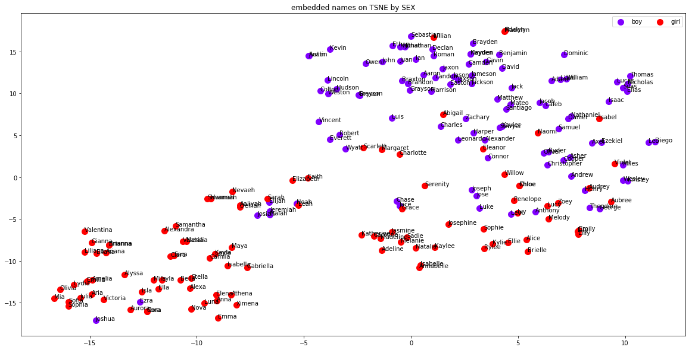

<cite>Self Attention: 이름 분류기 </cite>

 

## Image Embedding

텍스트처럼 이미지도 비슷한 것끼리 묶어볼 수 있을까? 고차원의 정보를 저차원으로 맵핑하는 기술은 TSNE와 같은 알고리즘을 이용해서 쉽게 해볼 수 있다. 예를 들어 1x28x28 크기의 손글씨 이미지를 TSNE로 돌려보면..

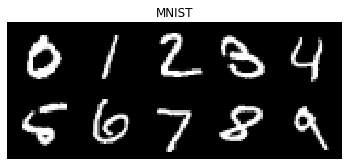

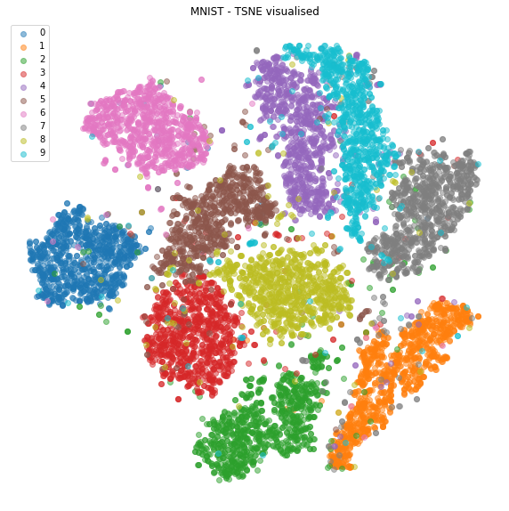

조금 노이즈가 있긴 하지만 꽤 그럴듯한 결과를 얻을 수 있다. TSNE는 아쉽게도 새로운 데이터에 대한 inference를 할 수 없다. 적어도 Sklearn의 구현체는 `transform`을 지원하지 않는다. 이러한 단점을 보완하면서 좀 더 빠르게 Embedding을 수행하는 <a href="https://umap-learn.readthedocs.io/en/latest/index.html">UMAP</a>이라는 방법이 최근에 나왔다. 파이썬 라이브러리로 개발되어서 매우 쉽게 사용할 수 있다.

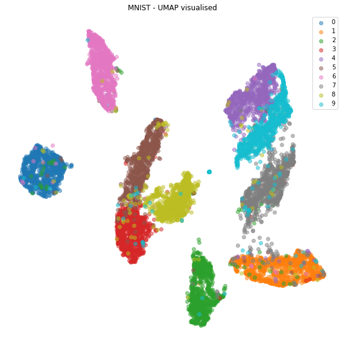 

UMAP을 이용한 군집화 결과도 꽤 그럴듯하다. 

TSNE와 UMAP을 이용해 더 복잡한 이미지도 클러스터링할 수 있을까? 이번에는 3x197x197 크기의 대선주자 이미지셋 (PredFaces)를 돌려보자.

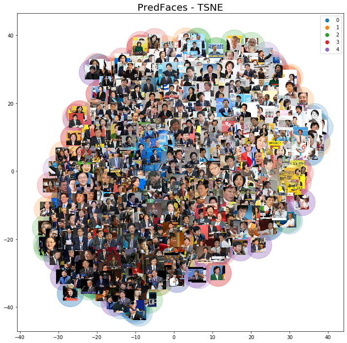

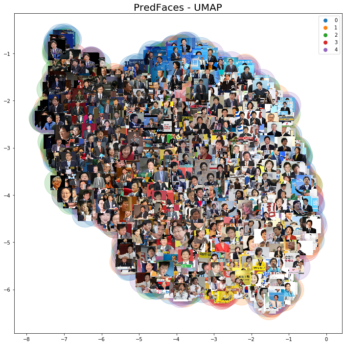

지배적인 색상별로 이미지가 뭉쳐서 멀리서 보기엔 비슷한 이미지끼리 뭉친 것처럼 보이지만, 자세히 뜯어보면 클래스가 뒤섞여있다. TSNE와 UMAP은 왜 군집화에 실패했을까? PredFaces의 피쳐 갯수는 116,427개(3x197x197)로 MNIST의 784개에 비해 훨씬 많지만 이미지 수는 1,477개로 MNIST 테스트셋(10,000)에 비해 매우 적다. 즉, 저차원으로 맵핑해야 하는 고차원의 복잡성이 대폭 증가했음에도 불구하고 그에 필요한 데이터셋은 더 적어져 차원의 저주에 걸려든게 아닌가 싶다. 또 TSNE나 UMAP은 이미지의 피쳐를 더 적은 수의 파라미터로 학습할 수 있는 Convolution 레이어를 쓰지 않았기 때문에 군집화에 더 어려움을 겪지 않았을까.

 

## Image Embedding with Deep Learning

TSNE와 UMAP은 복잡한 이미지를 저차원으로 압축하는데 적합하지 않았다. Embedding에 딥러닝을 이용해보면 어떨까? 

### 1) Embedding from Image Classifier

첫번째 방법은 Convolution 레이어를 사용한 이미지 분류기에서 Embedding을 추출하는 방법이다. 일반적인 딥러닝 이미지 분류기는 Convolution 레이어 등으로 구성된 feature extractor를 통해서 이미지의 특징적인 패턴을 추출하고, 이 패턴과 타겟 레이블간의 관계를 fully connected layer에서 학습한다. Feature Extractor를 통해 얻은 압축된 정보를 Embedding으로 사용해보면 어떨까? 

<a href="https://jsideas.net/samplepairing/">Sample Pairing 포스팅</a>에서는 Transfer Learning으로 PredFaces 분류기를 학습했다. 데이터셋이 매우 작기 때문에 ImageNet으로 학습한 ResNet50를 빌려온 다음, 맨 뒤의 Global Average Pooling과 Linear 레이어를 없애고, 1x1 Convolution 레이어와 Global Average Pooling을 붙여 재학습했다. Random Sample Pairing을 사용한 PredFaces Classifier 모델은 Test Error가 3.8%에 달할 정도로 학습이 잘 되었다.

PredFaces Classifier의 Feature extractor는 3x197x197 크기의 이미지를 받아 2048x7x7 크기의 피쳐맵을 출력한다. 이를 파라미터가 없는 Global Average Pooling 레이어에 통과시키면 이미지별로 2048개의 숫자를 얻게 된다. 이를 UMAP을 통해 2차원으로 변환해보자. 비교를 위해 먼저 재학습하지 않은 ImageNet 파라미터로 Embedding을 시각화해본다.

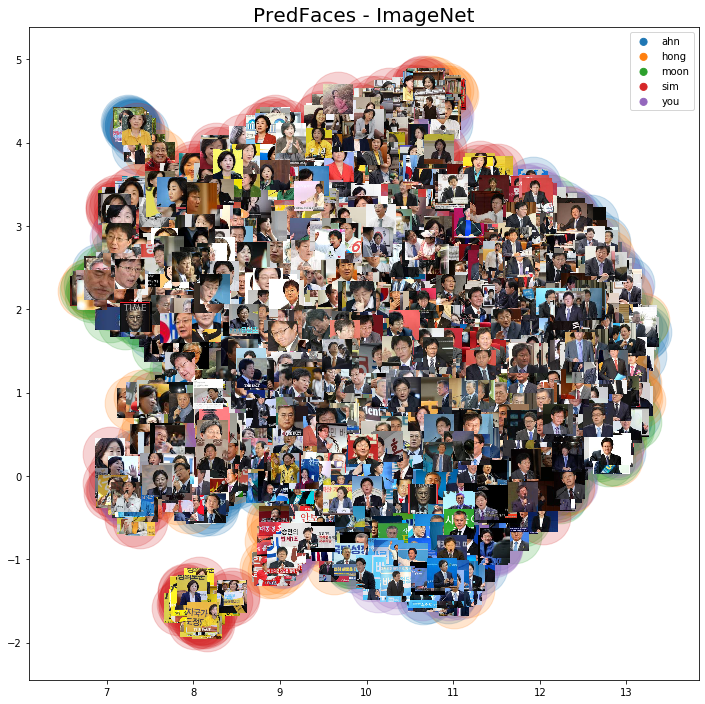

이미지넷 웨이트를 통한 Embedding은 이전 결과와 대동소이하다. 왜 그럴까? 이미지넷으로 학습한 모델은 자연물에 담긴 피쳐를 뽑는데 최적화되어있다. 그래서 위 결과는 사람의 얼굴에서 자연물의 특징적인 피쳐를 뽑아다 차원축소한 것에 지나지 않는다. 만약 군집화가 잘 되었다면 분류 성능을 높이려 FineTuning을 할 필요가 없었을 것이다.

이번에는 PredFaces Classifier를 통해 얻은 Embedding이다.

예상(?)보다 엄청나게 군집화가 잘 되었다. 동일 클래스 이미지간 거리(intra-class variance)도 좁고 다른 클래스간 거리(inter-class variance)도 적당히 넓다.

Embedding의 의미를 다시 생각해보자. 대선주자 이미지 분류기는 이미지를 입력받아 층을 지나면서 쓸모없는 정보는 버리고 중요한 정보를 추출한다. 그리고 이 정보를 사용해서 이 정보가 누구의 정보인지를 예측한다. 예측을 잘 한다는 것은 곧 그 사람 얼굴의 특징적인 정보를 잘 추출했다는 의미다. 뽑아낸 정보가 그 사람을 구별할 수 있을만큼 특징적이라면, 그 정보를 저차원으로 변환했을 때도 다른 정보와 잘 분리될 수 있어야 한다. 군집화 결과가 너무 잘나와서 당황스러웠지만, 테스트에러 3.8%를 생각해보면 납득할만한 결과이기도 하다. (위 결과는 학습 데이터에 대한 군집화다. 테스트 데이터에 대한 임베딩은 약간의 노이즈로 인해 조금 퍼져있으나 학습 데이터와 비슷한 분포를 보인다.)

 

## Image Embedding with One-Shot Learning

이미지를 좌표로 변환하는 것은 일반적인 딥러닝 분류기보다는 One-Shot Learning에서 더 적극적으로 사용된다. OneShot Learning은 그 이름처럼 클래스별 이미지가 한장씩있을 때 사용할 수 있는 방법이다. 예를 들어, 카메라로 얼굴을 인식해서 출입 여부를 결정하는 보안검문 소프트웨어를 만든다고 생각해보자. 일반적인 분류문제로 접근한다면, 출입 인가를 받은 100명에게 자기 사진 10,000장씩을 보내달라고 한 다음, 그 사람이 누구인지 혹은 출입 가능한 자인지 분류하는 모델을 만들어야 한다. 아, 그리고 대상자가 아닌 일반 사람들 이미지도 그만큼 필요하다. 더 큰 문제는 새로운 사람이 출입 대상이 되었을 때다. 이 사람에게서도 만장의 이미지를 받은 다음, 얼굴 분류 모델을 새로 학습해야 한다. 학습을 떠나서 이미지를 받다가 짤릴 것 같다.

One-Shot Learning은 이 문제를 더 경제적이고 흥미로운 방법으로 푼다. 사람별로 이미지가 한장 혹은 여러장 밖에 없어도, 새로운 사람이 추가되어도 재학습 없이 모델을 사용할 수 있다는 것이 장점이다. 기본적으로 One-Shot Learning 모델은 이미지를 저차원의 벡터로 변환한다. 동일한 사람의 이미지 2장를 모델에 밀어넣었을 때 얻는 두 벡터간의 거리가 일정 threshold보다 낮다면 이 둘을 같은 사람의 이미지로 판정하는 방식이다. 이 모델은 분류를 위한 것이 아니라 임베딩을 잘 하는 것을 목표로 한다.

임베딩을 잘 하려면 어떻게 학습에 피드백을 줘야 할까? 누구인지 맞추는 것이 아니므로 Softmax loss function을 쓰지 않는다. 대신, 두 이미지가 같은 사람이라면 거리가 작아지도록, 다른 사람이라면 거리가 멀어지도록 가이드한다. 같거나 다른 클래스의 이미지를 어떻게 받느냐에 따라 여러 loss function을 사용할 수 있다. https://gombru.github.io/2019/04/03/ranking_loss/에 잘 정리된 내용에 몇가지 살을 붙여 정리해보면..

- Contrastive Loss: $L(x_0, x_1, y) = y \|f(x_0) - f(x_1)\| + (1-y)max(0, m - \|f(x_0) - f(x_1)\|)$
  - Contrastive Loss는 $x_0$, $x_1 $ 두 개의 이미지를 사용한다.
  - 두 이미지 $x_0$과 $x_1$가 같은 클래스라면 $y$는 1, 다르다면 0이다. 
  - 두 이미지가 같다면 앞 텀만 남고, 모델 $f$를 통과한 임베딩간의 거리가 클수록 로스가 커지게 된다.
  - 반대로, 두 이미지가 다르다면 뒷 텀이 살아나고, 둘 사이의 거리가 마진 $m$보다 작으면 로스가 0 이상이 된다.
  - 즉, 서로 같은 클래스라면 거리가 작아지도록, 다르다면 거리가 m 이상이 되도록 가이드하는 로스라고 보면 된다.
- Triplet Loss: $L(x_a, x_p, x_n) = max(0, \|f(x_a) - f(x_p)\| + m - \|f(x_a) - f(x_n)\| ) $
  - Triplet Loss는 $x_a, x_p, x_n$으로 구성된 세쌍둥이를 사용한다.
  - $x_a$는 대상 이미지이며, 이와 같은 클래스의 이미지를 $x_p$, 다른 클래스의 이미지를 $x_n$이라 한다.
  - Contrastive Loss가 같은 이미지와 다른 이미지 페어 둘 중 하나를 선택해 로스를 구한다면, Triplet Loss는 이를 한번에 구한다.
  - 같은 이미지간 거리 $\|f(x_a) - f(x_p)\|$ 가 클수록, 다른 이미지간 거리$\|f(x_a) - f(x_n)\|$ 가 마진 m보다 작을수록 로스가 커지는 구조다.  
- Quadruplet Loss: $$L(x_a, x_p, x_{k}, x_{l}) = max(0, \|f(x_a) - f(x_p)) + m_1 - \|f(x_a) - f(x_n) \|) + max(0, \|f(x_a) - f(x_p)\| + m_2 - \|f(x_l) - f(x_k) \|)$$
  - Quadruplet Loss는 네쌍둥이를 사용한다.
  - $x_a$는 대상 이미지이며, 같은 클래스 이미지를 $x_p$로 둔다. $x_k$와 $x_l$은 대상 이미지와 다른 클래스의 이미지들인데, 이들은 서로 다른 클래스에 속한다. 즉, Quadruplet Loss는 3가지 다른 클래스의 이미지들을 사용한다.
  - 첫번째 텀은 Triplet Loss와 같다. 같은 이미지간 거리는 짧게, 다른 이미지간 거리는 $m_1$ 이상이 되도록 한다.
  - 두번째 텀은, 같은 이미지간의 거리를 짧게, 서로 다른 네거티브 이미지간의 거리가 $m_2$ 이상이 되도록 유도한다.
  - 즉, Quadruplet Loss는 클래스가 3개 이상일 때 클래스간 복합적인 관계를 더 반영한다고 볼 수 있다.

이러한 Loss를 사용해 학습할 때 마주치는 최대의 난관은 이미지 묶음을 만들어내는 것이다. 이미지 페어, 트리플렛, 쿼드루플렛을 무작정 찍어내면 이미지의 갯수가 조금 늘어나도 그만큼 조합의 수가 많아진다. 또 묶음의 적합성이 학습에 큰 영향을 미치기도 한다. 따라서 학습 전에 묶음을 만들어두기보다는, 여러 클래스로 구성된 미니배치를 모델에 통과시켜 임베딩을 얻은 다음, 그 안에서 적절한 pair, triplet, quadruplet을 만들어내는 online mining을 최근에는 많이 사용한다.

https://github.com/adambielski/siamese-triplet</a>를 살펴보니 online mining을 할때 포지티브 샘플은 모두 사용하고, 네거티브 샘플은 대상 이미지와의 거리에 따라 easy, semi-hard, hard로 구분하여 선택한다. 어떤 방식으로 네거티브 샘플을 골라야 할까?

<a href="https://arxiv.org/pdf/1901.08616.pdf">In Defense of the Triplet Loss for Visual Recognition</a> 논문에서는 semi-hard를 선택하면서 다음과 같이 설명한다.

> An easy negative satisfies the margin constraint and suffers a zero loss. Unlike hard-sampling, semi-hard sampling supports a multi-modal embedding. ... Hard sampling picks the farthest positive and nearest negative without any consideration for the margin.

또 다른 논문인 <a href="https://arxiv.org/pdf/1704.01719.pdf">Beyond triplet loss: a deep quadruplet network for person re-identification</a>에서는 semi-hard > easy > hard 순으로 우선순위를 두어 네거티브 샘플을 선택했다고 한다. 

샘플링 방식에 따른 차이를 알아보기 위해 나는 Random Negative 모델과 semi-hard를 우선 선택하는 모델을 학습했다.

Random Negative - Triplet Loss로 임베딩한 결과를 살펴보자.

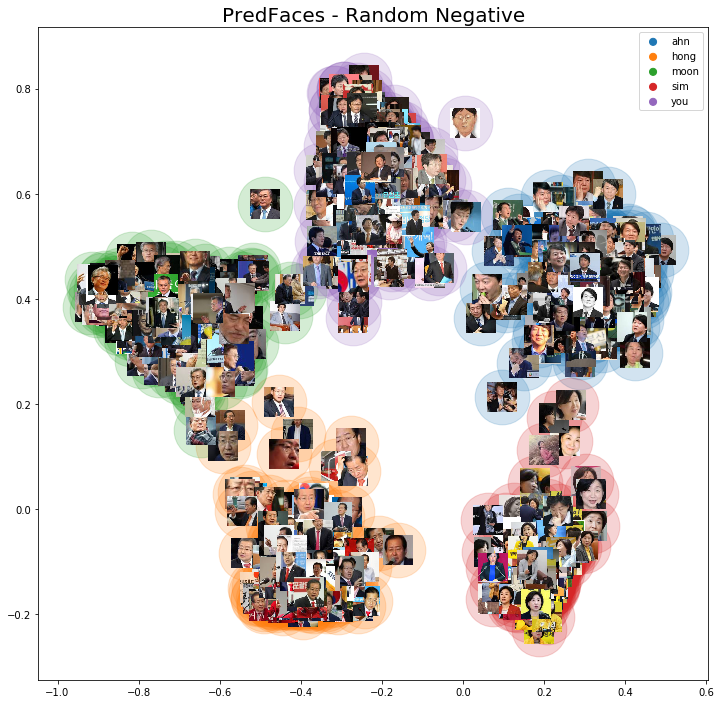

분류기로 만든 군집화만큼 뭉치지는 않았지만 그래도 같은 클래스끼리 적당히 잘 뭉친 형태가 드러난다.

이번에는 Semi-hard Negative - Triplet Loss의 결과를 살펴보자.

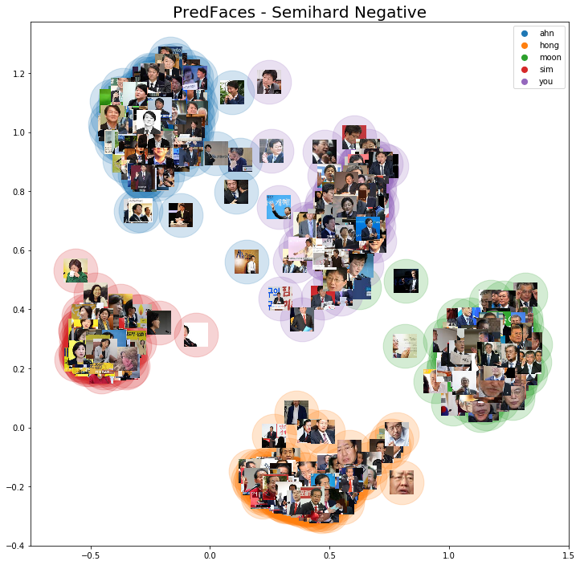

이전 결과와 비슷하나 같은 이미지끼리 더 뭉치는 경향성이 보인다. 왜 그럴까? Random Negative 모델은 트리플렛을 만들때 다른 클래스라면 아무거나 가져다 쓴데 반해, Semi-hard Negative 모델은 대상 이미지와 Negative 이미지간의 거리가 Positive 이미지와의 거리보다는 멀면서도 그 격차가 마진보다는 작은, 적당히 어려운 페어를 찾는다. 따라서 Semihard 모델은 클래스간 거리를 벌릴 수 있는 페어를 더 많이 찾게 되고 결과적으로 클래스간 거리가 먼 형태로 임베딩을 학습하게 된다. 

## Face Identification with Image Embedding

지금까지 여러 모델을 사용해서 PredFaces 이미지 데이터를 군집화해보았다. `동일 클래스간 거리는 좁게, 다른 클래스간 거리는 멀게`라는 관점에서 보면, PredFaces Classifier로 만든 이미지 분류기의 성능이 가장 좋은 것처럼 보인다. 그렇다면 새로운 이미지가 주어진다면 어떨까? 학습한 이미지와는 전혀 다른 사람들의 얼굴이 주어진다면, 모델은 새로운 이미지를 그에 합당한 벡터로 변환할 수 있을까? 벡터간 거리를 이용해서 새로운 이미지의 클래스를 잘 식별할 수 있을까?

실험을 위해 우리집 거주자들의 사진으로 구성된 Jastills 데이터셋을 만들었다.

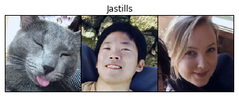

먼저 데이터셋을 각 모델에 넣고 돌려 임베딩을 뽑은 결과를 살펴보자. 2차원으로 임베딩하는 Triplet Loss 모델과 달리 ImageNet Weight와 PredFaces Classifier는 2048 차원으로 임베딩한다. 2048차원을 2차원으로 압축하는 과정도 모델에 포함하는 의미에서, UMAP은 PredFaces의 train 데이터로 학습시켜 Jastills에 적용한다.

### ImageNet Pretrained Model

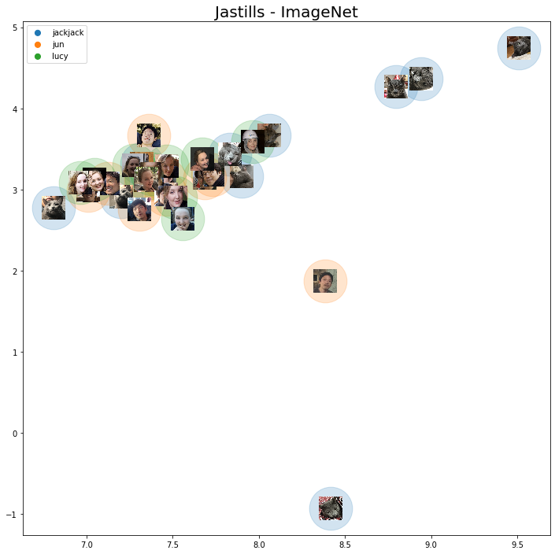 

### PredFaces Classifier

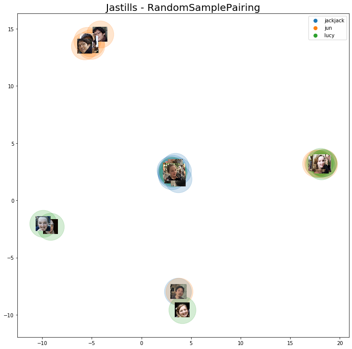

PredFaces 데이터셋과 마찬가지로 이미지넷 웨이트를 그대로 가져다 쓴 것보다 성공적으로 학습한 분류기의 feature extractor를 따다가 쓴 것이 더 군집화가 잘 된 듯 하다. 새로운 데이터에도 임베딩이 잘 동작하는 것처럼 보이지만.. Predfaces를 임베딩했던 결과를 다시 살펴보자.

위 아래 그림을 왔다갔다해보면 데이터들이 뭉치는 포인트가 완전히 포개지는 것을 알 수 있다. 즉, 분류기를 가공해 만든 임베딩은 분류기가 설정한 바운더리안에 종속된 형태로 작동하고 있다. 정치와는 거리가 먼 우리집 고양이 얼굴이 들어가더라도 대선주자 얼굴 분류기는 그 안에서 열심히 문재인과 홍준표의 일부분을 찾으려 한다.

### Random Negative - Triplet Loss

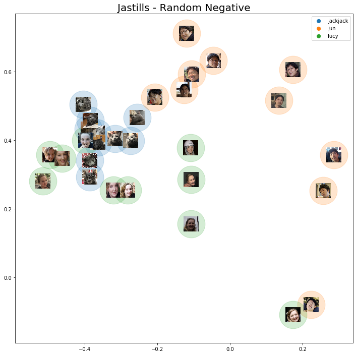

### Semihard Negative - Triplet Loss

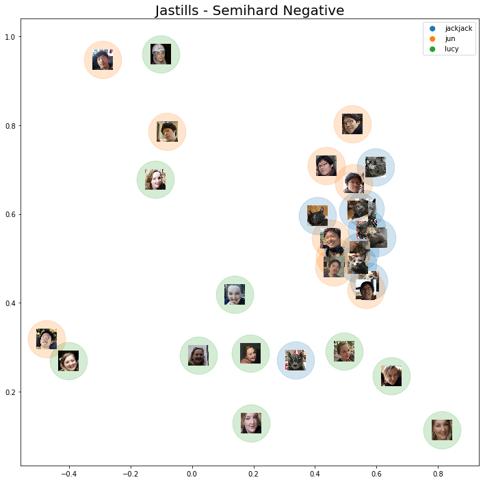

Triplet Loss로 학습한 두 모델은 기존 데이터의 바운더리에 종속되지는 않는다. 이미지 분류기 임베딩에 비해 같은 클래스끼리 뭉치는 정도가 많이 약하지만, 어느정도 비슷한 이미지끼리 가까이 위치한 느낌이다. 적어도 다른 종은 잘 알아보는 듯 하다.

## Evaluation with KNN

이번에는 보다 더 정밀하게 새로운 데이터에 대한 모델들의 성능을 측정해보자. 각 모델이 데이터를 임베딩한 결과를 `KNN(n_neighbors=3)`을 사용해 학습한 다음, 이를 그대로 학습 데이터에 적용해 레이블을 예측한다. 군집화가 잘 되었다면 주변의 가까운 이미지만으로 원래 레이블을 예측할 수 있을 것이고, 반대로 그렇지 않다면 예측 정확도가 낮게 나올 것이다.

PredFaces와 Jastills 데이터로 측정한 예측 정확도는 다음과 같다.

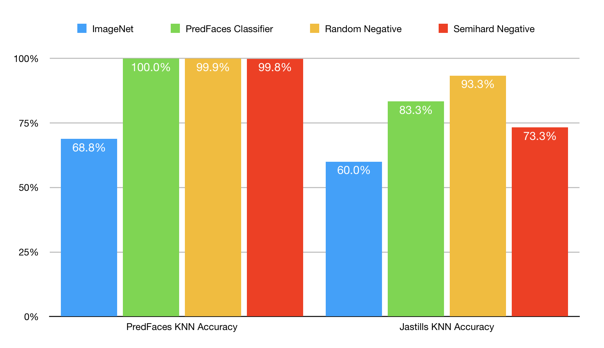

PredFaces 데이터셋은 이미지넷을 제외한 모든 모델이 높은 정확도를 보였다. 특히 PredFaces Classifier는 학습 데이터에는 Test Error가 0%에 수렴했으므로 이와 같은 결과가 놀랍지 않다. Triplet Loss로 모델링한 두 모델도 분류기에 못지 않는 성능을 보였다. 같은 것끼리는 가깝게, 먼 것끼리는 멀게 학습해도 분류기의 임베딩으로 사용할만한 결과라고 볼 수 있다.

두번째는 Jastills 데이터셋이다. 흥미롭게도 내가 가장 큰 기대를 걸었던 Semi-hard Negative 모델의 예측정확도가 PredFaces Classifier보다 더 낮게 나왔다. 다행히도 Random Negative 모델의 성능이 93.3%로 가장 좋게 나와 근 2주간의 노력이 조금은 보상받은 것 같다.

어째서 PredFaces 모델의 Jastills 예측정확도가 Semihard Negative 모델에 비해 더 좋게 나온 것일까? 첫번째 원인은 Jastills 데이터셋의 클래스 갯수에 있지 않을까. PredFaces Classifier가 새로운 이미지들을 대선주자 얼굴 위치에 강제적으로 피팅했음에도 불구하고, 클래스 수가 적기 때문에 예측 정확도가 운좋게 높은 수준을 유지했다고 본다. 또 PredFaces Classifier의 임베딩 자체가 어느정도 잘 작동하는 부분도 영향을 미쳤을 것이다.

두번째 원인은 Triplet Loss 모델이 사용한 PredFaces 학습 데이터에 있다. 새로운 얼굴 데이터도 잘 인식하는 모델을 만들려 했다면 5명의 얼굴이 아니라 적어도 수백명 이상의 얼굴 데이터셋을 사용했어야 한다. 모델이 일반적인 얼굴이 갖는 특성을 학습했다면 아마 더 좋은 결과를 얻을 수 있지 않았을까.

## Reference

- https://towardsdatascience.com/neural-network-embeddings-explained-4d028e6f0526
- https://github.com/adambielski/siamese-triplet
- https://gombru.github.io/2019/04/03/ranking_loss/
- <a href="https://arxiv.org/pdf/1901.08616.pdf">In Defense of the Triplet Loss for Visual Recognition</a>
- <a href="https://arxiv.org/pdf/1704.01719.pdf">Beyond triplet loss: a deep quadruplet network for person re-identification</a>
- https://developers.google.com/machine-learning/crash-course/embeddings/video-lecture
- https://towardsdatascience.com/one-shot-learning-with-siamese-networks-using-keras-17f34e75bb3d
