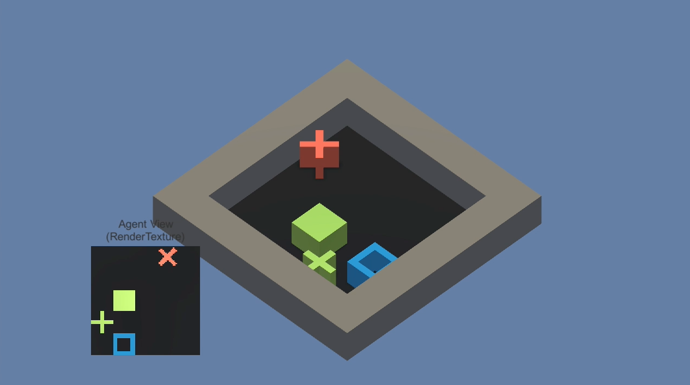
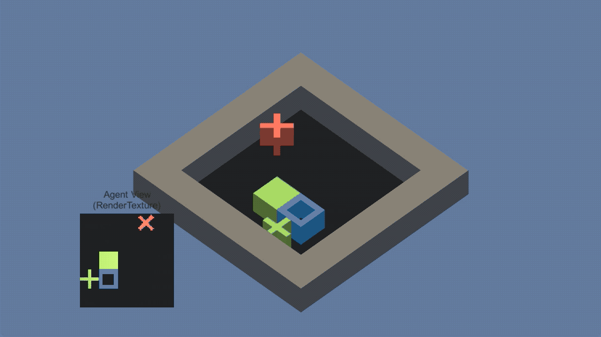
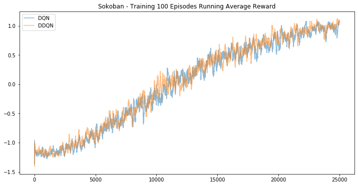
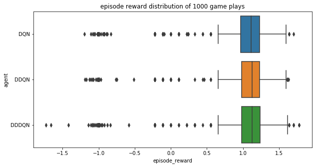
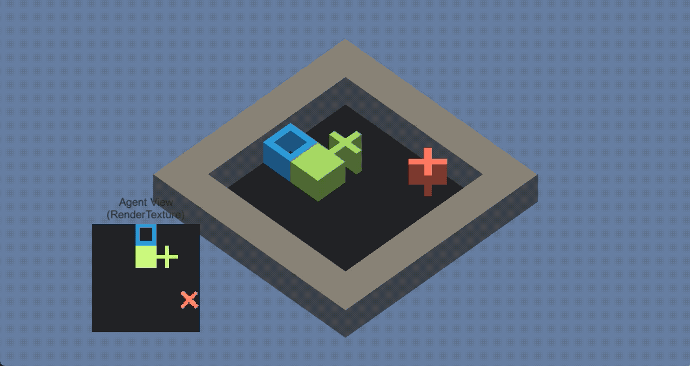
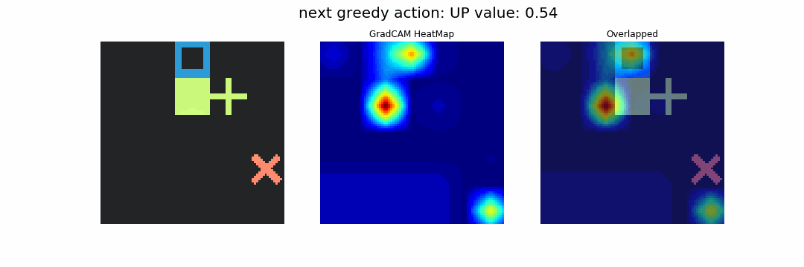
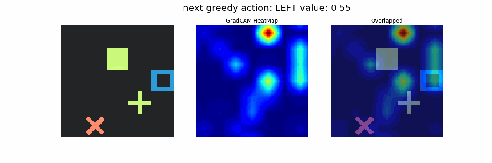
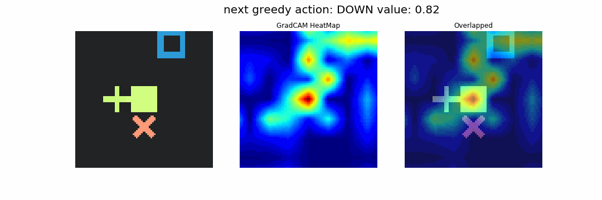
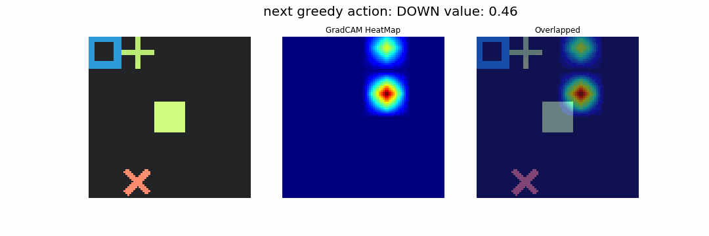
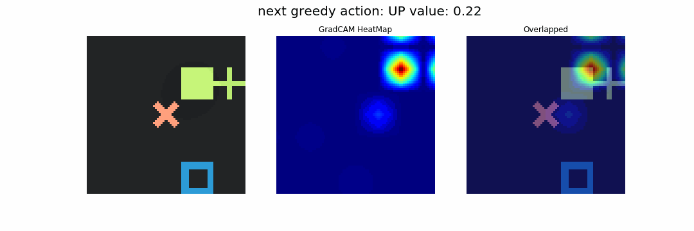

# ML-Agents로 만든 Sokoban

요새 사내 머신러닝 동호회에서 대여한 "텐서플로와 유니티 ML-Agents로 배우는 강화학습" 책으로 강화학습을 다시 공부해보고 있다. 전에 Udacity에서 Deep Reinforcement Learning Nano Degree를 들을 때 ML-Agents로 학습을 해봤었는데, 당시 코스는 학습 환경보다는 알고리즘에 초점이 맞춰져 있어서 실제로 내가 원하는 게임을 만들어 보기는 어려웠다. 이 책부터 시작해서 완전히 새로운 게임을 만들기는 어려워 보이지만, 설명이 스샷과 함께 잘 쓰여있기 때문에 따라하면서 어느정도 손 보면 원하는 컨셉을 구현할 수 있겠다는 느낌은 받았다.

3장에서는 Unity와 ML-Agents SDK를 이용해서 Sokoban이라는 게임을 만든다. 책에 쓰인 설명을 따라서 학습 가능한 환경을 만드는데 30분 정도면 충분하다. 단, mlagent 버전을 책에 쓰인대로 0.8.2 버전으로 하지 않으면 그대로 구현하기 어려우므로 주의가 필요.

Sokoban은 일본에서 만든 유명한 고전 게임의 이름이란다. 아이템을 밀어서 목적지로 배달한다. 이 책에서는 UnitySDK에 있는 GridWorld 예제에 박스 오브젝트와 게임 룰을 조금 변경해서 Sokoban 환경을 만든다.

[Sokoban](https://en.wikipedia.org/wiki/Sokoban)

Unity로 구현한 게임 환경은 아래와 같다. 구멍이 뚫린 파란색 네모(에이전트)를 상하좌우로 움직여 녹색 박스를 민다. 녹색 박스를 녹색 십자로 배달하면 +1을 받고 게임이 종료된다. 그러나 빨간색 X로 배달하거나 에이전트가 직접 목표/X에 이동하면 -1을 받고 게임이 끝난다.

# Training Sokoban with DQN

3장에서 만든 Sokoban을 이용해서 4장에서는 DQN을 이용해 에이전트 학습을 진행한다. 책에서는 TensorFlow 1.12.0을 이용해서 학습을 진행한다. 텐서플로는 2년 전에 해보고 최근까지 PyTorch만 사용해본지라, (1) 책에 쓰인대로 1.12.0로 할까 (2) 이번 나온 2.0으로 할까 (3) 아님 익숙한 PyTorch로 할까.. 하다가 명관인 구관을 택했다. 그리고 어제 OpenAI에서 베이스라인을 PyTorch로 포팅한다는 뉴스가 떴다.

[OpenAI→PyTorch](https://openai.com/blog/openai-pytorch/)

Sokoban 환경은 위 이미지에 왼편 하단에 그려진 탑뷰 시점 이미지를 observation으로 제공한다. 84x84 크기의 RGB 채널의 이미지다. 이걸 컨볼루션 레이어를 이용한 네트워크에 태워서 Q함수를 근사하는 식으로 학습이 진행된다.

DQN에서는 리플레이 메모리에 {현재 스테이트, 현재 액션, 그로 인한 리워드, 다음 스테이트, 완료 여부}를 저장하고, 이를 배치 사이즈(32)만큼 랜덤으로 뽑아다가 네트워크를 학습시킨다. 집에 있는 아이맥으로 CPU 환경에서 학습을 돌리다보니, 책에 쓰인대로 25,000번 에피소드를 돌리는데 대략 10~12시간 정도 소요된다. 파라미터가 조금 더 많은 Dueling Network는 15시간 정도 소요된 듯 하다. GPU로 돌리면 3~4시간 정도 걸린다고 한다.

어쨌든 학습이 끝난 후, 랜덤으로 행동을 결정하는 임계값인 epsilon을 0.05로 설정하고 플레이를 시키면 아래와 같이 문제를 잘 푸는 에이전트를 얻을 수 있다. 

DQN만 하기 아까워서 전에 LunarLander를 학습했던 DDQN과 DDDQN(Dueling Network)를 가져와서 추가로 학습을 돌려봤다. DDDQN은 중간에 텐서보드 파일을 지워버리는 바람에 유실되었지만, 조금 낫거나 비슷한 추세를 보였을 듯 하다.

# Sokoban Test

학습시킨 3개의 모델이 Sokoban을 얼마나 잘 풀어내는지 실험을 통해 알아보자. 25,000번 에피소드로 학습한 DQN, DDQN, DDDQN 모델을 각각 1000번 게임 플레이를 해서 점수를 모은다.

박스 플롯으로 시각화해보면 다음과 같다.

세가지 에이전트 모두 비슷한 점수대를 기록했다. 에이전트간 성능 차이가 매우 두드러지는 편은 아니다. 게임 자체가 그다지 복잡하지 않아서 그런 것 같기도 하다. DDDQN이 다른 두 에이전트에 비해 아웃라이어가 눈에 띈다. 1.5점 이상 점들이 더 많기도 하지만 반대로 -1.5점 이하를 기록한 판도 2판 가량 있었다.

점수의 평균과 표준편차를 보자.

|       	| 병      	| 멀쩡     	|
|-------	|---------	|----------	|
| DDDQN 	| 0.93424 	| 0.649377 	|
| DDQN  	| 0.92271 	| 0.633903 	|
| DQN   	| 0.90592 	| 0.639037 	|

표준편차는 별로 차이가 없으며, 평균 점수는 DDDQN > DDQN > DQN 순으로 높았다. DQN > DDQN > DDDQN으로 D가 하나씩 더 늘어남에 따라 평균 점수가 좋아지는 모양이 나오니 돌린 보람이 있다.

# 이상한 케이스

위 비교 실험에서 이상한 점이 눈에 띈다. 세 에이전트 모두 학습 리워드가 거의 1.0에 달할 정도로 학습도 잘 되었는데, 간혹 -1.0 혹은 그 이하로 점수를 받으면서 게임을 제대로 클리어하지 못하는 경우가 있다. 예를 들어 아래 짤처럼 쉬운 문제를 제대로 풀지 못한다. 학습 종료 후 테스트를 할 때 epsilon을 0.05로 주기는 했지만, 저렇게 연속적으로 길을 못 찾는 것은 분명.. 뭔가 수상해보인다.

휴리스틱 룰이 아닌 Q함수 근사를 통해서 에이전트를 학습시켰으므로 저런 예외적인 사항을 완벽하게 컨트롤할 수 없을지도 모른다. 그러나 어떤 이유에서 에이전트가 왼쪽 혹은 오른쪽으로 갔는지 알아내면 학습이 제대로 되고 있는지 판단할 수도 있지 않을까?

# GradCAM: Why did you move there?

일전에 대선주자 얼굴을 분류하는 CNN 모델을 학습시키는 토이 프로젝트를 해보면서 CAM을 이용해 특정 클래스 레이블에 반응한 이미지 영역을 찾아보는 실험을 해보았다. CAM의 단점은 average pooling을 이용한 구조의 CNN에서만 동작한다는 것이었다. 그 후속 논문인 Grad-CAM은 이러한 단점을 보완하여 Flatten-FC로 공간 정보가 중간에서 소실되더라도 이미지가 반응한 영역을 gradient를 이용해서 찾아내는 방식을 제안했다.

[Grad-CAM: 대선주자 얼굴 위치 추적기](https://jsideas.net/grad_cam/)

이번 DQN에서 사용한 네트워크 구조도 average pooling 대신 conv-conv-conv-flatten-fc-fc의 구조로 되어있다. 또한 DDDQN의 경우에는 conv-conv-conv-flatten 이후에 state stream과 action stream으로 나뉜 다음 다시 마지막에 합쳐지는 복잡한 구조를 가진다. 원래 CAM이라면 적용하기 어려웠을 네트워크 구조이나 Grad-CAM은 가능해보였다.

[junkwhinger/pytorch_gradcam](https://github.com/junkwhinger/pytorch_gradcam)

위 repo에 작성해둔 PyTorch GradCAM 코드를 가져다가 약간의 튜닝을 거친다. 여기서는 네트워크가 클래스에 대한 확률값이 아닌 실수로 Q value를 출력하기 때문에, softmax 처리를 없앤다. 그리고 backward를 할 때 predicted value가 가장 높은 인덱스를 1.2 정도로 두고 나머지는 -1.2 정도로 두었다. 대체로 Q value가 -1.1 ~ 1.1 사이에 분포했다.

## GradCAM으로 본 이상한 케이스

풀지 못했던 이상한 케이스에 GradCAM을 적용해보면 다음과 같다. 에이전트가 위로 갈 수 없음에도 불구하고 가장 Q value를 "UP"에 할당했다. UP을 해도 벽에 부딪히므로 계속 그자리에 머무른다. 히트맵에서 붉게 활성화된 부분은 "UP"이라는 액션에 가장 크게 기여하는 이미지 내 영역이다. 이를 통해 뇌피셜로 해석하자면 뭔가 박스를 왼편에서 밀어야 한다고 여기는 모양이기는 한데... 알 수 없다. 

혹시 뭔가 잘못된 걸까? 다른 케이스를 보자.

다른 케이스에서는 꽤 괜찮은 결과가 나왔다. 특히 첫번째 케이스를 보면 에이전트가 박스로부터 멀리 떨어져 있는 상황에서도 박스 바로 위에 이미지 영역이 활성화되고, 바로 그 자리로 이동해서 박스를 이동시킨다. 세번째 케이스에서는 박스를 목표지점에 가깝게 이동시킬 때마다 바로 다음에 이동하게 되는 영역이 붉게 활성화된다. 

Sokoban에서는 랜덤으로 게임 맵이 생성되는데, 쉬운 맵도 있는 반면 어려운 맵도 존재한다. 

이 경우에는 왼쪽으로 조금 돌아가서 박스를 밀어야 하는데, 에이전트가 박스를 보고 신나서 달려가다가 벽에 밀어버린다. 이번 DQN용 Sokoban에는 박스가 벽에 붙은 일부 게임 불가 상황에 대한 예외처리가 빠져있다. 책에서는 이 부분을 뒤에 커리큘럼 러닝 쪽에서 구현한다고 한다. 이 조건을 뺀 상태에서 학습을 해서 그런지 Q value와 GradCAM 히트맵에서 에이전트의 좌절감이 느껴지는 듯 하다.

end
