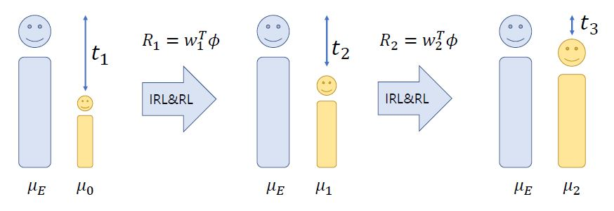
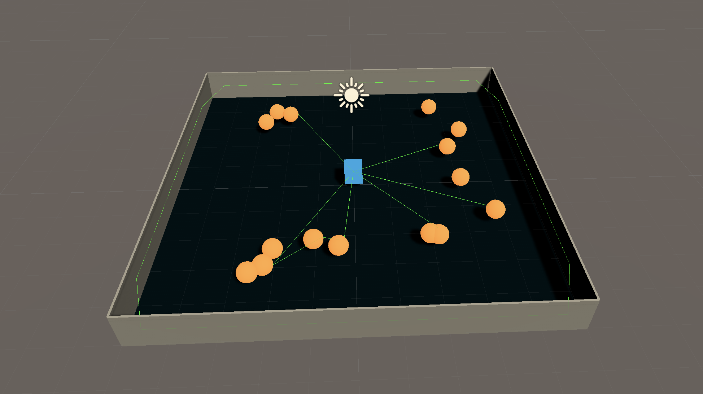
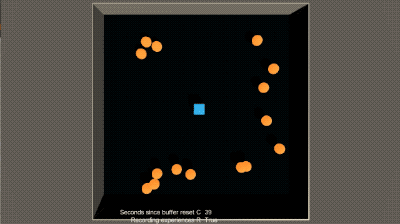
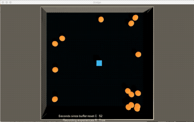
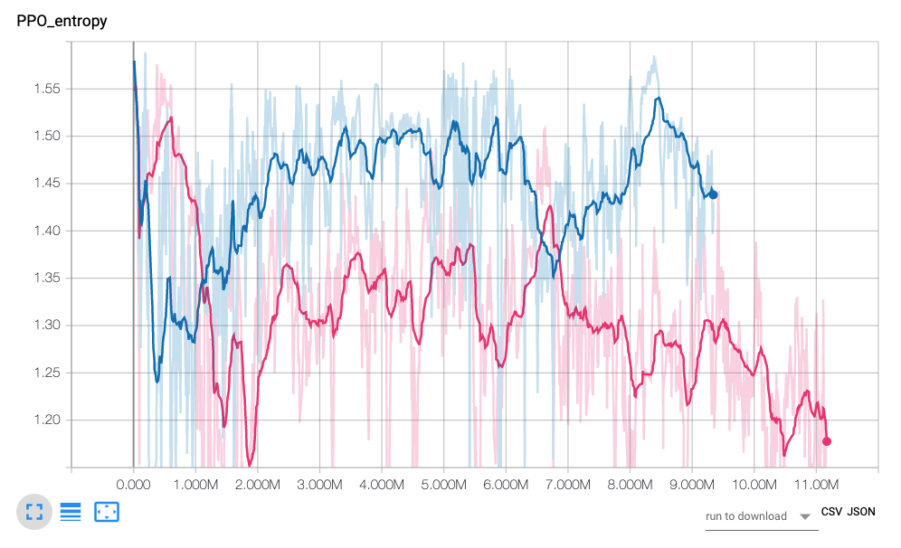
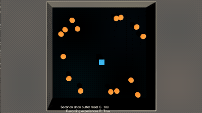
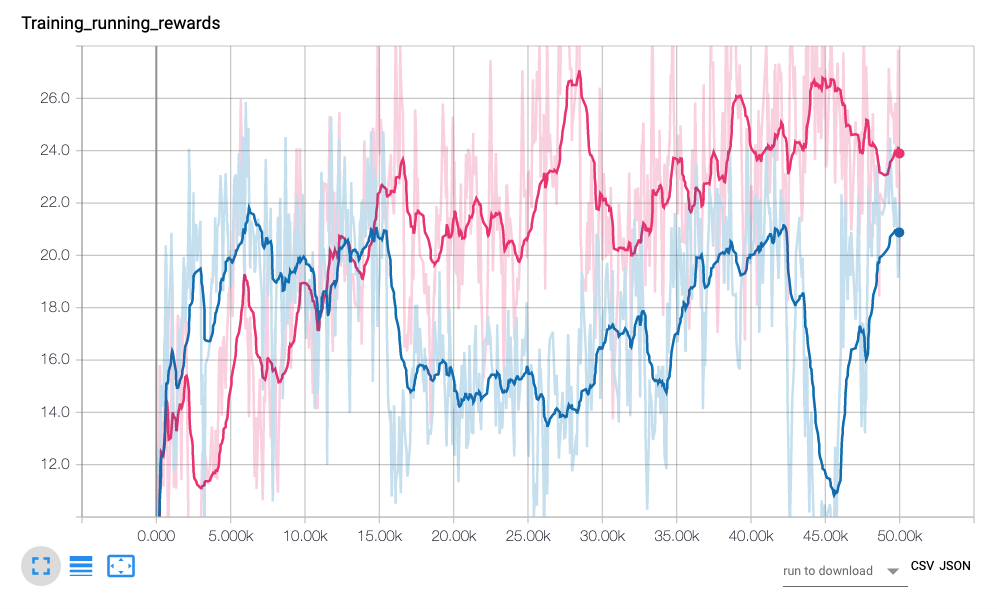
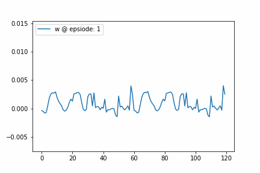

# Intro

지난번 <a href="https://jsideas.net/BC/">포스팅</a>에서는 Behaviour Cloning(BC)을 이용해서 Dodge 게임을 플레이하는 에이전트를 학습했다. 일반적인 RL과 다르게 BC는 지도학습으로 문제를 푼다. 녹화한 플레이에 담긴 state-action 페어를 입력-출력 삼아서 DNN을 학습하고, 이를 이용해 에이전트의 행동을 결정한다. 녹화 분량이 길지 않았음에도 불구하고 전문가의 플레이 스타일을 그럴듯하게 모방하는 에이전트를 학습할 수 있었다.

성능이 나쁘지는 않았지만, BC는 새로운 상황에 잘 대응하지 못했다. 전문가의 action을 정답으로 두고 예측 오차를 줄이다보니 seed를 고정한 게임에서는 잘 작동했지만, 그렇지 않은 게임에서는 점수가 낮았다. 이를 해소하고자 state에 몇가지 data augmentation을 적용해 보았으나, Dodge 문제가 가진 넓은 경우의 수를 커버하기에는 한참 부족했다.

일반적인 이미지 분류 문제와 달리, 여기서 풀고자 하는 게임 문제는 순차적인 의사결정 문제다. 현재 state에서 무슨 action을 선택했느냐에 따라 다음 state가 결정된다. Dodge 게임에서는 벽에 닿은 공은 무작위 위치에서 재생성되는데, 이때 공의 이동 방향은 현재 상태의 공의 위치가 된다. 그러다보니 게임 초반에는 state가 어느정도 고정되어 있지만, 점차 게임이 진행될수록 선택하는 action과 게임 자체의 랜덤성이 누적되면서 게임 state가 녹화한 전문가 플레이와는 점차 다른 방향으로 흘러간다. 적은 데이터로 학습한 BC 에이전트에게 생소한 state에서도 좋은 선택을 하리라 기대하는 것은 무리였다.

이번 포스팅에서는 BC가 가진 한계를 Apprenticeship Learning을 통해 풀어보고자 한다. RLKorea의 "Gail하자" https://reinforcement-learning-kr.github.io/2019/01/22/0_lets-do-irl-guide/ 의 두번째 항목 APP의 내용과 코드를 참조했다.

 

# Apprenticeship Learning

Apprenticeship Learning(APP)은 전문가의 시연을 보고 문제를 푸는 방법을 습득한다. `Apprentice`라는 표현은 한글로는 도제, 견습의 의미인데, 유명한 리얼리티 TV 프로그램인 "The Apprentice"가 떠오른다. 프로그램 참가자들로 팀을 두개 만들고 물건을 떼다 파는 등 비즈니스 대결을 시켜서 패배한 팀의 사람을 하나씩 자르는 포맷이다. 이 때 현 미국 대통령인 도널드 트럼프가 당시 심판으로 나와서 "You're fired"로 유명세를 탔다. 지금 와서 생각해보니 실제로 시연을 보여주고 한 것은 아니니 엄밀한 의미에서의 Apprentice Learning이라고 보기엔 어렵지 않나 싶다.

어쨌든 이 APP은 크게 두가지로 나뉜다. 첫째는 "전문가의 행동을 그대로 모방하는 것"이다. 이전 포스팅에서 소개한 Behaviour Cloning이 그 대표적인 방법이다. 두번째 방법은 "행동의 의도를 학습하는 것"이다. 이번 포스팅에서 참조한 Peiter Abbeel과 Andrew Ng의 `Apprenticeship Learning via Inverse Reinforcement Learning` (2014)는 그 행동의 의도를 Inverse Reinforcement Learning(IRL)로 학습한다.

 

## Reward Shaping의 어려움을 IRL로

강화학습(RL)의 목표는 문제를 잘 푸는 에이전트를 만드는 것이다. 그럼 문제를 잘 풀었다는 것은 무엇을 뜻할까? 보통 우리가 원하는 목표를 에이전트가 달성했을 때 문제를 잘 풀었다고 한다. Dodge 문제에서는 공을 피하는 에이전트를 학습하기 위해서 공과 충돌하면 -1을 페널티로 준다.

페널티를 최소화하도록 RL로 학습해보면 문제가 풀릴 것 같지만 실제로는 학습이 제대로 되지 않는다. 학습 알고리즘이나 Observation 설정 등의 문제도 있겠지만, Reward 정의에도 문제가 있다.

사람은 Dodge를 플레이할 때 최대한 운신의 폭을 확보하려고 한다. 공이 멀리 있는 것이 가까이 있는 것보다 유리하다는 것을 알고 최대한 거리를 넓히려 노력한다. 그러나 RL 에이전트는 공과 닿아야만 -1이라는 정보를 받기 때문에 어떤 행동이 좋은지에 대한 학습을 매우 어렵게 한다.

그러면 주변 공과의 거리에 비례해서 페널티를 주면 성능이 더 나아질까? 그렇게 해보지는 않았지만 보상에 대한 정보가 더 많아지니 학습에 도움이 될 수도 있을거다. 그러나 여기에는 생각보다 고려해야 할 점이 많다. 에이전트의 위치과 공의 이동 방향에 따라 공의 위험도도 천차 만별이다. 나를 향해 달려드는 공과 이미 나를 지나쳐가는 공의 위험도는 분명히 다르다. 거리에 따라 차등적으로 주려는 페널티는 어떻게 증가시켜야 할까? 선형적으로 위험도를 줘야할까 아니면 지수적으로 증가하게 해야 할까? 어떤 조합의 Reward가 제일 성능이 좋을까?

수동 피쳐 엔지니어링이 생각나게 하는 이 과정을 Reward Shaping이라고 한다. 논문에서 저자들은 수동으로 Reward를 정의하는 과정이 강화학습 현업이나 연구에 있어 큰 장애물(a significant barrier)이라고 소개한다. Reward function을 정의하기 어려운 문제, 즉 리워드 함수가 주어지지 않은 MDP 문제 `MDP\\R`를 풀기 위해 저자들은 관측한 전문가 데이터로부터 Reward function을 이끌어내는 Inverse Reinforcemet Learning(IRL)을 제시한다.

 

## Deriving Reward Function with Feature Expectation

Reward Function이 주어지지 않았다면 어떻게 해야할까? 저자들은 전문가 데이터에서 그 해답을 얻으려 한다. 저자들은 시연을 하는 전문가들이 어떤 관측되지 않은 `unknown` 보상을 극대화하려고 노력하고 그것이 플레이에 드러난다고 가정한다. Dodge 게임에서는 공에 부딪히지 않는 한 -1 점을 얻지 않는다. 조심스럽게 플레이하려는 사람은 최대한 공으로부터 멀리 떨어져서 안전한 공간을 확보하려고 할 것이다. 즉, "공으로 부터 가급적 멀리 떨어지자"라는 자기가 바라는 기준이 플레이에 녹아들어 있는 것이다.이 논문에서는 그 기준을 True Reward Function이라고 정의한다.

True Reward Function은 어떻게 구할 수 있을까? 이 함수가 취할 수 있는 형태는 무한할 것이다. 논문에서는 이를 우리가 관측할 수 있는 알려진 `known` 피쳐들의 선형 조합이라고 가정한다.

$$R^*(s) = w^* \cdot \phi(s)$$

(잠깐! 꽤 간단해보이는 선형 조합으로 구성해도 괜찮은걸까? 논문 뒷부분에 error 텀이 붙은 상태에 대해서도 소개를 하는데, 설령 오차가 있다 하더라도 그로 인한 성능 저하가 어느 정도를 넘어서지는 않는다고 한다.)

여기서 \phi(s)는 state s에서 뽑아낸 피쳐 벡터다. 여기에 피쳐에 적용할 가중치 w^*를 점곱하면 True Reward Function인 R^*(s)가 된다.

논문에서는 feature expectation이라는 개념을 소개하는데 이것이 유도되는 방식은 다음과 같다.

먼저 어떤 policy \pi의 기대 가치는 그것을 이용해 얻는 reward의 할인된 누적 합과 같다.

$$E_{s_0 \sim D}[V^\pi(s_0)] = E[\Sigma_{t=0}^ \infty \gamma^tR(s_t) | \pi]$$

여기서 R을 True Reward Function으로 대체한다.

$$E_{s_0 \sim D}[V^\pi(s_0)] = E[\Sigma_{t=0}^ \infty \gamma^t w \cdot \phi(s_t) | \pi]$$

여기서 w는 t와 상관없으므로 expectation 밖으로 뺀다.

$$E_{s_0 \sim D}[V^\pi(s_0)] = w \cdot E[\Sigma_{t=0}^ \infty \gamma^t \phi(s_t) | \pi]$$

위 식에서 w에 곱하는 expectation 부분을 \mu(\pi) 혹은 feature expectation이라고 한다.

$$\mu(\pi) = E[\Sigma_{t=0}^ \infty \gamma^t \phi(s_t) | \pi]$$

여기서 전문가의 시연(demonstration)에서 그가 사용한 policy를 \pi_E라고 둔다. 전문가는 그가 가진 True Reward Function을 최대화하려고 노력했으므로, \pi_E를 R^*에 대한 optimal policy라고 할 수 있다. 그러나 전문가의 뇌를 까서 policy를 발라내지 않는 한 optimal policy를 구할 방법 따윈 없으므로, 전문가의 feature expectation $\mu(\pi_E)$을 구할 수 없다. 그 대신 전문가가 남긴 시연 데이터(m개의 trajectories)를 통해서 $\hat{\mu}_E$를 추정한다.

$$\hat{\mu}_E = \frac{1}{m}\Sigma_{i=1}^m\Sigma_{t=0}^\infty \gamma^t \phi(s_t^{(i)})$$

 

# APP Algorithm

`MDP\R`과 feature mapping \phi, 전문가의 feature expectation \mu_E가 주어진 상황에서 찾고자 하는 것은 Unknown Reward Function을 가진 전문가와 유사한 성능을 보이는 policy를 찾는 것이다. 즉, 전문가만큼이나 플레이를 잘 하는 에이전트를 만드는 것이다. 처음에는 True Reward Function을 구성하는 것이라고 생각했는데, 논문에서도 밝히듯 여기서 제안된 방식으로 참 트루 함수를 알아내는 것은 어려울 수 있다. 대신 그 함수를 통해 뽑아낸 퍼포먼스가 전문가만큼 좋은 에이전트를 학습하는 것은 가능하다.

논문에서는 APP 알고리즘을 6단계로 소개하는데, 이보다는 RL Korea에서 정리한 4가지 스텝이 더 이해하기 쉽다. 간단히 소개하자면 다음과 같다.

1. IRL 단계: 전문가 feature expectation \mu_E와 에이전트의 feature expectation set인 \mu_i와의 차이를 t_{i+1}로 정의한다. t_{i+1}를 최대화하는 weight w_{i+1}를 찾는다. 이때 논문에서는 QP의 일종인 SVM을 사용해서 w를 찾는다.
2. RL 단계: 1에서 찾은 w_{i+1}을 이용해 추정한 Reward Function R_{i+1}을 이용해 RL 에이전트를 학습한다.
3. RL 단계에서 얻은 policy로부터 Monte Carlo 시행을 통해 새로운 feature expectation을 구하고, 이를 feature expectation set에 추가한다.
4. 1번 IRL 단계와 2번 RL 단계를 반복하다가 t가 \epsilon 이하로 떨어져서 전문가와 에이전트의 성능 차이가 미미해지면 학습을 종료한다.

이처럼 정리할 수 있으나, RL Korea에서 만든 Mountain Car 예제를 보면, episode 5000번마다 3번과 1번 단계를 수행하고, 지정된 episode 횟수를 넘기면 학습을 완료한다.

 

# Solving Dodge with APP

논문을 읽으면서 개인적으로 잘 모르는 Quadratic Programming이 나와 실습을 어떻게 할까 걱정했다. 다행히 RL Korea에서 작성한 Mountain Car 예제가 잘 되어 있어서 이를 참고하여 실험을 진행할 수 있었다.

 

## Dodge3

이전 포스팅에서는 기본 Dodge와 양의 보상을 주는 Dodge2를 만들었다. 그런데 실습을 하다보니 벽과 공을 동일하게 취급하는 것이 불만족스러웠다. 벽에는 붙어도 되지만, 공에 충돌하는 순간 게임이 끝나기 때문이다. 따라서 공과 벽을 식별하는 ray를 분리하여 총 60 x 2(stack) = 120개의 숫자로 구성된 vector observation을 구성하는 Dodge3를 만들었다.

 

## Agents

성능 비교를 위해 다음과 같이 3가지 에이전트를 구성한다.

1. BC 에이전트
2. PPO 에이전트
3. PPO_APP 에이전트

BC 에이전트는 전문가 시연 데이터를 이용해 state에 대한 action 정답을 맞추는 모델을 학습한다. 전문가 시연 데이터는 총 7개의 어느정도 긴 trajectory로 구성된다. 벽에 너무 붙지 않으면서도 적절히 요리조리 잘 피해다니는 플레이(시드 77, 약 500초, 11.1MB)를 녹화했다. 이전 포스팅에서 시도했던 Data Augmentation이나 Noise는 사용하지 않고 총 1000회 학습했다. 제일 validation accuracy가 높은 모델을 베스트 모델로 선택한다.

PPO 에이전트는 PPO 알고리즘을 이용해 학습한다. 이전에 DQN으로 실험했을 때 만족스러운 성능을 얻기가 어려워 알고리즘을 변경했다. 또한 PPO는 학습이 잘 진행될 때 Entropy가 완만하게 감소하는 경향을 보인다. 이를 통해 에이전트의 학습이 정상적으로 진행되는지 파악할 수 있을 것이라 판단했다. 총 50,000 episode 학습하며, 최근 100개 episode의 평균 스코어가 가장 높은 모델을 베스트 모델로 선택한다.

PPO_APP 에이전트는 APP으로 IRL 단계을, PPO로 RL 단계를 진행한다. BC 에이전트와 동일한 전문가 시연 데이터를 사용하며, PPO 에이전트와 동일한 하이퍼 파라미터를 사용한다. 2,000 episode마다 IRL 단계를 실행하여 w를 업데이트한다.

 

# Score 비교

| Dodge Leaderboard 	| 고정 seed 100판 평균 / 최대 	| 변동 seed 100판 평균 / 최대 	|
|-------------------	|-----------------------------	|-----------------------------	|
| BC 에이전트       	| 39.0 / 220.1                	| 20.6 / 166.9                	|
| PPO 에이전트      	| 7.0 / 44.5                  	| 24.5 / 47.8                 	|
| PPO_APP 에이전트  	| 46.9 / 105.7                	| 32.9 / 125.5                	|

 

## BC 에이전트

BC 에이전트는 전문가의 행동 자체를 직접적으로 모방하므로, 고정 시드 게임 점수가 변동 시드 점수보다 평균 점수와 최고 점수가 모두 높았다. 전문가 시연 데이터와 완전히 동일한 환경에서는 아주 좋은 점수를 기록했다.

변동 게임에서도 운 좋게 166점을 기록하긴 했지만, 평균 점수는 20.6점으로 3개 에이전트 중에 가장 저조한 성적을 기록했다. 랜덤성이 누적되어 처리해야 하는 state가 전문가 시연 데이터로부터 멀어져 제대로 처리하지 못하는 상황에 처한 탓이다.

 

## PPO 에이전트

PPO 에이전트는 변동 시드 게임에서는 BC 에이전트보다 평균 점수가 소폭 높았으나, 다른 모든 부문에서는 아주 좋지 않은 점수를 기록했다. 그 이유는..

PPO 에이전트는 시작과 동시에 무조건 오른쪽으로 이동한 후 우상단에 대피하는 행동을 선택한다. 고정 시드 77은 오른쪽으로 빠져나갈 구멍이 없다보니 PPO 에이전트는 아주 처참한 점수(평균 7점)를 냈다. 변동 시드 게임에서는 상황이 조금 나은 편이기는 하지만 구석에 박히는 움직임만 반복하다보니, 최고 점수가 47.8점에 그쳤다.

PPO 에이전트의 Entropy(푸른선)는 2번 감소하지만 다시 오르는 패턴을 보인다. 꿈보다 해몽이긴 하지만, 초반에 "오른쪽으로 빠져나가기", 중반에는 "우상단으로 피하기"를 알아낸 것으로 보인다. 그러나 그 이후에 문제를 풀 방법을 찾지 못하자 Entropy가 올라간 것이 아닐까.

반대로 PPO_APP 에이전트의 Entropy(붉은선)은 아주 부드럽지는 않지만 대체로 우하향하는 추세를 보였다.

 

## PPO_APP 에이전트

학습 코드를 구현할때만 해도 제대로 학습이 될까 긴가민가 했었다. 기대를 걸었던 PPO가 학습에 실패하면서 그 걱정은 더 깊어졌다. 결과를 까보니 PPO_APP 에이전트는 최고 점수에서는 BC를 넘지는 못했지만, 평균적으로는 가장 좋은 성능을 보였다!! 게다가 플레이를 보면 내가 플레이했던 것과 꽤 비슷하게 움직이는 것을 알 수 있다.

PPO_APP(붉은선)의 점수가 학습 초중반 이후부터 PPO(푸른선)을 압도하기 시작한다.

 

## w

APP에서는 feature expectation에 가중치 w를 곱해서 True Reward Function을 추정했다. 처음 PPO_APP 에이전트를 구성할 때 w는 랜덤한 vector로 초기화한다. 그리고 2,000 episode 마다 학습한 PPO 에이전트의 feature expectation과 전문가의 feature expectation의 차이를 최대화하도록 w를 갱신한다. w는 feature와 선형 조합할 수 있어야 하므로, feature 갯수와 동일하게 120개의 숫자로 구성된다. 갱신할 때마다 w가 어떻게 변하는지 살펴보자.

앞 30개는 주변 벽까지의 거리에 대한 가중치이고, 다음 30개는 주변 공까지의 거리에 대한 가중치다. 2 stack이므로 가중치 w도 120개의 숫자로 구성된다. episode가 진행됨에 따라 w가 점차 특정 지점으로 수렴되는 양상을 보인다. 벽과 공에 대한 가중치가 다르게 변화하는 것이 흥미롭다.

 

# Outro

이번 포스팅에서는 2004년 발표된 Apprenticeship Learning with Inverse Reinforcement Learning의 주요 내용을 간단히 정리하고, PPO와 APP을 조합하여 Dodge 문제를 다시 풀어보았다. 아주 오래된 알고리즘임에도 불구하고 사람처럼 행동하면서 새로운 환경에도 어느정도 잘 대응할 수 있는 에이전트를 학습시킬 수 있었다.

전문가의 특징과 에이전트의 특징이 비슷해지도록 유도하는 APP은 GAN과 닮은 구석이 있다. GAN도 노이즈로 시작해서 점차 피드백을 받아 개선을 하다보면 어느 순간에는 실제 이미지와 분간하기 어려운 수준에 도달한다. 방법은 다르지만 APP도 전문가와 에이전트의 특징 차이로 정의하는 t가 epsilon보다 작아지는 수준에 다다를 때까지 반복한다. 나중에 읽게 될 GAIL이 이런 관점에서 Adversarial하게 학습을 하는 걸까?

 

# Reference

- https://reinforcement-learning-kr.github.io/2019/02/01/2_app/
- https://github.com/reinforcement-learning-kr/lets-do-irl/tree/master/mountaincar/app
- Apprenticeship Learning via Inverse Reinforcement Learning