# Intro

올해 초부터 Inverse Reinforcement Learning을 공부하고 있다. <a href="https://jsideas.net/APP/">Dodge3</a>를 대상으로 GAIL을 실험하던 도중 학습이 제대로 되지 않거나, 잘 되어도 재현이 되지 않는 문제가 계속 발생했다. GAIL은 전문가(혹은 사람의 플레이) 데이터와 에이전트가 생성한 데이터를 판별하는 Discriminator를 학습하고, 이 Discriminator로부터 `얼마나 전문가 데이터에 가까운지` 측정하여 reward를 대체한다. 그리고 이 reward를 이용해서 TRPO나 PPO 에이전트를 학습한다. 

Discriminator 학습 루프 자체는 간단하기에 문제의 소지가 별로 없어보였다. D 루프를 몇번 바꿔보아도 만들어내는 점수 편차는 작았다. GAIL로 인해 효과를 보지 못하자 PPO 코드를 3번쯤 갈아 엎었는데, 할때마다 다른 구현체들을 참조하고 구현 방식을 섞다보니, PPO를 대체 어떻게 구현해야 할지 혼란스러웠다.

그러던 도중 `Implementation Matters in Deep Policy Gradients: A Case Study on PPO and TRPO`라는 상당히 도발적인 내용의 논문을 읽게 되었고 이 과정에서 구현에 큰 도움을 받았다. 이 포스팅에서는 PPO의 여러 구현 디테일에 대해 알아보고 그에 따른 에이전트의 성능을 비교해본다.

<hr>

# Proximal Policy Optimization

PPO는 아래 그림처럼 이해하면 쉽다.


<a href="https://medium.com/@jonathan_hui/rl-proximal-policy-optimization-ppo-explained-77f014ec3f12">Jonathan Hui의 RL — Proximal Policy Optimization (PPO) Explained</a> 에서 소개한 그림을 가져와 약간 수정했다. 우리의 목표는 산 꼭대기에 오르는 것이다. 가장 빠른 길은 현재 지점과 꼭대기까지의 직선거리다. 그런데 우리는 산양이 아니므로 이 길을 바로 오르는 것은 불가능하다. 절벽에서 떨어지고 나면 리셋을 하는 것이 아니라 그곳에서 PPO 에이전트가 길을 찾으려 하기 때문에 학습 자체가 매우 어려워질 수 있다.


오른쪽 그림의 길은 더 안전하다. 현재 위치에서 안전하게 내딛을 수 있는 영역을 식별한 다음 그 거리만큼 이동한다. 속도는 조금 더딜지 몰라도 더 안전하게 목적지에 도달할 수 있다. 에이전트가 내딛는 보폭이 안전하다는 것을 어떻게 담보할까? 정책을 업데이트할 때 기존의 정책과 새로운 정책이 너무 크게 달라지지 않도록 하면된다. TRPO는 이 제약조건을 두 정책간 KL-Divergence를 이용해서 만족시킨다. 그런데 TRPO의 방식은 2차 미분을 사용하기 때문에 연산량이 많다는 단점이 있다. PPO는 이 복잡함을 두 정책의 action probability로 간단히 구하는 importance ratio를 하이퍼 파라미터 `epsilon`으로 잘라버림으로써 이를 해결한다. 자세한 내용은 위 블로그를 읽어보자.

<hr>

# Implementation Details

OpenAI의 <a href="https://spinningup.openai.com/en/latest/algorithms/ppo.html">SpinningUP</a>에 소개된 PPO-Clip의 PseudoCode는 다음과 같다.


policy, critic 네트워크 만들고, 메모리 만들고.. episode 돌려서 s, a, r, logpa 수집한 다음, R_t, A_t 구하고 policy는 클리핑으로 최적화하고, value는 MSELoss로 구하면 될 것 같아 간단해(?) 보인다.

그런데 내가 참조한 구현체들은 크게는 구조가 다르거나, 초보자 입장에서 이해하기 어려운 트릭들이 제법 들어가 있었다.

참조한 구현체 목록은 다음과 같다. 

- [1] https://github.com/nikhilbarhate99/PPO-PyTorch/blob/master/PPO.py
- [2] https://github.com/mimoralea/gdrl/blob/master/notebooks/chapter_12/chapter-12.ipynb
- [3] https://github.com/reinforcement-learning-kr/pg_travel/blob/master/mujoco/agent/ppo_gae.py
- [4] https://github.com/openai/spinningup/tree/master/spinup/algos/pytorch/ppo
- [5] https://github.com/openai/baselines/tree/master/baselines/ppo2
- [6] https://github.com/hill-a/stable-baselines/tree/master/stable_baselines/ppo1

내가 경험한 구현상의 어려움은 다음과 같다.

- Epoch / Episode 기준: PPO는 메모리가 다 차면 학습을 수행한다. 위 PseudoCode와 [4]에서는 k는 Epoch 기준이다. 그런데 [1]과 같은 구현체에서는 다른 강화학습 예제 코드처럼 에이전트의 게임이 끝나는 Episode 기준으로 되어있다. Epoch을 기준으로 하면, PPO update 함수를 trajectory를 수집하고 돌리면 그만이지만, Episode 기준이라면 타임스텝 루프 안에 메모리 크기를 체크하고 업데이트하는 로직이 들어있다.  
- MultiEnv, SingleEnv: MultiEnv를 이용해 병렬로 데이터를 수집하면 더 빠르게 학습할 수 있는 것은 자명하다. 그런데 Epoch / Episode 문제와 맞물리면서 복잡해진다. LunarLander-v2는 그 자체로 병렬 환경이 아니기 때문에 MPI와 같은 멀티프로세싱 라이브러리를 이용해서 이를 병렬화해야 한다. 병렬화를 구현하는 것도 쉬운 것이 아닌데, 각 worker들의 게임 오버 조건을 어떻게 체크하고 메모리에 반영하며, 이를 순서에 맞게 정리하는 것에서 벅참을 느꼈다. [2] 코드를 보면 코드가 길지는 않아도 병렬 프로그래밍에 익숙하지 않은 나같은 사람들은 충분히 어려워보인다.
- Memory 마무리: 메모리가 다 차면 업데이트를 하는데, 이때 GAE를 이용해서 Advantage를 추정한다. 간단히 말하자면 현재 시점 t에서 미래시점 t+1를 고려한다는 것이다. 게임이 끝나지 않아도 메모리가 다 차서 그냥 마무리하면 마지막 시점 t가 조금 억울해진다. t+1의 value를 0으로 두면, 즉 게임 오버와 동일하게 취급하면 바로 전에 있는 t는 평가절하된다. 그렇기 때문에 이 경우에는 다음 state의 Value estimate를 계산해서 value buffer에 추가한다. 반대로 게임 오버라면 0을 넣는다. 구현체마다 이 처리를 하기도 하고 그냥 넘어가기도 한다. 메모리 크기가 넉넉하다면 이로 인한 효과가 크지 않을 수 있어서인지 [1]에서는 이 부분을 무시한다.
- Mask 처리: PPO 메모리에는 보통 여러 episode가 들어간다. 이때 에피소드간 연결을 끊어야 정상적으로 GAE나 discounted return을 구할 수 있기에 done 정보를 이용해 이를 끊어준다. [3]에서는 done을 뒤집어 mask를 구한다음 이를 GAE 함수에 전달해 GAE를 계산한다. GAE를 계속 업데이트해가면서 구현되어 있어 아주 효율적이지만, 바로 이해하기 어려웠으며 여러 배열의 값들을 묶어서 처리할때 혹 실수하지 않았는지 불안했다. 그때문에 나는 [4]의 구현이 상당히 마음에 들었다. [4]는 에피소드가 끝날 때마다 GAE를 계산하여 done 정보를 아예 사용하지 않는다. 너무 좋다.
- Advantage, Return 계산: Advantage는 policy loss를 계산할 때 들어간다. Advantage는 여러가지 방법으로 구할 수 있는 듯 하다. [1]에서는 Return을 구한 다음 현재 Value estimate을 빼서 Advantage를 구한다. 그런데 다른 대부분의 구현체들은 GAE를 이용해서 Advantage를 계산한다. Return도 비슷하다. [3]에서는 discounted return을 쓰는데 반해 [5]에서는 Advantage에 value estimates를 더해서 Return을 만든다. 
- Value Clipping: PPO PseudoCode와 [1]에서는 policy만 클리핑할 뿐, value는 하지 않는다. 그러나 [3], [4] 등에서는 old Value estimate와 new Value estimate의 차이를 클리핑하여 old Value estimate에 더하는 식으로 클리핑한다.
- Standardization: state나 reward를 clipping하거나 running 방식으로 standardize한다. [3]의 main.py를 보면 ZFilter라는 클래스를 사용하는데, 이것이 state를 표준화하고 clip을 기준으로 자른다. 이게 왜 들어가있는지 의문이 있었는데, 아래 논문을 보고 이해가 되었다.

이외에도 Gradient Clipping, KL Stopping 등 여러가지 잡다한 구현상 차이점들이 있지만, 지면 관계상 생략한다.

<hr>

# Implementation Matters in Deep Policy Gradients: A Case Study on PPO and TRPO

각양각색의 PPO 구현체에 지쳐 인터넷에 "PPO implementation details" 따위를 검색하고 있었는데 <a href="https://openreview.net/forum?id=r1etN1rtPB">OpenReview</a>에 올라온 이 논문을 발견했다. 논문이라 하면 어렵고 따분하기만 하지만 이 논문은 아니다. Policy Gradient 바닥에서 널리 쓰이는 PPO. 이 논문은 그 PPO를 저격한다. 

요지는 이렇다. PPO는 TRPO보다 성능이 좋다고 알려져있다. 그러나 저자들의 실험 결과, PPO의 핵심 기능인 Clipping이 아닌, 논문에서 거의 언급도 되지 않는 구현상의 디테일이 상당한 성능 개선 효과를 보인다고 한다. 

저자들이 실험에서 검증한 코드 레벨 최적화는 다음과 같은 4가지다.

1. Value Clipping: value loss를 구할 때 ppo clipping range를 이용해서 클리핑한다.
2. Reward Scaling: reward를 그대로 memory에 넣지 않고 running std로 나눠서 넣는다.
3. Orthogonal Initialization and layer scaling: 네트워크 웨이트를 orthogonal initialize한다.
4. Adam Learning rate annealing: 일부 task에 따라 lr을 조정한다고 한다.

저자들의 abalation study에 따르면, 2, 3, 4를 사용한 에이전트들의 reward 분포(붉음)가 그렇지 않은 분포(푸름)에 비해 높은 것을 알 수 있다. 

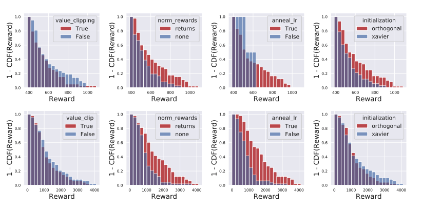

현행 PPO에서 코드 최적화를 제외한 버전 PPO-M을 PPO, TRPO와 비교해보면, PPO-M의 mean reward는 TRPO보다 조금 나아보이지만, KL은 이터레이션을 거듭함에 따라 TRPO를 뛰어넘는다. 그에 반해 최적화를 한 PPO는 TRPO보다 더 낮은 KL을 기록한다. 이를 통해 저자들은 PPO-M이 가진 PPO의 핵심 알고리즘만으로는 "trust region"을 유지하는 것이 충분치 않다고 지적한다.


그 다음 실험에서는 한술 더 떠서, PPO에서 clipping 기능을 제거한 PPO-NoClip과 PPO, PPO-M을 비교한다. 여러 task에 대한 실험 결과 PPO-NoClip이 PPO-M보다 더 나은 성능을 보인다;;


결론에서 저자들은 별로 중요한 취급을 받지 못했던 디테일들이 PPO의 성능에 큰 영향을 미쳤으며, "trust region"을 확보하는데 필수적인 역할을 수행했다는 것을 실험을 통해 확인할 수 있었다고 한다.

> In fact, these seemingly unimportant optimizations fundamentally change algorithm operation in ways unpredicted by the conceptual policy gradient framework. Indeed, the optimizations prove necessary for enforcing trust regions regardless of whether we optimize with the PPO step or just unconstrained stochastic gradient descent. We go on to test the importance of these code-level optimizations in agent performance, and find that PPO’s marked improvement over TRPO (and even stochastic gradient descent) is largely due to these optimizations.


이들은 저격에만 그치지 않고 재현성이 개선된 RL 연구를 위해 강화학습을 모듈화할 것을 주장한다. 여러 요소들을 쉽게 가져와서 조합하는 형태로 만들어진다면 확실히 이해와 구현의 난이도가 낮아질 것 같다.

도발적인 실험 내용을 증명하기 위해 이 논문을 쓴 익명의 저자들은 <a href="https://github.com/implementation-matters/code-for-paper">그 실험 코드</a>를 깃헙에 공개했다. OpenAI의 PPO 코드를 바탕으로 실험 코드를 만든 모양이다. 내용이 아주 재밌다. 특히 주석이.. 

<hr>

# Code Level Optimization in LunarLander-v2

PPO에서 제안한 클리핑은 정말 효과가 없는걸까? PPO 핵심 기능을 구현해놓고 보니, 논문에서 제시한 코드 최적화 기법들이 학습 성능에 얼마나 큰 영향을 미치는지 궁금해졌다. 논문에서는 코드 최적화 방법 4가지를 실험했다. 총 16개의 경우의 수가 나온다. 이를 랜덤 시드 3개를 이용해 여러 learning rate로 에이전트를 만들고, 이중에 가장 성능이 좋았던 에이전트가 뽑아내는 reward를 이용해서 분석을 진행했다. 

나는 조금 더 많은 코드 최적화 방법을 테스트해보고 싶었다. Learning Rate Annealing 대신 Appendix에 기록된 Observation Normalization과 Clipping Gradient를 추가하고, 논문에서 다룬 Policy NoClipping을 추가했다.

1. Value Clipping
2. Reward Clipping
3. Reward Standardization
4. Observation Normalization
5. Orthogonal Initialization
6. Clipping Gradient
7. Policy NoClipping

총 실험 가짓수는 2의 7승이 된다. 논문처럼 그리드서치를 하기엔 서치 스페이스가 너무 크다. 또 시드를 3개로 고정하는 것도 조금 아쉬웠다. 따라서 그리드서치 대신에 HyperOpt를 이용해 시드 폭을 크게 넓힌 상태에서 Bayesian Optimization으로 최적의 평균 에피소드 점수(latest 100)를 기록하는 조합을 찾아보았다. LunarLander-v2는 이전 실험 결과 1500~5000 에피소드 사이에서 최고점을 찍었었다. 5000 에피소드를 돌리는데 보통 20~25분이 소요된다. 시간 소요가 부담스러웠기 때문에 최대 에피소드를 1000으로 제한하고 총 100회로 HyperOpt 실험 횟수를 설정했다.

```python
space = {
        'observation_normalization': hp.choice('observation_normalization', 
                                               [True, False]),
        'reward_clipping': hp.choice('reward_clipping', 
                                     [True, False]),
        'value_clipping': hp.choice('value_clipping', 
                                    [True, False]),
        'reward_standardization': hp.choice('reward_standardization', 
                                            [True, False]),
        'orthogonal_initialization': hp.choice('orthogonal_initialization', 
                                               [True, False]),
        'clipping_gradient': hp.choice('clipping_gradient', 
                                       [True, False]),
        'policy_noclip': hp.choice('policy_noclip', 
                                   [True, False])
}

def objective(params):
  config['seed'] = np.random.randint(78, 1000)
  config.update({"experiment" : params})
  agent = PPO(config)
  best_score = agent.train()
  loss = -best_score
  return loss

trials = Trials()
best = fmin(objective, space, trials=trials, algo=tpe.suggest, max_evals=100)

```

<hr>

## HyperOpt Search Result

아침에 일어나보니 실험이 모두 끝나있었다. `trials`에 저장된 실험 결과를 가공하여 플롯을 뿌려본다. LunarLander-v2는 보통 200이나 230 정도를 미션 컴플릿으로 본다. 1000번을 돌렸음에도 성공에 근접한 결과를 낸 에이전트들이 보인다. 플롯에서 푸른 히스토그램은 해당 실험 기능이 켜진 것이고 오렌지는 꺼진 것이다. 히스토그램의 분포가 오른쪽으로 갈수록 좋은 성능을 보였다고 할 수 있다. 

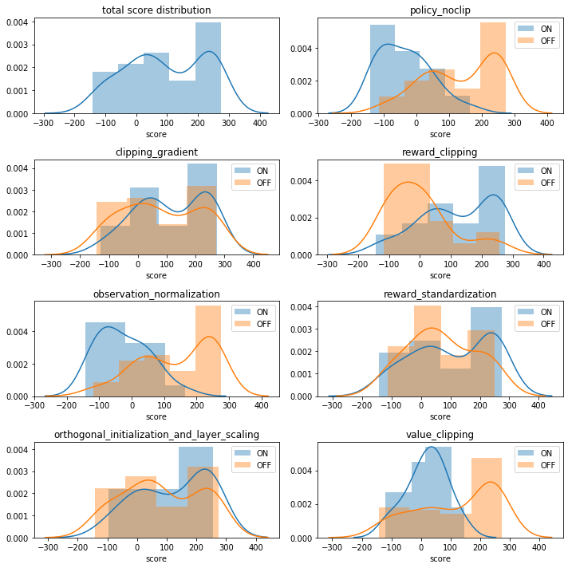

결과를 종합해보면 좋은 성능과 관련된 선택은 다음과 같다.

- PPO NoClipping OFF: PPO의 핵심 기능인 Policy Clipping을 사용한다.
- Reward Clipping ON: reward를 [-5, 5] 사이로 클리핑한다.
- Observation Normalization OFF: Observation을 z표준화하지 않고 그대로 쓴다.
- Value Clipping OFF: Value Clipping을 사용하지 않는다.


Bayesian Optimization 결과 가장 높은 점수와 낮은 점수를 기록한 실험 조합은 다음과 같다.

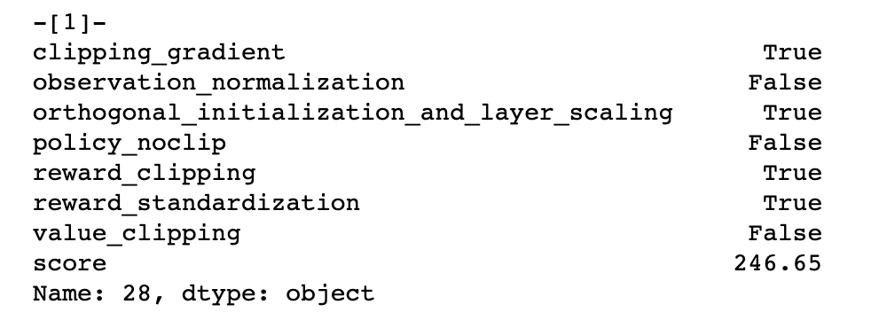

Orthogonal Initialization으로 네트워크를 초기화하고, reward를 standardize, clip하고, 학습할 때 gradient에 clip을 한 실험이 1등을 차지했다.

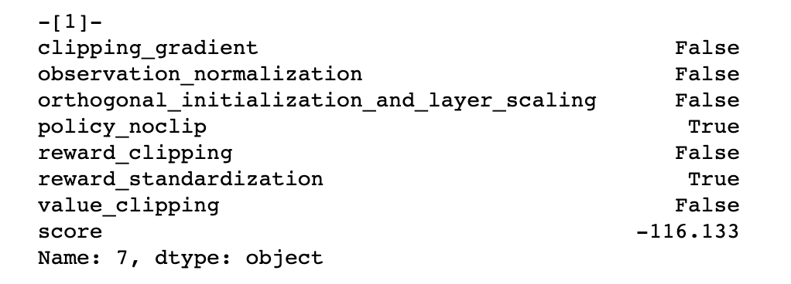

최하위는 policy clipping을 하지 않고 reward standardization을 한 실험이 차지했다. -116점이라니.. 거의 추락만 하는 셈이다.

<hr>

# Training

1000번 에피소드 제한은 너무 가혹한 조건이었을지도 모른다. 5000 에피소드까지 기회를 줘보자. 앞서 Bayesian Optimization으로 뽑은 결과에서 점수를 기준으로 top1, top2, bottom1, bottom2, 그리고 1/3과 2/3 지점에 있는 mid1과 mid2를 뽑았다. 이외에도 논문과 비슷하게 별다른 최적화 없이 policy clipping만 하는 PPO, 다른 모든 최적화가 적용된 PPO_Plus, 그리고 PPO_Plus에서 policy clipping만 빠진 PPO_Plus_NOCLIP을 추가했다. 공교롭게도 PPO_Plus가 mid2과 겹쳐서 mid2은 제외했다.

이번에는 시드를 행운의 숫자 77로 고정하고 5000 에피소드씩 학습을 진행했다. 이때 실험 요소 `experiment`를 제외한 모든 하이퍼파라미터는 동일하게 설정했다. 

```yaml
# top1.yaml
agent: PPO
device: cpu
env:
  nA: 4
  nS: 8
  name: LunarLander-v2
exp_name: top1
experiment:
  clipping_gradient: true
  observation_normalization: false
  orthogonal_initialization_and_layer_scaling: false
  policy_noclip: false
  reward_clipping: true
  reward_standardization: true
  value_clipping: false
model:
  actor:
    betas:
    - 0.9
    - 0.999
    hidden_acivation_fn: tanh
    hidden_dims:
    - 64
    - 64
    lr: 0.002
  critic:
    betas:
    - 0.9
    - 0.999
    hidden_acivation_fn: tanh
    hidden_dims:
    - 64
    - 64
    lr: 0.002
seed: 77
train:
  average_interval: 100
  gae:
    tau: 0.95
  gail: false
  gamma: 0.99
  max_episodes: 5000
  max_steps_per_episode: 300
  ppo:
    batch_size: 32
    clip_range: 0.2
    coef_entpen: 0.001
    coef_vf: 0.5
    memory_size: 2048
    optim_epochs: 4
  terminal_score: 230

```

실험 에이전트들의 설정은 다음과 같다.

<style type="text/css">
.tg  {border-collapse:collapse;border-spacing:0;}
.tg td{border-color:black;border-style:solid;border-width:1px;font-family:Arial, sans-serif;font-size:14px;
  overflow:hidden;padding:10px 5px;word-break:normal;}
.tg th{border-color:black;border-style:solid;border-width:1px;font-family:Arial, sans-serif;font-size:14px;
  font-weight:normal;overflow:hidden;padding:10px 5px;word-break:normal;}
.tg .tg-0pky{border-color:inherit;text-align:left;vertical-align:top}
</style>
<table class="tg">
<thead>
  <tr>
    <th class="tg-0pky">experiments</th>
    <th class="tg-0pky">top1</th>
    <th class="tg-0pky">top2</th>
    <th class="tg-0pky">mid1</th>
    <th class="tg-0pky">mid2</th>
    <th class="tg-0pky">bot1</th>
    <th class="tg-0pky">bot2</th>
    <th class="tg-0pky">PPO_M</th>
    <th class="tg-0pky">PPO_Plus</th>
    <th class="tg-0pky">PPO_Plus_NOCLIP</th>
  </tr>
</thead>
<tbody>
  <tr>
    <td class="tg-0pky">clipping_gradient</td>
    <td class="tg-0pky">O</td>
    <td class="tg-0pky">X</td>
    <td class="tg-0pky">X</td>
    <td class="tg-0pky">O</td>
    <td class="tg-0pky">X</td>
    <td class="tg-0pky">O</td>
    <td class="tg-0pky">X</td>
    <td class="tg-0pky">O</td>
    <td class="tg-0pky">O</td>
  </tr>
  <tr>
    <td class="tg-0pky">observation_normalization</td>
    <td class="tg-0pky">X</td>
    <td class="tg-0pky">X</td>
    <td class="tg-0pky">X</td>
    <td class="tg-0pky">O</td>
    <td class="tg-0pky">O</td>
    <td class="tg-0pky">O</td>
    <td class="tg-0pky">X</td>
    <td class="tg-0pky">O</td>
    <td class="tg-0pky">O</td>
  </tr>
  <tr>
    <td class="tg-0pky">orthogonal_initialization</td>
    <td class="tg-0pky">X</td>
    <td class="tg-0pky">X</td>
    <td class="tg-0pky">X</td>
    <td class="tg-0pky">O</td>
    <td class="tg-0pky">X</td>
    <td class="tg-0pky">X</td>
    <td class="tg-0pky">X</td>
    <td class="tg-0pky">O</td>
    <td class="tg-0pky">O</td>
  </tr>
  <tr>
    <td class="tg-0pky">policy_noclip</td>
    <td class="tg-0pky">X</td>
    <td class="tg-0pky">X</td>
    <td class="tg-0pky">X</td>
    <td class="tg-0pky">X</td>
    <td class="tg-0pky">O</td>
    <td class="tg-0pky">O</td>
    <td class="tg-0pky">X</td>
    <td class="tg-0pky">X</td>
    <td class="tg-0pky">O</td>
  </tr>
  <tr>
    <td class="tg-0pky">reward_clipping</td>
    <td class="tg-0pky">O</td>
    <td class="tg-0pky">O</td>
    <td class="tg-0pky">O</td>
    <td class="tg-0pky">O</td>
    <td class="tg-0pky">O</td>
    <td class="tg-0pky">O</td>
    <td class="tg-0pky">X</td>
    <td class="tg-0pky">O</td>
    <td class="tg-0pky">O</td>
  </tr>
  <tr>
    <td class="tg-0pky">reward_standardization</td>
    <td class="tg-0pky">O</td>
    <td class="tg-0pky">O</td>
    <td class="tg-0pky">X</td>
    <td class="tg-0pky">O</td>
    <td class="tg-0pky">O</td>
    <td class="tg-0pky">O</td>
    <td class="tg-0pky">X</td>
    <td class="tg-0pky">O</td>
    <td class="tg-0pky">O</td>
  </tr>
  <tr>
    <td class="tg-0pky">value_clipping</td>
    <td class="tg-0pky">X</td>
    <td class="tg-0pky">X</td>
    <td class="tg-0pky">X</td>
    <td class="tg-0pky">O</td>
    <td class="tg-0pky">X</td>
    <td class="tg-0pky">X</td>
    <td class="tg-0pky">X</td>
    <td class="tg-0pky">O</td>
    <td class="tg-0pky">O</td>
  </tr>
</tbody>
</table>
<hr>

# Result

Training 과정에서 다음과 같은 지표를 트래킹했다.

- Average 100 episode score
- Policy Loss
- Value Loss
- Entropy Loss

<br>

### Average 100 episode score

먼저 평균 점수를 살펴보자. 각 실험 라벨은 평균 점수가 가장 높았던 에피소드 구간에 달아두었다. 

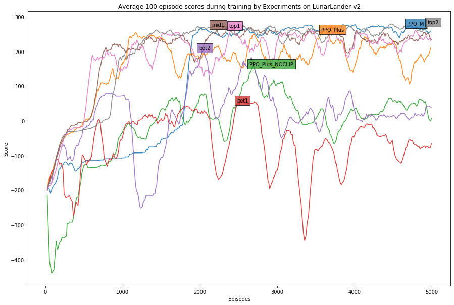

흥미로운 결과가 나왔다.

policy clipping을 하지 않은 bot1, bot2, PPO_Plus_NOCLIP의 성적이 매우 저조하다. 게임 승리의 기준선인 230에 도달하지 못했다. 학습 후반부에는 오히려 평균 점수가 떨어지는 경향을 보인다. 

게임 승리 조건인 230점에 가장 빨리 도달한 실험은 어떤 것일까? 

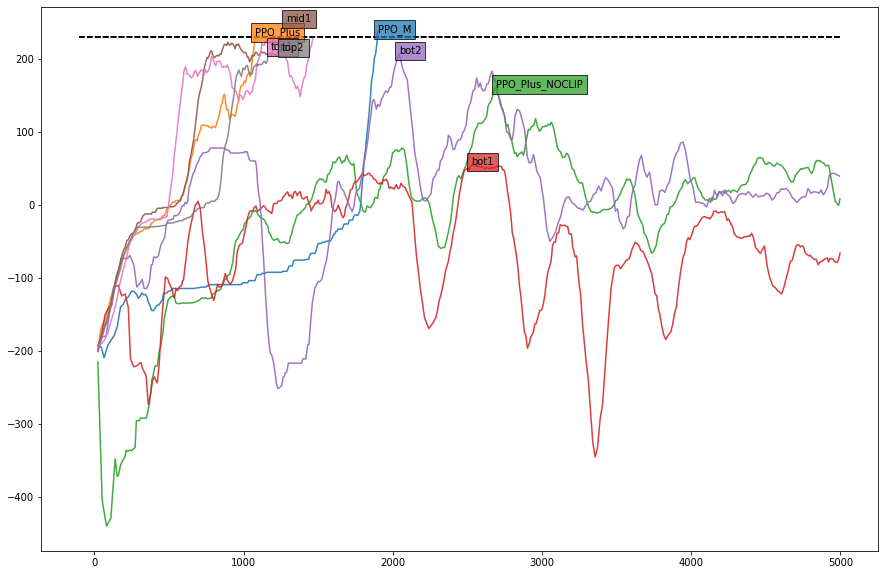

Policy Clipping을 한 실험 중에서는 코드 최적화를 사용한 실험들이 기본 PPO_M보다 기준선에 도달했다. 즉 코드 최적화를 하면 더 빠른 학습을 기대할 수 있겠다.

<br>

### Policy Loss

policy clipping을 하지 않은 실험들은 policy loss가 크게 들쭉날쭉하는 패턴을 보인다. PPO 학습 루프에서 새로운 정책의 action probability가 이전 정책의 그것에 비해 크게 달라졌음에도 불구하고 제약없이 Advantage에 곱해져서 policy_loss가 계산되기 때문에 스파이크가 크게 튀는 것을 막을 방법이 없었다. 반대로 클리핑을 한 실험들의 policy_loss는 0 근처의 아주 작은 값을 갖는다.

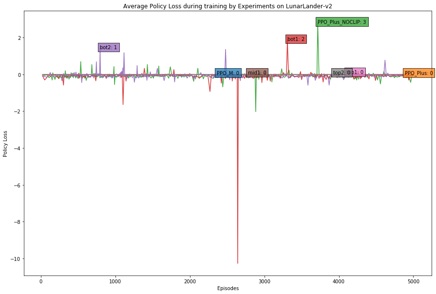

<br>

### Value Loss

Value_loss는 어떨까? 다른 실험들에 비해 PPO_M, mid1의 큰 초기 value loss가 눈에 띈다. PPO_M은 아무런 코드 최적화가 적용되지 않았다. LunarLander-v2에서 우주선이 바닥에 박으면 -100점의 큰 점수를 얻게 되는데, 이것이 초반의 큰 loss_value로 이어진 듯 하다. mid1은 reward clipping이 적용되어 -100을 -5로 클리핑하여 차이가 상대적으로 작아진 듯 하다. 다른 코드 최적화 기법들도 더 작은 value loss에 기여하는 듯 하다. 

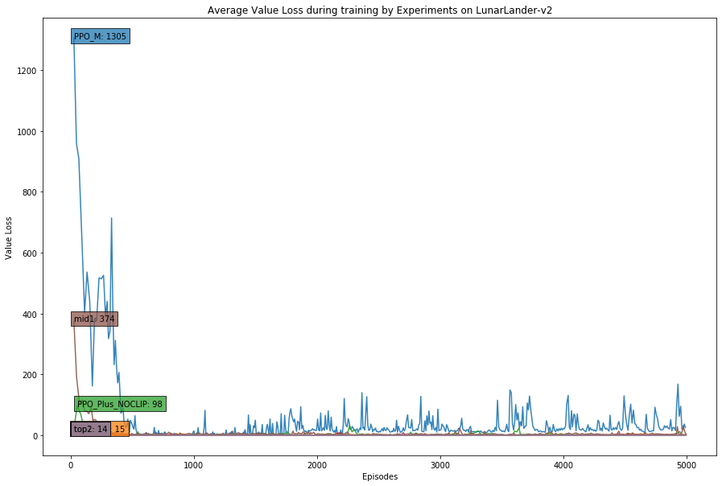

<br>

### Entropy Loss

마지막으로 Entropy_loss를 보자. 이 플롯을 보면 점수가 저조했던 실험 에이전트들이 왜 저조했는지 알 수 있다. 학습이 잘된 에이전트들에 비해 bot1, bot2, PPO_Plus_NOCLIP은 초장부터 entropy loss가 0에 가깝게 올라간다. PPO에서 entropy loss는 에이전트가 출력하는 action probability가 지나치게 쏠리지 않도록, 확신이 없는 경우 확률을 최대한 균등하게 흩뿌리도록 정규화하는 역할을 수행한다. 학습이 정상적으로 진행되면 초반에는 entropy loss가 낮다가 서서히 올라가야 한다. entropy loss가 0에 가깝다는 것은 특정 액션에 지나치게 기댄다는 것을 뜻한다.

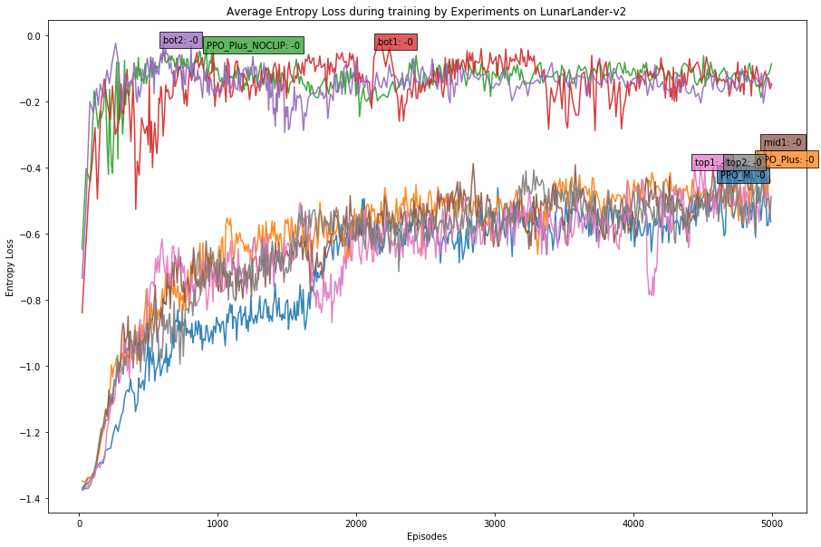

혹 PPO_Plus_NOCLIP의 불운한 결과가 0.001로 설정한 coef_entpen에 있을까 싶어 0.1로도 올려보았다. 그 결과 entropy loss가 다른 성공적인 실험들과 비슷하게 시작했지만, 그렇다고 해서 점수가 딱히 개선되는 효과를 볼 수는 없었다. 

<br>

### Play Score

학습 중 각 에이전트가 최고 평균 점수를 기록했을 때 best weight를 저장했다. 이를 이용해 시드 9999로 각각 100판을 돌려 그 점수를 비교해보았다. 

평균 점수로 줄세운 결과.. 아이러니하게도 아무 코드 최적화를 하지 않은 PPO_M이 1등을 차지했다. 표준편차도 다른 실험에 비해 낮다. 이 결과를 보려고 이 고생을.. 훈련 점수 결과와 마찬가지로 policy clipping을 사용하지 않은 실험들은 좋은 결과를 얻지 못했다. 

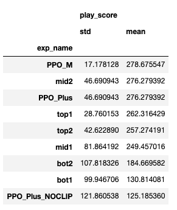

박스 플롯도 그려본다. 

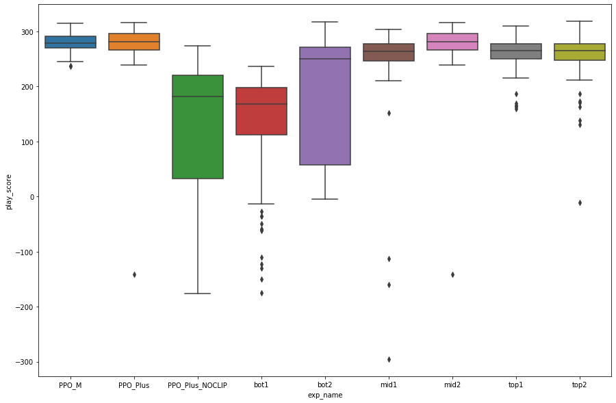

<hr>

# 결론

이 짧은 실험에서는 LunarLander-v2 환경에서 PPO의 핵심 기능인 policy clipping과 논문에서 제안된 코드 최적화 기법이 성능에 미치는 효과를 알아보았다. 논문에서의 결과와 유사하게 여러 코드 최적화 기법은 에이전트의 학습 효율을 향상시키는게 기여함을 확인할 수 있었다. 그러나 논문에서 주장하는 바와 달리 코드 최적화가 적용되더라도 policy clipping을 하지 않으면 학습이 제대로 이루어지지 않았다. 논문과 다른 결과가 난 원인에는 1) 논문에서 실험한 환경보다 더 간단한 LunarLander-v2라는 환경, 2) 시드 갯수 등 제한된 실험 설계 3) PPO 로직 구현상의 오류 등이 있을 수 있지만, 논문 자체도 아직 리뷰 중이므로 추후에 정식으로 발표되면 원인을 다시 살펴봐야겠다.

들인 노력에 비해 결론이 밍밍하지만, 튜닝의 끝은 순정이라고 PPO-M이 제일 좋은 테스트 결과를 낸 것도 나름 재밌다. PPO-M이 멋지게 착륙하는 장면으로 포스팅을 마무리한다. 

실험 코드: https://github.com/junkwhinger/PPO_PyTorch

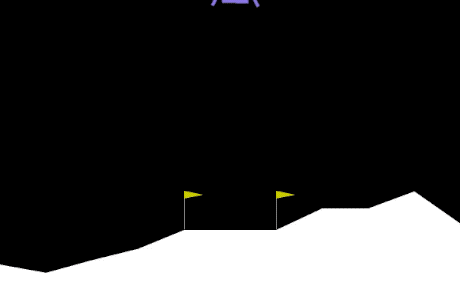


# Reference

- https://github.com/nikhilbarhate99/PPO-PyTorch/blob/master/PPO.py
- https://github.com/mimoralea/gdrl/blob/master/notebooks/chapter_12/chapter-12.ipynb
- https://github.com/reinforcement-learning-kr/pg_travel/blob/master/mujoco/agent/ppo_gae.py
- https://github.com/openai/spinningup/tree/master/spinup/algos/pytorch/ppo
- https://github.com/openai/baselines/tree/master/baselines/ppo2
- https://github.com/hill-a/stable-baselines/tree/master/stable_baselines/ppo1
- https://medium.com/@jonathan_hui/rl-proximal-policy-optimization-ppo-explained-77f014ec3f12