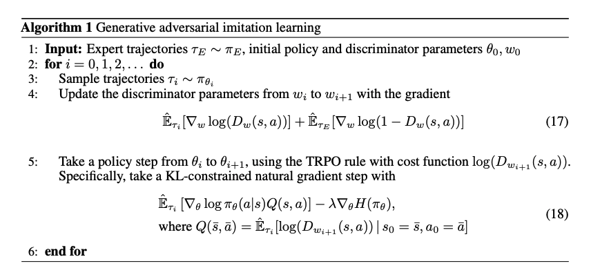
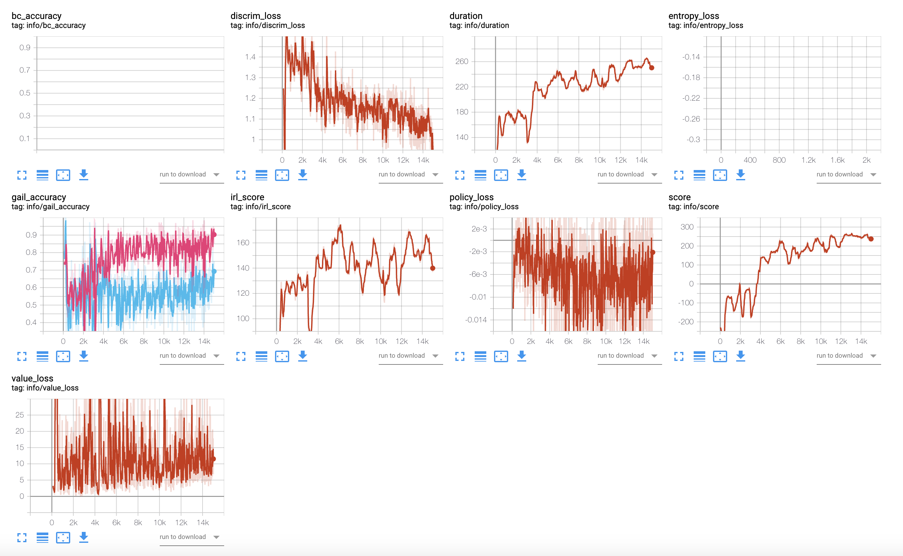
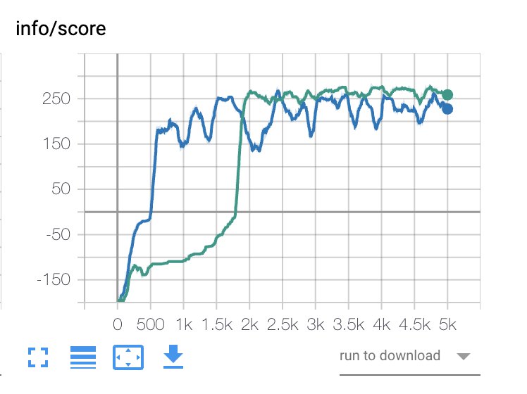
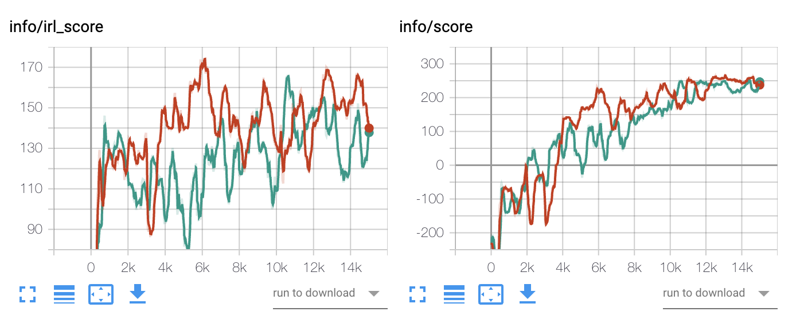
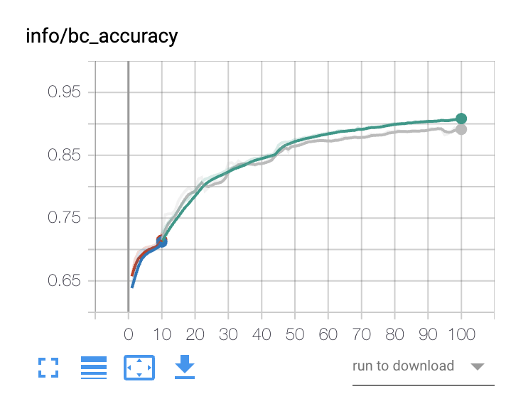
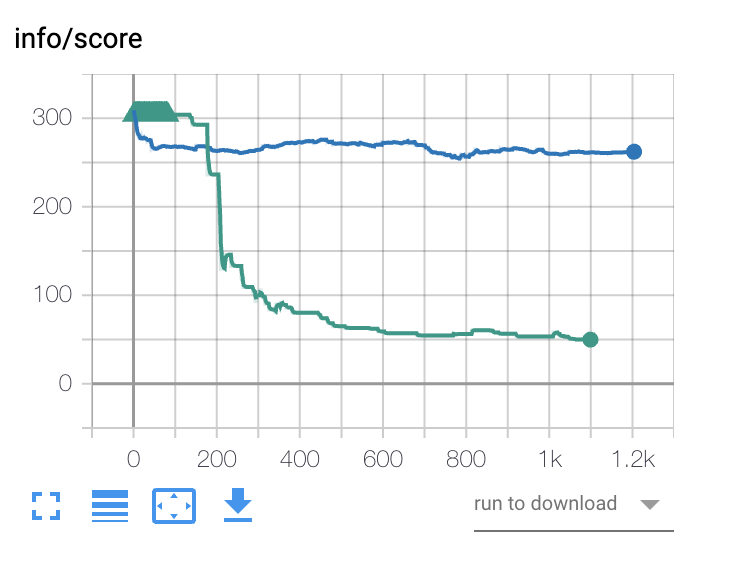
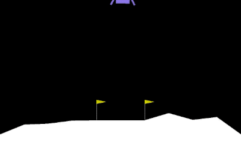

# Intro

PPO를 다뤘던 <a href="">지난 포스팅</a>에 이어 이번에는 GAIL을 알아보고 LunarLander-v2에 적용해보자.

<hr>


# GAIL

Generative Adversarial Imitation Learning. 앞글자를 따서 GAIL이라고 한다. 

GAIL은 Imitation Learning의 한 방법이다. 이전 포스팅을 통해 <a href="https://jsideas.net/BC/">Behaviour Cloning</a>(BC)와 <a href="https://jsideas.net/APP/">Apprenticeship Learning</a>(APP)을 알아봤다. GAIL은 이것들과 어떻게 다를까?

축구를 예로 들어보자. 어떻게 축구도사가 될 수 있을까. 메시의 플레이 기록을 얻었다 치자. 경기장 내에서의 좌표, 주변 선수들의 거리, 공과의 거리 등의 state와 그에 상응하는 패스, 슈팅, 스프린트 등의 action 정보가 담긴 데이터다. BC는 state로 action을 예측하는 모델을 만들어 행동을 직접적으로 모방한다. 공을 가진 상태에서 상대방 선수가 앞에 있을때 메시가 어떻게 했더라? 헛다리를 짚는다. 헛다리는 따라할수 있어도 메시처럼 플레이하긴 어렵다.

BC가 행동을 바로 모방했다면 APP은 한단계 더 들어간다. 전문가의 의도를 파악하려 한다. 플레이를 보고 눈에 보이는 몇가지 요소로 간단한 식을 만든다. 패스 횟수, 스프린트 횟수, 슈팅 횟수, 헛다리 횟수.. 각 요소 중에 어떤 것이 중요한지는 아직 모른다. 그래서 먼저 허접한 나와 메시와의 차이가 가장 큰 식을 뽑아낸다(IRL 과정). 그리고 그 식을 바탕으로 열심히 훈련해서 좋은 점수를 얻으려고 노력한다(RL 과정). 그리고 다시 나와 메시의 차이를 파악하고, 그 차이를 메꾸려 노력한다. 의도를 파악하려는 노력은 가상하나, APP은 시간이 너무 오래 걸린다 (의도 파악 > 연습 > 의도 파악 > 연습). 또 축구를 보는 눈이 떨어진다면 의도를 구성하는 식이 매우 원시적이어서 원래 의도를 제대로 표현할 수 없을지도 모른다.

APP이 고민>연습>고민>연습을 번갈아한다면 GAIL은 연습하면서 고민한다. 공을 차면서 내가 지금 처한 환경과 취하는 액션이 메시의 그것과 얼마나 같고 다른지 생각한다. 내가 마치 메시가 된듯.. 메시처럼 플레이했다면 스스로에게 높은 점수를 주고, 뉴비처럼 볼을 찼다면 스스로를 책망한다. 처음에는 내 플레이가 메시같은지 긴가민가하다. 그런데 끊임없이 머릿속에서 프리메라리가를 재생하면서 볼을 차다보면 점차 나와 메시를 분간할 수 있게 된다. 그와 동시에 나도 메시가 볼을 차는 상황에 처하려고, 또 그에 맞는 메시다운 행동을 하려고 노력한다. 그러다보면 어느순간 메시의 경지에 다다르게 된다... 의도를 굳이 생각하지 않아도 근육에 각인되는 경지...인 것이다. 이번 포스팅의 대문은 예전에 TED에서 본 Amy Cuddy의 `Fake it until you become it` 강연의 짤이다. 생각해보니 GAIL이나 GAN의 맥락에 잘 들어맞는 표현이 아닌가 싶다. 

자세한 이론 및 수학에 관한 부분은 markdown 지면이 부족하여 남기지 않는다..는 핑계를 대고 넘어간다.

<br>

# Implementing GAIL

GAIL은 어떻게 구현하면 좋을까? 논문에 소개된 pseudo code를 보자.



1. 전문가 플레이 기록, policy network, discriminator network를 준비한다.
2. 다음의 스텝을 계속 반복한다.
   1. policy를 이용해서 에이전트의 플레이를 생성한다.
   2. 에이전트의 플레이와 전문가의 플레이를 잘 분간하도록 discriminator를 학습한다.
   3. TRPO 방식으로 에이전트의 policy를 업데이트한다. (좀 더 간단한 PPO를 써도 된다.)

이것만 보면 구현이 매우 쉬워보이는데.. 막상 구현하려니 숨이 턱턱 막혔다. 다른 유명한 코드를 참조하면서 찾아낸 내용을 간단히 남겨둔다.

## IRL reward

GAIL은 reward function이 정해지지 않은 IRL 문제를 푸는 알고리즘이다. 그런데 PPO는 reward를 이용해서 expected culumative reward(기대 누적 리워드)를 최대화시키는 방향으로 policy를 학습한다. ?? 그럼 reward는 어떻게 설정해야하지?

```python
# GAIL: get irl_reward
with torch.no_grad():
  reward = self.discriminator.get_irl_reward(state_tensor, action_tensor).detach()
```

매 타임 스텝에서 state와 action을 discriminator에 전달하여 reward를 얻는다. 즉, 현재 상태와 선택한 액션이 얼마나 메시와 비슷한가에 대한 답을 얻어야 한다. 얻는 방법은 다음과 같다.

```python
# class Discriminator
def get_irl_reward(self, state_tensor, action_tensor):
  logit = self.forward(state_tensor, action_tensor)
  prob = torch.sigmoid(logit)
  return -torch.log(prob)
```

discriminator는 주어진 state와 action이 얼마나 메시같은지에 대한 하나의 값을 출력한다. 이걸 sigmoid 함수에 넣어 0~1 사이로 만든다음, -log를 씌워 점수화한다. 

왜 -log일까? 그 이유는 discriminator는 메시 플레이를 0, 내 플레이를 1로 분류하게끔 학습하기 때문이다. 0에 가까울수록 점수를 많이 주어야 한다. -log함수를 사용하면 부드러운 점수 함수를 만들 수 있다.


## Discriminator Training Loop

두번째 난관은 discriminator의 학습 루프다. 네트워크를 학습하려면 데이터를 배치로 넣어줘야 하는데, 당췌 어떻게 구현해야 한단 말인가. 내가 가진 전문가 데이터셋의 크기와 PPO가 가진 메모리 사이즈는 다르게 마련인데, 어느 기준에 맞춰야할까.. openai 구현체를 따르기로 했다.

```python
# GAIL
if self.config['train']['gail']:
  self.expert_dataset = get_gail_dataset(self.config['train']['gail']['samples_exp_name'],
                                         self.config['train']['gail']['minimum_score'],
                                         self.config['train']['gail']['n_samples'],
                                         self.config['train']['ppo']['memory_size'],
                                         self.config['train']['gail']['dstep'])

def optimize_gail(self, data):
    """
    https://github.com/openai/baselines/blob/master/baselines/gail/trpo_mpi.py
    """
    loss_fn = nn.BCELoss()
    D_losses = []
    learner_accuracies = []
    expert_accuracies = []

    learner_ob = data['states']
    learner_ac = data['actions']
    rub = torch.zeros_like(learner_ob) # just wanted to reuse ppo_iter()
    learner_iter = self.ppo_iter(self.expert_dataset.batch_size, learner_ob, learner_ac, rub, rub, rub, rub)
    for learner_ob_b, learner_ac_b, _, _, _, _ in learner_iter:
        expert_ob_b, expert_ac_b = self.expert_dataset.get_next_batch()
        if self.config['experiment']['observation_normalization']:
            expert_ob_b = self.observation_scaler(expert_ob_b, update=False).float()

        learner_logit = self.discriminator.forward(learner_ob_b, learner_ac_b)
        learner_prob = torch.sigmoid(learner_logit)

        expert_logit = self.discriminator.forward(expert_ob_b, expert_ac_b)
        expert_prob = torch.sigmoid(expert_logit)

        learner_loss = loss_fn(learner_prob, torch.ones_like(learner_prob))
        expert_loss = loss_fn(expert_prob, torch.zeros_like(expert_prob))

        loss = learner_loss + expert_loss
        D_losses.append(loss.item())

        self.discriminator_optimizer.zero_grad()
        loss.backward()
        self.discriminator_optimizer.step()

        learner_acc = ((learner_prob >= 0.5).float().mean().item())
        expert_acc = ((expert_prob < 0.5).float().mean().item())

        learner_accuracies.append(learner_acc)
        expert_accuracies.append(expert_acc)

    avg_d_loss = np.mean(D_losses)
    avg_learner_accuracy = np.mean(learner_accuracies)
    avg_expert_accuracy = np.mean(expert_accuracies)
```

 Discriminator를 학습할 때 기준이 되는 데이터는 에이전트의 trajectories다. 단, PPO의 배치 사이즈를 그대로 사용하지 않고, 전문가 데이터셋을 생성할 때 만든 배치 사이즈를 사용한다. 이 배치사이즈는 PPO의 memory_size를 dstep으로 나눈 몫이다. 예컨대 memory_size가 2048이고 dstep이 1이라면 GAIL 최적화에 사용할 배치 사이즈는 2048이 된다.

이를 이용해서 PPO의 memory를 순회하는데 이때 전문가 데이터셋에서 동일한 배치 사이즈의 state-action 데이터를 뽑아온다. 다른 구현체에서는 무작위로 뽑아왔지만, openai 구현체에서는 포인터를 이용해서 배치 사이즈만큼 뽑아다 쓰고, 다 쓰면 순서를 섞는 방식을 취한다. 

학습은 앞서 설명했던 바와 같이 전문가 데이터의 타깃을 0으로, 에이전트 생성 데이터의 타깃을 1로 둔다.


## Accuracy-based Early Stopping

openai와 함께 참조한 <a href="https://github.com/reinforcement-learning-kr/lets-do-irl/tree/master/mujoco/gail">RLKorea의 구현체</a>에는 discriminator의 분류 성능이 너무 좋아지면 discriminator의 업데이트를 중지하는 기능이 들어가있다.

```python
# https://github.com/reinforcement-learning-kr/lets-do-irl/blob/master/mujoco/gail/main.py
# line 150
if train_discrim_flag:
  expert_acc, learner_acc = train_discrim(discrim, memory, discrim_optim, demonstrations, args)
  print("Expert: %.2f%% | Learner: %.2f%%" % (expert_acc * 100, learner_acc * 100))
  if expert_acc > args.suspend_accu_exp and learner_acc > args.suspend_accu_gen:
  	train_discrim_flag = False
```

generator와 discriminator가 서로 경쟁하는 Adversarial Learning 세팅에서는 그 둘 사이의 밸런스를 유지하는 것이 매우 중요하다. 보통 생성하는 것이 판단을 하는 것보다 어렵기 때문에, 주의하지 않으면 discriminator 모델의 성능이 generator의 그것을 압도하고 만다. 창작보다 훈수가 쉬운 것처럼.. 적당히 봐주면서 판단을 해야 generator가 힌트를 얻어 발전하는데, discriminator가 딱 잘라서 문전박대해버리면 불쌍한 generator의 신세는 처량해진다. 위 기능은 discriminator의 분류 성능이 전문가/에이전트 모두 일정 임계값(ex. 80%)를 넘을 경우 discriminator의 학습을 더이상 하지 않도록 설정한다. 

RLKorea의 GAIL 구현체는 continuous action space를 가진 mujoco 문제를 푼다. 내가 실험해본 lunarlander-v2는 mujoco보다는 훨씬 간단하기 때문인지 discriminator의 성능이 과하게 앞서나가지 않아서 이 기능을 쓸 필요가 없었다.

<hr>


# Experiments

## Base GAIL

PPO는 이전 lunarlander-v2 실험 환경을 그대로 사용했다. GAIL의 하이퍼 파라미터는 openai 구현체를 참조했다. 자세한 상항은 다음과 같다.

```yaml
discriminator:
    betas:
      - 0.9
      - 0.999
    hidden_acivation_fn: tanh
    hidden_dims:
      - 100
      - 100
    lr: 0.002

samples_exp_name: "PPO_M"
n_samples: 3
minimum_score: 230
dstep: 1
```

discriminator는 policy, critic과 거의 같다. 차이나는 부분은 (100, 100)으로 설정된 hidden_dims다. openai 구현체의 기본값을 가져왔다. policy와 critic의 hidden_dims는 (64, 64)로 되어 있다.

전문가 데이터는 이전 실험에서 좋은 성적을 기록한 PPO_M의 플레이 기록이다. 약 200번 정도 플레이를 하고 state와 action을 타임스텝 단위로 저장했다. 여기서 minimum_score 230을 넘는 플레이만 추린 다음, 무작위로 n_samples만큼의 trajectories를 가져온다. n_samples는 3을 기본으로 설정했다.

dstep은 openai 기본값인 1을 썼다.



총 15000 episodes를 돌렸는데, 참 리워드로 계산한 score를 보면 대략 6천 episodes 정도 되어야 PPO에 조금 못 미치는 수준에 도달한다. 250점은 대략 10,000 episodes를 넘겨야 겨우 닿았다. 


녹색은 일반 PPO로 학습한 PPO_M 실험의 score 추이다. GAIL보다 훨씬 빨리 학습한 것을 알 수 있다.

우려했던 discriminator의 폭주는 일어나지 않았다. 아래 gail_accuracy 차트의 y축은 분류 정확도이고 두 선은 각각 전문가(붉은색), 에이전트(푸른색)다. 학습 초반에는 두 데이터가 잘 분류되지 않다가 4k episode 이후에는 양상이 달라진다. 전문가 데이터의 정확도는 80% 이상으로 올라가는데 반해 에이전트의 정확도는 50~60%를 맴돈다. 이미지 생성 GAN에서는 진짜 데이터 분류 정확도와 가짜 데이터 분류 정확도가 모두 50% 가량으로 수렴하면 D를 속이는 G를 만들어내다고 해석하기도 한다. 그러나 이번 실험에서는 learner의 accuracy는 그러한 패턴을 따르는데 반해 expert의 accuracy는 그보다 높은 수준에서 형성되는 경우가 많았다. 다른 환경에서도 비슷한 현상이 발생하는지 확인해봐야겠다.

여튼 에이전트를 잘못 분류할수록, 즉 전문가로 오인할수록 irl_reward는 높은 값을 받는다. 이로 인해 irl_score도 4k episode 이후 높게 형성되는 추세를 그린다. 흥미로운 점은 참 score 역시 비슷한 추세를 보인다는 것이다. 즉, 이상적인 전문가 플레이의 state-action 분포를 모방하기만 하도록 가이드한 에이전트도 높은 점수를 얻을 수 있다는 것을 보인 셈이다.


매우 좋은 결과이기는 하지만 찜찜한 구석이 하나 있다. true reward function이 존재하는 문제에서는 그 reward로 계산한 score가 최대값으로 갱신되는 지점에서 모델을 저장하면 된다. 그러나 그것을 모르는 imitation learning 환경에서는 전문가 플레이를 얼마나 잘 모방했는지만으로 최고점을 판단해야 한다. (게임 오버가 있는 경우에는 어느정도 경향성이 더 강하겠지만..) 위 경우에 irl_score를 기준으로 했다면 6k에서 베스트 모델이 생긴다. 그러나 true score를 보면 best 모델은 12k 부근에 위치한다. 베스트 모델을 어떻게 선정할 것인가? 고민이 필요하다. 아래 실험에서는 irl_score의 최고점을 기준으로 베스트 모델을 선정하고 그 성능을 비교해본다.


## PPO 코드 레벨 최적화가 GAIL에도 도움이 될까?

앞선 포스팅에서 lunarlander-v2를 더 효과적으로 풀기 위한 코드 레벨 최적화 기법을 Bayesian Optimization으로 찾은 다음, 이를 적용한 실험 모델을 Top1이라 칭했다. PPO 모델에서 top1(푸른색)은 기본 모델인 PPO_M(녹색)보다 훨씬 빨리 높은 점수를 기록했다. 이러한 양상이 GAIL 실험에서도 발견될까? 



붉은 선이 PPO_M_Gail, 녹색선이 Top1_Gail이다. seed가 하나뿐인 실험이라 섣불리 일반화하긴 어려우나, 이전 실험과 달리 큰 차이를 발견하기 어려웠다. 추이만 놓고 보면 PPO_M_Gail이 중반부에 더 잘 학습된 것처럼 보이기도 한다. 그러나 베스트 모델이 저장된 기점을 보면 Top1이 더 나아보인다. 



100회 플레이에 대한 베스트 모델의 평균 점수를 비교하면 다음과 같다.

- base: 227.0
- Top1_Gail: 259.1

## Discriminator의 모델 사이즈가 GAIL 성능에 영향을 줄까?

앞서 discriminator의 모델 사이즈를 policy나 critic보다 조금 더 크게 설정했다. 만약 사이즈를 동일하게, 혹은 더 적게 설정했을때 차이가 있을까? small은 (32, 32), same은 (64, 64), base는 (100, 100)으로 두고 성능을 비교해보자.

자글자글해서 보기가 어려워 스무딩을 .99로 준다. 일단 irl_score와 score 상으로는 아주 큰 차이는 보이지 않는다. score 상으로는 base(진붉)가 학습 중반에 제일 높은 score를 기록했다. 그러나 irl_score 상으로는 small(주황)이 종반에 좋아보인다. 그러나 세 모델 모두 최종적으로는 비슷한 위치에 도달한다. 또한 gail_accuracy를 보면 네크워크 크기에 관계없이 분류 성능 추이는 비슷한 것을 알 수 있다. 


irl_score 최고점 기반 베스트 모델의 성능은 다음과 같다.

- small: 250.1
- same: 267.3
- base: 227.0


## Sample Size가 GAIL의 성능에 영향을 줄까?

참조할 Expert 데이터의 길이가 길수록 성능이 달라질까? base는 3개의 sample trajectories를 사용했다. 이보다 10배 많은 30개 샘플을 참조하면 어떻게 될까? 아래 score 그래프에서 푸른선이 30개, 붉은선이 base 3개 샘플을 사용했다. irl_score는 30개가 평균적으로 높고, score는 3개가 더 높았다. 그 이유는 30개 실험 모델의 learner_accuracy가 3개에 비해 더 낮았기 때문이다. 샘플 갯수가 더 많아서 분류 모델의 학습이 지체되었는지 30개 모델의 expert와 learner accuracy는 3개 모델에 비해 각각 10% 포인트 정도 낮게 형성되어 있다.


Irl_score 최고점 기준 베스트 모델의 플레이 100회 점수를 비교하면 다음과 같다.

- base: 227.0
- sample_30: 244.6


## BC로 pretrain을 하면 더 빨리 GAIL을 학습할 수 있을까?

openai 구현체를 보면 BC로 policy를 pretrain하는 옵션이 있다. 전문가 데이터로 먼저 policy를 뜨듯하게 뎁혀놓은 다음 GAIL을 돌리면 어떤 결과가 나올까? BC를 6 epochs 정도 돌리면 validation accuracy는 68%, 100회 돌리면 90%에 다다른다. 


BC pretrain 이후 GAIL을 돌려본 결과 흥미로운 결과가 나타난다. 6회만 살짝 돌린 모델은 다른 GAIL 실험 모델과 비슷하게 서서히 점수가 오르는 패턴을 보인다. 그러나 15000회를 돌려도 BC pretrain을 하지 않은 모델의 성능에는 전혀 미치지 못했다. BC 100회는 흥미롭게도 초반에 매우 높은 score를 획득한다. 그러나 곧 score와 irl_score 모두 곤두박질치면서 학습이 제대로 되지 않았다. 더이상 지켜볼 필요가 없을 듯 하여 학습을 중단했다.

왜 이런 결과가 나왔을까? BC를 100회 돌리면 action의 분류 정확도가 90%에나 이른다. 이전에 Dodge 실험에서는 80% 정도가 전부였다. BC를 마지막에 구현해보고서야 알게 되었지만.. 사실 LunarLander-v2는 BC로도 풀 수 있는 문제다. 그렇기 때문에 초반에 score가 300 가까이 나온다. 이정도라면 pretrain한 policy가 만들어내는 state-action은 전문가의 그것과 거의 차이가 없다. 그렇기 때문에 irl_score 역시 초반에 매우 높게 나온다. BC만으로 GAIL이 달성해야 할 목표에 도달한 상황이기 때문에.. 오히려 학습되지 않은 discriminator가 생산하는 잘못된 정보로 인하여 policy의 성능이 시간이 지날수록 급격하게 떨어지는 것으로 보인다.


## 그냥 BC로 돌려보자?

BC로 10 epochs, 100 epochs를 돌려서 학습을 해보자. validation accuracy를 기준으로 10회는 60%, 100회는 90% 정도에 수렴한다. train accuracy와 validation accuracy가 비슷한 것으로 보아 overfitting이 일어나지는 않은 것으로 보인다.



100회 테스트 평균 스코어는 다음과 같다.

- BC_ep10: -130.2
- BC_ep100: 278.5

90% 분류 정확도를 기록한 BC는 그자체로.. 훌륭한 모델이다.


## PPO 초기값으로 BC를 쓰면 어떻게 될까?

PPO_M의 policy 초기값으로 BC를 10회, 100회 돌린 웨이트를 사용해보았다. 흥미롭게도 100회(푸른선)는 PPO의 score가 어느정도 높은 선에서 유지되는 반면, 10회만 학습한 모델(녹색선)은 초반에 급격하게 점수가 떨어지더니 더이상 학습이 제대로 되지 않는 모습을 보였다.



BC를 100 epochs 돌리면 잘 훈련된 PPO 모델과 비등비등한 좋은 policy를 갖게 된다. 추가적으로 PPO를 학습해도 얻을 것이 별로 없고, PPO의 clipping으로 인해 poilcy가 급격하게 바뀌지 않으면서 어느정도 높은 점수를 계속 유지하는 것으로 보인다. 10회만 학습한 모델은 학습 극초반에 여러 지표에서 원인 불명의 NaN값을 기록했다. 완전 무작위로 가중치를 초기화하는 것이 어설프게 BC로 초기화한 것보다는 나은걸까? 이에 대해서는 조금 더 어려운 Dodge3에서 다시 한번 확인해봐야겠다.


## 실험 결과

Irl_score를 기반으로 GAIL의 베스트모델을 선정하는 경우, 좋은 성능에 기여한 요인은 다음과 같다.

- 코드 레벨 최적화 기법을 적용
- policy, critic과 동일한 크기의 discriminator 사용
- 큰 expert sample size

1개 seed 환경에서 제한적인 실험을 한 결과인데다 조합이 아닌 개별 요소를 테스트한 것이므로 제한적인 해석이 필요하다.

<hr>

# Conclusion

이번 포스팅에서는 GAIL에 대해 간략히 정리하고 LunarLander-v2 환경에서 GAIL을 실험해보았다. 전문가와 비슷한 환경, 유사한 행동을 취하려는 노력만으로도 실제로 좋은 스코어를 얻을 수 있다는 것을 실험을 통해 확인할 수 있어 즐거웠다. BC로 2분만에 테스트 최고점을 찍기 전까지는... 마지막으로 킹갓 BC_ep100의 LunarLanding을 감상하자.



실험 코드: <a href="https://github.com/junkwhinger/PPO_PyTorch">github</a>


<hr>

# Reference

[https://reinforcement-learning-kr.github.io/tags/GAIL%ED%95%98%EC%9E%90/](https://reinforcement-learning-kr.github.io/tags/GAIL하자/)

https://papers.nips.cc/paper/6391-generative-adversarial-imitation-learning.pdf


